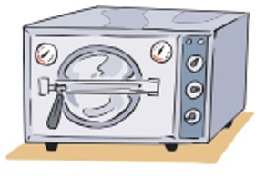

En `1995` se publicó en el `DOF` la primera norma para regular los `RPBI`. El objetivo de esta norma es la de proteger al personal del salud.

Los `RPBI` obedecen las formalidades legales de los `RP`.

Después se excluyeron los desechos humanos normales, que pueden ser generados en casa, reduciendo los costos para el manejo de los `RPBI`, por lo que pañales, toallas femeninas, condones, etc. no necesariamente son `RPBI`.

Para que se pueda considerar como `RPBI`:
* Deben `contener` o deben ser `sospechosos` de contener algún `agente biológico infeccioso`.
* La cantidad es determinante, cuando se está empapado de fluidos debe ser RPBI.

`NO` se cuentan como `RPBI`:
* Torundas y gasas con sangre seca o manchadas de sangre.
* Material de vidrio utilizado en laboratorio (matraces, pipetas,  cajas de Petri).
* Muestras de orina y excremento para análisis de laboratorio.
* Tejidos, partes del cuerpo en formol.

# Proceso de manejo de los RPBI
**Paso 1**. `Identificación` de los residuos.
**Paso 2**. `Envasado` de los residuos generados.
**Paso 3**. `Almacenamiento` temporal.
**Paso 4**. `Recolección` y `transporte` externo.
**Paso 5**. `Tratamiento`.
**Paso 6**. `Disposición final`.

## Paso 1: Identificación de los residuos
Se debe realizar de acuerdo a su `estádo físico` (líquido o sólido) y su `tipo`.
* Objetos punzocortantes.
* Residuos no anatómicos.
* Residuos patológicos.
* Sangre líquida y sus derivados.
* Utensilios desechables utilizados.

## Paso 2: Envasado de los residuos generados
| TIPO DE RESIDUO                         | ESTADO FÍSICO  | ENVASADO               | COLOR    |
|-----------------------------------------|----------------|------------------------|----------|
| Sangre                                  | Líquido        | Recipientes Herméticos | Rojo     |
| Cultivos y Cepas de Agentes Infecciosos | Sólido         | Bolsa de Plástico      | Rojo     |
| Resuduos No Anatómicos                  | Sólido         | Bolsa de Plástico      | Rojo     |
| Patológico                              | Sólido         | Bolsa de Plástico      | Amarillo |
| Patológico                              | Líquido        | Recipientes Herméticos | Amarillo |
| Objetos Punzocortantes                  | Sólido         | Recipientes Rígidos    | Rojo     |

## Paso 3: Almacenamiento temporal
Los `RPBI` deben ser almacenados en:
* Contenedores con tapa y permancer cerrados todo el tiempo.
* El área de almacenamiento debe estar claramente señalizada.
* Contenedores identificados según el tipo de residuo.
* Se deben respetar los tiempos máximos de almacenamiento:
	* Hospitales con 1 a 5 camas: 30 días.
	* Hospitales con 6 a 60 camas: 15 días.
	* Hospitales con más de 60 camas: 7 días.

## Paso 4: Recolección y trasporte externo
* El `personal` encargado debe estar `capacitado` en su manejo y conocer ampliamente los riesgos que implica su trabajo.
* Seguir una `ruta preestablecida` para trasladar los RPBI en forma segura y rápida.
* Los carros con residuos `no` deben `rebasar` su `capacidad` de carga para evitar dispersiones.
* Los carros se `lavarán diario` con agua y jabón para garantizar sus condiciones higiénicas.
* La recolección deberá realizarse una o `dos` `veces` al `díá` o cuando estén al `80%` de `capacidad`.
* Las bolsas `no` deben de `llenarse` más de un `80%`.
* `No` se deben `comprimir` las bolsas.
* `Cerrar` las bolsas con un `mecanismo de amarre` seguro.
* Verificar que los `contenedores` estén `bien cerrados`.
* La `basura común` se colocará en botes o bolsas de plástico de `cualquier color` `excepto` rojo o amarillo.

## Paso 5 Tratamiento
Las instituciones de salud realizan el tratamiento final dentro de la misma. La forma más rápida y barata es utilizando un `autoclave`, excepto para punzocortantes y partes del cuerpo.

## Paso 6 Disposición final
Los `RPBI` que hayan sido `tratados` pueden disponerse en lso camiones `recolectores` de `basura común`, mientras que los que `no` tengan `tratamiento` deberán enviarse a `empresas recolectoras autorizadas`.