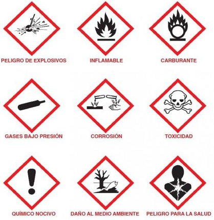
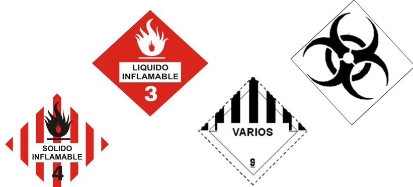

La clasificación de un residuo como peligroso, se establecerá en las normas oficiales  mexicanas que especifiquen la `forma` de determinar sus `características`, que incluyan los `listados` de los mismos y  fijen los `límites de concentración` de las sustancias contenidas en ellos, con base en los conocimientos científicos y  las evidencias acerca de su peligrosidad y riesgo.

Son aquellos que poseeen alguna característica `CRETI` (`C`orrosividad, `R`eactividad, `E`xplosividad, `T`oxicidad, `I`nflamabilidad) y sus recipientes, embalajes y suelos contaminados.

Estos son `responsabilidad` de las `autoridades federales`.

El `Instituto Nacional de Ecología` de la `Semarnat` ha trabajado en la elaboración  del `Inventario Nacional de Sustancias Químicas` (`INSQ`), que es un instrumento de información, conformado a partir de fuentes secundarias de información (Cédula de Operación Anual, pedimentos  aduanales, datos de la Asociación Nacional de la Industria Química, entre  otras). A la fecha el inventario cuenta con una lista de `5816 sustancias químicas` identificadas en el comercio nacional. Contiene datos sobre la `identidad química`, `volúmenes` de producción e importación y datos `ecotoxicológicos`.

# Obligaciones de los generadores de RP

Todo generador de `RP` deberá estar registrado ante la `Secretaria del Medio Ambiente` (`SEDEMA`).

Los generadores de `RP`, fuentes fijas de jurisdicción federal, los prestadores de servicio de manejo de residuos, los que descarguen  aguas residuales a cuerpos receptores que  sean aguas nacionales y los que generan  25,000 toneladas o más de `Bióxido de  Carbono Equivalente` (`tCO₂e`) de emisiones de `Compuestos y Gases de Efecto Invernadero` (`CyGEI`) deben cumplir con una `Cédula de Operación Anual` `COA` que sirve para reportar `emisiones` y `transferencias`.

Además se debe informar a la autoridad competente (`SEDEMA`), las cantidades reales que generamos mediante el trámite de `Licencia Ambiental Única`

# Clasificación de los RP
Primero se debe analizar la diferencia entre sustancia química peligrosa y residuo peligroso.

Las `sustancias químicas peligrosas` son elementos y compuestos de la naturaleza que presentan algún riesgo para la salud, seguridad o meido ambiente.

Los `RP` son los que tienen alguna característica `CRETI`

La clasificación de los `RP` se lleva a cabo bajo el `análisis CRIT` y el `nombre genérico`.

# Manejo de los RP
Los residuos peligrosos pueden manejarse y/o disponerse de manera segura  de distintas formas:

* por el `reciclaje` y `reuso` previo a su tratamiento y disposición final,

* por medio del `tratamiento` que `reduce` su `peligrosidad`,

* por su `incineración` bajo condiciones controladas, y

* por su `confinamiento` en sitios adecuados para ello. Para llevar a cabo estos  procesos, los residuos deben transportarse previamente y de manera segura  desde sus sitios de origen hasta las instalaciones donde serán manejados o  dispuestos para su confinamiento

Entre la recolección  de los RP y su tratamiento o  disposición final puede requerirse el llamado  `almacenamiento temporal` o `acopio de residuos`, en el  cual permanecen almacenados un tiempo en espera de  ser llevados a su siguiente fase de manejo, conforme a los  tiempos que marca la `LGPGIR`.

# Legislación
Además de las leyes principales `CPEUM`, `LEGEEPA`, `LGPGIR` y el `RGPGIR`, se debe cumplir con:

* NOM-004-SEMARNAT-2002

* Protección ambiental.- lodos y biosólidos.-especificaciones y límites máximos permisibles  de contaminantes para su aprovechamiento y disposición final.

* NOM-052-SEMARNAT-2005: Que establece las características, el procedimiento de identificación, clasificación y los  listados de los residuos peligrosos.

* NOM-053-SEMARNAT-1993: Que establece el procedimiento para llevar a cabo la prueba de extracción para  determinar los constituyentes que hacen a un residuo peligroso por su toxicidad al  ambiente.
* NOM-054-SEMARNAT-1993: Que establece el procedimiento para determinar la incompatibilidad  entre dos o más residuos considerados como peligrosos por la NOM-052-SEMARNAT-1993.

* NOM-055-SEMARNAT-2003: Que establece los requisitos que deben reunir los sitios que se  destinarán para un confinamiento controlado de residuos peligrosos  previamente estabilizados.

* NOM-056-SEMARNAT-1993 Que establece los requisitos para el diseño y construcción de las  obras complementarias de un confinamiento controlado de  residuos peligrosos.

* NOM-057-SEMARNAT-1993 Que establece los requisitos que deben observarse en el diseño, construcción y  operación de celdas de un confinamiento controlado para residuos peligrosos.

* NOM-058-SEMARNAT-1993 Que establece los requisitos para la operación de un confinamiento controlado de  residuos peligrosos.

* NOM-087-SEMARNAT-SSA1-2002 Protección ambiental - salud ambiental - residuos peligrosos biológico-infecciosos - clasificación y especificaciones de manejo.

* NOM-133-SEMARNAT-2015 Protección ambiental-bifenilos policlorados (BPCS)-  especificaciones de manejo.

* PROY-NOM-160-SEMARNAT-2011 Que establece los elementos y procedimientos para  formular los planes de manejo de residuos peligrosos.