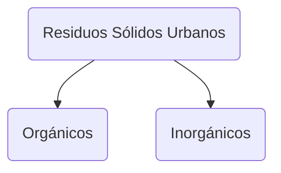
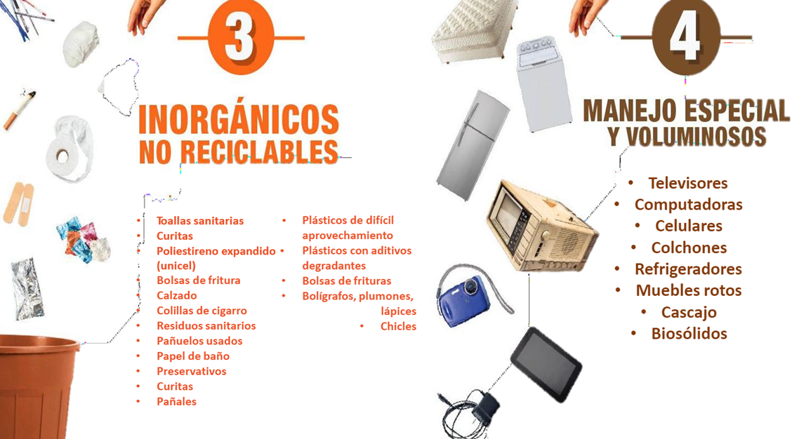

Los generados en las `casas habitación`, que resultan de la  eliminación de los materiales que utilizan en sus actividades  domésticas, de los productos que consumen y de sus  envases, embalajes o empaques; los residuos que provienen  de cualquier otra actividad dentro de `establecimientos` o en la  `vía pública` que genere `residuos` con `características  domiciliarias`, y los resultantes de la limpieza de las vías y  lugares públicos, siempre que no sean considerados por esta  Ley como residuos de otra índole (DOF 2015).

Es responsabilidad de `autoridades municipales`. Tienen las funciones de `recolección`, `traslado`, `tratamiento` y `disposición final`.

# Servicios que deben prestarse
* `Transporte` de residuos sólidos.

* Sistema municipal para `manejo` integral de residuos sólidos urbanos.

* `Concesión`	de	los	servicios	para	el	manejo	de	los	residuos	sólidos  urbanos.

* `Autorizaciones` y `lineamientos` para centros de transferencia de residuos.

## Los encargados de tratar los RSU deben verificar
* Que se haga la `separación primaria` de los residuos: orgánicos e inorgánicos.

* Que los `contenedores` estén en `optimas` condiciones físicas.

* Que los `contenedores` estén `identificados` (orgánicos e inorgánicos).

* Que el `área` asignada para los residuos sólidos sea `adecuada` a las  `características` de los `residuos`.

# Clasificación de los RSU
Se establece en el `Articulo 18 de la LGPGIR`

# Disposición final
Es el depósito `permanente` de los residuos en sitios `adecuados` que impidan su precencia en el ambiente y afectaciones.

En México existen `dos tipos` de sitios de disposición final.

Los `rellenos sanitarios` son la mejor solución para los `RSU`; este tipo de `infraestructura` involucra métodos y obras de `ingeniería` particulares que controlan la fuga de `lixiviados` y la generación de `biogases`.

Los `rellenos de tierra controlados` `comparten` las `especificaciones` de los rellenos sanitarios en `infraestructura` y `operación`, `no culmplen` con las especificaciones de `impermeabilización` para el control de `lixiviados`.

Las especificaciones de estos sitios se encuentran en la [NOM- 083-SEMARNAT-2003](https://biblioteca.semarnat.gob.mx/janium/Documentos/Ciga/agenda/PPD02/nom-083.pdf)

## NOM-083-SEMARNAT-2003
### Residuos no admitidos
* Residuos `líquidos` como aguas residuales y líquidos industriales de proceso, así como lodos hidratados de cualquier origen, con más de 85% de humedad con respecto al peso total de la muestra.
* Residuos conteniendo `aceites minerales`.
* Residuos `peligrosos` clasificados de acuerdo a la normatividad vigente.

### Los sitios de disposición final deben contar con
* `Manual de operación` que contenga:
	* `Control de registro`
	* `Informe mensual` de actividades
* Programa de `monitoreo ambiental` y conservar los registros correspondientes.
* Elaborar un programa de `monitoreo del lixiviado`, que tenga como  objetivo conocer sus características de Potencial de Hidrógeno (pH),  Demanda Bioquímica de Oxígeno (DBO), Demanda Química de Oxígeno  (DQO) y metales pesados.
* Programa de `monitoreo de biogás` que tenga como objetivo, conocer el  grado de estabilización de los residuos para proteger la integridad del sitio  de disposición final y detectar migraciones fuera del predio. El programa  debe especificar los parámetros de composición, explosividad y flujo del  biogás.​

### Rellenos sanitarios deben
*  Garantizar la extracción, captación, conducción y control de los `biogases` generados.
*  Garantizar la captación y extracción de `lixiviados`.
*  Contar con `drenajes pluviales` para el desvío de escurrimientos y desalojo del agua de lluvia.
*  Controlar la dispersión de `materiales ligeros`, así como la `fauna nociva` y la `infiltración pluvial`.

### Estudios de impacto ambiental para los sitios de disposición final
Estudios y análisis:
* Geológico e hidrológico
* Evaluación geologica y geohidrológica
* Hidrológico
* Topografico
* Geotécnico
* Generación y composicion de RSU y rme
* Generación de biogas
* Generación de lixiviados

Categorías
* `A` Mayor a 100 Ton/día
* `B` 50 hasta 100
* `C` 10 y menor a 50
* `D` Menor a 10

# Autorizaciones de la Agencia Ambiental
* Aprovechamiento, incluyendo la reutilización y el reciclaje;
* Acopio;
* Almacenamiento

# Prohibiciones (Estatales)
`Artículo 100`. La legislación que expidan las `entidades federativas`, en relación con la generación, manejo y disposición final de residuos sólidos urbanos podrá contener las siguientes `prohibiciones`:
* `Verter residuos` en la vía pública, predios baldíos, barrancas, cañadas, ductos de drenaje y alcantarillado, cableado eléctrico o telefónico, de gas; en cuerpos de agua; cavidades subterráneas; áreas naturales protegidas y zonas de conservación ecológica; zonas rurales y lugares no autorizados por la legislación aplicable;
* `Incinerar` residuos a cielo abierto
* `Abrir nuevos tiraderos` a cielo abierto.