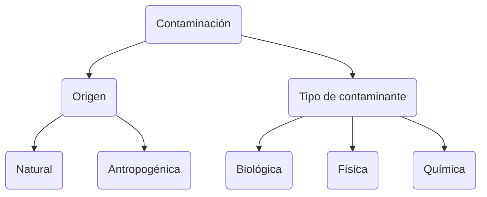

Contaminación

# Contaminación
Las dos clasificaciones principales son `origen` y `tipo de contaminante`.

## Origen
### Natural
Se debe a fenómenos naturales como la `erosión` y las `erupciones volcánicas` y está relacionada  con la `composición  de suelos`, `aguas` y los  `componentes de  algunos alimentos`  pero que `no es tan  grave` como la  antropogénica.

### Antropogénica
Que es generada por  las `actividades` que  realiza el hombre  como son las  `industriales`, `mineras`,  `agropecuarias`,  `artesanales` y  `domésticas` y es `más  grave` por su  naturaleza y la gran  variedad de  contaminantes que  genera.

## Tipo de contaminante
### Biológica
se presenta cuando un  `microorganismo` (virus, hongo o  bacteria) se encuentra en un  `ambiente` que `no le corresponde`  y `causa daños` a los `demás  organismos` que lo habitan.

Con frecuencia es provocada  por las `deficiencias` de los `servicios de saneamiento` como drenajes y alcantarillado,  abastecimiento de agua  potable, sistemas de  tratamiento de aguas negras o por malos hábitos higiénicos.

### Física
Es provocada por `agentes físicos`  como las radiaciones ionizantes,  energía nuclear, ruido, presiones  extremas, calor y vibraciones. Se  presenta tanto en `ambientes  cerrados` como los `laborales`,  como en `abiertos` donde provocan  `daños a la población` en general.

Una característica de este tipo de  contaminación es que en ocasiones  sus `efectos` pueden presentarse a  `largo plazo`; por ejemplo, en el caso  del ruido, que después de que una  persona está expuesta a este agente  de manera permanente y prolongada,  presentará problemas en su sistema  auditivo como sordera y provocar la  muerte de la flora y la fauna, cáncer y  mutaciones entre otros.

### Química
Es provocada por diferentes  `sustancias` de `uso industrial` y  `doméstico` que se  encuentran `dispersas` en el  ambiente. Se considera  como `la más grave` de las  tres, pues dichas sustancias  suelen encontrarse en los  tres estados de la materia  (liquido, sólido y gaseoso) y  por lo tanto al quedar  depositadas en el agua,  suelo y aire `afectan  fácilmente` a los organismos  vivos.