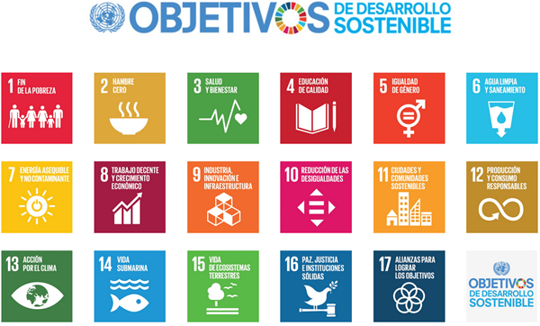
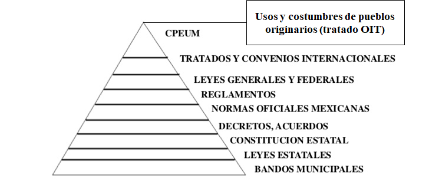

# Los ODS
Los `Objetivos de Desarrollo Sostenible` (2015-2030) también conocidos por sus siglas ODS son una iniciativa  impulsada por la ONU para dar `continuidad` a la `agenda de desarrollo` tras los `Objetivos de Desarrollo del  Milenio` (`ODM`).

Son `17 objetivos` y `169 metas` propuestos como continuación de los ODM incluyendo nuevas esferas como  el cambio climático, la desigualdad económica, la innovación, el consumo sostenible y la paz y la justicia,  entre otras prioridades.

Tras un proceso de negociación sobre los ODS que involucró a `193 estados` miembros de la ONU, el 25  septiembre de 2015, los `193 líderes mundiales` aprobaron en una cumbre celebrada en Nueva York en  reunión plenaria de alto nivel de la Asamblea General una Agenda que lleva por título “Transformar nuestro  mundo: la Agenda 2030 para el Desarrollo Sostenible" y que entró en vigor el 1 de enero de 2016.

“Transformar nuestro mundo: La Agenda 2030 para el Desarrollo Sostenible”

# Legislación ambiental en México
La `legislación ambiental` (`derecho ambiental`) es un complejo conjunto  de tratados, convenios, estatutos, leyes, reglamentos, que de manera  muy amplia, funcionan para `regular` la `interacción` de la `humanidad` y  el resto de los `componentes biofísicos` o el `medio ambiente` natural,  con el fin de `reducir` los `impactos` de la `actividad humana`, tanto en el  medio natural y en la humanidad misma.

Se divide en 3 áreas principales:
* Control de la contaminación
* Remediación y conservación de los recursos
* Gestión del ambiente

# Jerarquía de legislación ambiental en México

# CPEUM
## Garantía de un medio ambiente sano
Según el `articulo 4to párrafo 5to` de la `Constitución Política de los Estados  Unidos Mexicanos` (`CPEUM`).

Toda persona tiene `derecho` a un `medio ambiente sano` para su desarrollo  y	bienestar, y el estado debe garantizar este derecho. El daño y deterioro  ambiental generara responsabilidad para quien lo provoque en términos  de lo dispuesto por la ley.
## Derecho al acceso, disposición y saneamiento de agua para consumo personal y doméstico
`Articulo 4to párrafo 6to` de la `CPEUM`.

Toda persona tiene `derecho` al `acceso`, `disposición` y `saneamiento` de  `agua` para consumo `personal` y `doméstico` en forma suficiente,  salubre, aceptable y asequible. El Estado garantizará este derecho y la  ley definirá las bases, apoyos y modalidades para el acceso y uso  equitativo y sustentable de los recursos hídricos, estableciendo la  participación de la Federación, las entidades federativas y los  municipios, así como la participación de la ciudadanía para la  consecución de dichos fines.

## Ley General de Equilibrio Ecológico y Protección del Medio Ambiente (`LGEEPA`)
La presente Ley es reglamentaria de las disposiciones de la `CPEUM` que se refieren a la `preservación` y `restauración` del `equilibrio ecológico`, así como a la `protección`  al `ambiente`, en el territorio nacional y las zonas sobre las que la nación ejerce su soberanía y jurisdicción.

Tiene por objeto propiciar el desarrollo sustentable y establecer las bases para garantizar el derecho de toda  persona a vivir en un medio ambiente sano para su desarrollo, salud y bienestar, definir los principios de la  política ambiental y los instrumentos para su aplicación, preservar, la restauración y el mejoramiento del  ambiente y la biodiversidad; administración de las áreas naturales  protegidas; el aprovechamiento  sustentable, la preservación y, la restauración del suelo, el agua y los demás recursos naturales, la  prevención y el control de la contaminación del aire, agua y suelo;

Establece medidas de control y de seguridad para garantizar el cumplimiento y la aplicación de esta Ley y de   l as disposiciones que de ella se deriven, a sí como para la imposición de las sanciones administrativas y   p enales que correspondan. En todo lo no previsto en la presente Ley, se aplicarán las disposiciones  contenidas en otras leyes relacionadas con las materias que regula este ordenamiento.

# Principales leyes ambientales vigentes en México (03/11/2020)
* Ley General del Equilibrio Ecológico y Protección al Ambiente (instrumentos de política ambiental) (`LGEEPA`)

* Ley de Aguas Nacionales

* Ley General de Desarrollo Forestal Sustentable

* Ley General de Vida Silvestre

* Ley de Desarrollo Rural Sustentable

* Ley General para la Prevención y Gestión Integral de Residuos (`LGPGIR`)

* Ley de Bioseguridad de Organismos Genéticamente Modificados

* Ley de Productos Orgánicos

* Ley General de Pesca y Acuacultura Sustentables

* Ley de Promoción y Desarrollo de los Bioenergéticos

# Principales organizaciones medioambientales de México (civiles)
* **Centro Mexicano de Derecho Ambiental (CEMDA)**: formada por un grupo de abogados que hace investigaciones sobre medio ambiente, documenta agresiones contra los ecologistas  y hace pronunciamientos, dirigidos mayormente al gobierno, para la mejora y correcta aplicación de las normas ambientales. También aplica acciones concretas en ecosistemas  amenazados y monitorea sitios con alerta ecológica.

* **Pronatura México**: tiene ya 30 años promoviendo cambios en las legislaciones para proteger al medio ambiente. Ha obtenido, entre otros logros, la reforestación de más de 30 millones de árboles nativos en bosques tropicales, el decreto de veda total y permanente para las especies y subespecies de tortuga marina, etc. Tiene además actividades de  conservación todo el año, en las que recibe voluntarios. Hace también pronunciamientos al gobierno sobre amenazas al medio ambiente.

* **Espacios Naturales y Desarrollo Sustentable**: además de la denuncia, esta organización está enfocada en restaurar los espacios que ya han sido dañados por la acción humana. Ha recuperado miles de hectáreas de bosques, selvas y humedales en diversos puntos del país. Sobre desarrollo sustentable tiene varios proyectos en comunidades, a los cuales, si estás  interesado, sin duda podrás unirte.

* **Fondo Mexicano para la Conservación de la Naturaleza**: Tiene programas y proyectos para la conservación de áreas protegidas, bosques, cuencas, mares y costas. También financia algunos programas sustentables y hace convocatorias para costear proyectos de terceros, relativos al medio ambiente.

* **Beta Diversidad**: esta organización, aunque es independiente, busca sus fondos vinculándose con acciones de responsabilidad social por parte de las empresas. Lo recabado lo invierte  en programas, diseñados por la organización, para recuperar ecosistemas de (paradójicamente) Áreas Naturales Protegidas. También aplica programas de sustentabilidad.

* **Naturalia**: Tiene programas muy puntuales de conservación como el rescate del lobo mexicano, la conservación del jaguar del norte en Sonora, la reforestación y desarrollo sustentable de las Áreas Naturales Protegidas alrededor del valle de México y municipios conurbados, etc. Es una organización muy activa en cuanto a pronunciamientos sobre leyes  políticas públicas u omisiones del gobierno.

* **Organización mexicana para la Conservación del Medio Ambiente**: realiza actividades para la mejora de las políticas públicas, la generación y difusión de información, el empoderamiento y la participación de la sociedad, y la promoción de la educación como herramienta básica y fundamental para el desarrollo equilibrado y duradero en México. Está  basada en dos ejes esenciales**: la educación y la promoción de políticas públicas.

* **WWF-México**: también conocida como Fondo Mundial para la Naturaleza, es considerada la organización líder de conservación mundial. Nacida en Suiza en 1961, esta asociación trabaja en México desde 1990 y ha ejercido acciones para la preservación en zonas como el desierto chihuahuense, el golfo de California y el santuario de la mariposa monarca.  También ha sido férrea denunciante de las medidas que, desde las políticas públicas, dañan el medio ambiente.

* **Conservación Internacional**: esta organización internacional con acciones en México hace trabajo directo con comunidades mediante asesoría y organización, para la conservación de la naturaleza. Hoy tiene proyectos focalizados en Chiapas, en particular en la Sierra Madre y el río Usumacinta. Tiene una bolsa de trabajo en las comunidades, sobre todo de asesoría.

* **Greenpeace México**: esta asociación internacional es quizá la más popular del mundo. Además de hacer un creativo activismo, es un fuerte crítico de las políticas  gubernamentales antiecológicas. Aunado a ello, hace un monitoreo de omisiones al medio ambiente en este país, como los derrames diarios de petróleo.