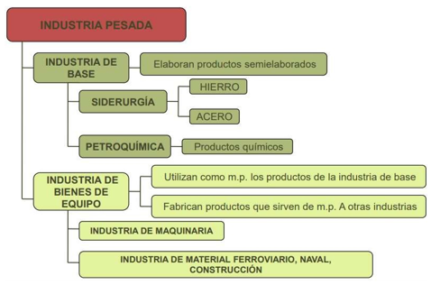
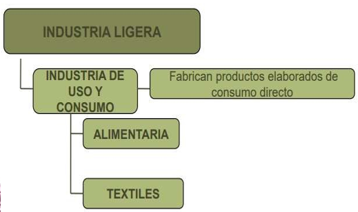
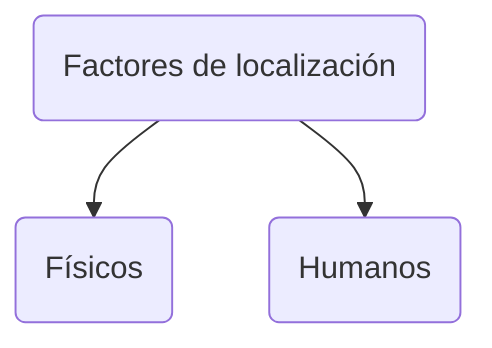
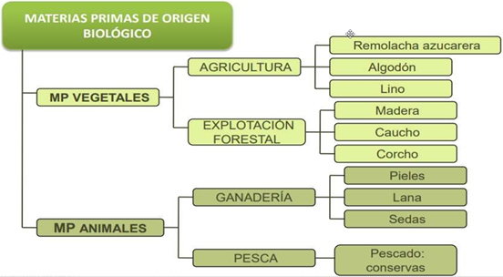
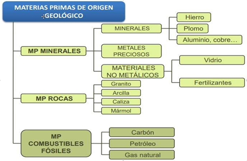
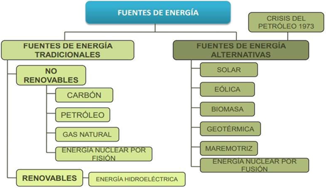

La industria es la `actividad económica` encargada  de `transformar` los `productos extraídos` de las  naturaleza en `material elaborado`. En dicho  proceso productivo se  combinan  los  distintos  `factores de producción` y se generan `residuos`.

La industria emite cientos de `contaminantes`  `sólidos`, `líquidos` y `gaseosos`, que contribuyen a la  formación de smog, la acumulación de metales  pesados y la contaminación del agua por  sustancias orgánicas, constituyen desechos sólidos  peligrosos y `dañan` de muchas otras formas a las  `comunidades` y los `ecosistemas`.

La industria es de suma `importancia` para la `economía` de un país. Esta no solo es una fuente de `empleo`,  sino que también permite que los países obtengan mejores `ingresos` en sus transacciones comerciales.

# Proceso productivo industrial
1. `Materias primas`: Son los recursos naturales que serán transformados en la industria.
2. `Energía`: Fuerza impulsora de la maquinaria.
3. `Tecnología`: Maquinaria necesaria para la transformación de la materia prima.
4. `Mano de obra`: Actividad humana que dirige y maneja la maquinaria para fabricar productos elaborados a partir de las materias primas.
5. `Capital`: Inversión económica necesaria para el inicio y continuidad de la actividad productiva.
6. `Organización empresarial`: Estructura organizatva de la empresa; mandos directivos e intermedios.

# Tipos de industria
## Según el peso
### Industria Pesada

### Industria Ligera

## Según el tamaño
* **Pequeña industria**: < 50 trabajadores.
* **Mediana industria**: Entre 50 y 1000 trabajadores.
* **Gran industria**: > 1000 trabajadores.

# Criterios de localización de una industria
Existen factores físicos y humanos.

## Factores físicos
1. Proximidad a materias primas
2. Proximidad a fuentes de energía
3. Topografía
4. Conservación del medio ambiente

## Factores humanos
1. Mano de obra
2. Mercados próximos
3. Capital
4. Transportes
5. Factor aglomeración
6. Políticos

## Mayores zonas industriales del país
En México las mayores zonas industriales están en:
* Aguascalientes
* CDMX
* Estado de México
* Monterrey
* Jalisco
* San Luis Potosí
* Querétaro
* Guanajuato

# Materias primas

# Fuentes de energía
