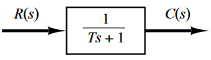
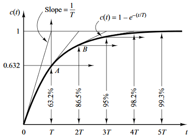
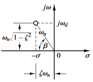
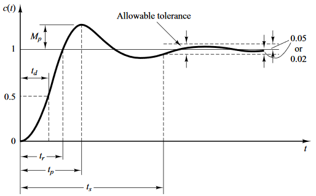
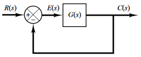
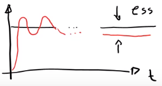
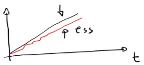
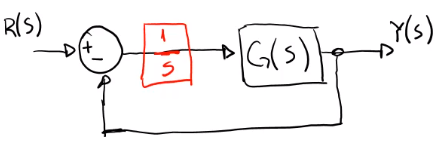
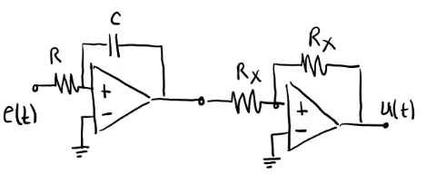

Se puede analizar para los dos estados de un sistema lineal:
* Estado `transitorio`
* Estado `estacionario`

# Estado transitorio
## Sistemas de primer orden
El parámetro importante es la constante de tiempo $T$. Pues la respuesta llega al `98%` de su valor final en $4T$. Se considera que ahí termina el transitorio y comienza el estado estacionario.

## Sistemas de segundo orden
Tienen la siguiente función de transferencia general:

$$
\dfrac{C(s)}{R(s)}=\dfrac{\omega_n^2}{s^2+2\xi\omega_n s +\omega_n^2}
$$

### Análisis de la respuesta al impulso
* Los polos del sistema son: 

$$s_{1,2}=-\xi\omega_n\pm\omega_n\sqrt{\xi^2-1$$
$

$$\cos\beta=\xi\\\beta=\arccos{\xi$$
$
* La forma de la respuesta depende de $\xi$

|Caso|Amortiguamiento|Polos|Respuesta|
|----|---------------|-----|---------|
|$\xi=0$|No hay amortiguamiento|Imaginarios e iguales|Senoidal|
|$0\lt\xi\lt1$|Subamortiguado|Imaginarios y diferentes|Oscila y se atenúa|
|$\xi=1$|Criticamente amortiguado|Reales e iguales|Exponencial|
|$\xi\geq1$|Sobreamortiguado|Reales y diferentes|Exponencial|

### Análisis de la respuesta al escalón unitario
Nos centramos en el caso donde $0\lt\xi\lt1$:
Se definen:
* El tiempo pico $t_p$

$$tp=\dfrac{\pi}{\omega_n\sqrt{1-\xi^2}$$
$
* El máximo sobre impulso $M_p$

$$M_p=\dfrac{c(t_p)-c(\infty)}{c(\infty)}100\%\quad\quad M_p=e^{-\dfrac{\pi\xi}{\sqrt{1-\xi^2}}}100\$$
$
* El tiempo de establecimiento $t_s$

$$t_s=\dfrac{4}{\xi\omega_n$$
$

# Estado estacionario
## Teorema del valor final
Establece que el límite cuando el tiempo tiende a infinito de una función que depende del tiempo, es igual al producto de la variable $s$; en el dominio de Laplace, por la transformada de Laplace de dicha función.

$$
\lim_{t \rightarrow \infty} f(t) = \lim_{s \rightarrow 0} s\mathcal{L}\left\{f\right\}(s)
$$

Por lo que:

$$
\lim_{t \rightarrow \infty} y(t) = \lim_{s \rightarrow 0} sY(s)
$$

## Error en el estado estacionario

$$E(s)=\dfrac{1}{1+G(s)}R(s$$
$

$$e_{ss}=\lim_{t\rightarrow\infty}e(t)\stackrel{\text{t. valor final}}{=}\lim_{t\rightarrow\infty}sE(t)=\lim_{s\rightarrow 0}{\dfrac{sR(s)}{1+G(s)}$$
$
El error $E(s)$ depende de:
* Entrada $R(s)$
* TIPO del sistema $G(s)$: 
### TIPO del sistema
El tipo de sistema es la cantidad de polos de G(s) en el origen del plano de Laplace.

Considerando la función de transferencia G(s) general:

$$
G(s)H(s)=\dfrac{K(T_a s + 1)(T_b s + 1)\ldots(T_m s + 1)}{s^N(T_1 s + 1)(T_2 s + 1)\ldots(T_p s + 1)}
$$

Donde:
$K$ = Ganancia en lazo abierto.
$s^N$ = Polo de multiplicidad $N$ en el origen.

El TIPO del sistema sería la multiplicidad del polo en el origen $N$

El TIPO de sistema está relacionado con la precisión, mientras `más grande` sea el tipo de sistema, `mayor` será la `precisión` pero `peor`, será la `estabilidad`. 

### Constante del error de posición (escalón) $K_p$
Cuando la entrada es un escalón unitario.

$$c(t)=\begin{cases}
0 & t<0\\
1 & t>0\\
\end{cases}
$$

Dado que la transformada de Laplace está definida para $t>0$:

$$
C(s)=\dfrac{1}{s}
$$

Aplicando la expresión del error:

$$
\begin{aligned}
    e_{ss}&= \lim_{s \rightarrow 0} \dfrac{s\dfrac{1}{s}}{1 + G(s)}\\
    &= \lim_{s \rightarrow 0} \dfrac{1}{1 + G(s)}\\
    &= \lim_{s \rightarrow 0} \dfrac{1}{1 + Kp}\\
\end{aligned}
$$

Por lo que, $Kp$ queda definida de la siguiente forma:

$$
    Kp=\lim_{s \rightarrow 0} G(s)
$$

Esta constante describe la capacidad de un sistema con retroalimentación para reducir o eliminar el error de posición en el estado estable.

### Constante del error de velocidad (rampa) $K_v$
Cuando la entrada es una rampa unitaria.

$$
    c(t)=|t|
$$

Dado que la transformada de Laplace está definida para $t>0$:

$$
    C(s)=\dfrac{1}{s^2}
$$

Aplicando la expresión del error:

$$
\begin{aligned}
    e_{ss}&= \lim_{s \rightarrow 0} \dfrac{s\dfrac{1}{s^2}}{1 + G(s)}\\
    &= \lim_{s \rightarrow 0} \dfrac{1}{s[1 + G(s)]}\\
    &= \lim_{s \rightarrow 0} \dfrac{1}{s + sG(s)}\\
    &= \lim_{s \rightarrow 0} \dfrac{1}{s + Kv}\\
    &= \dfrac{1}{Kv}\\
\end{aligned}
$$

Por lo que, $Kv$ queda definida de la siguiente forma:

$$
    Kv=\lim_{s \rightarrow 0} sG(s)
$$

Esta constante describe la capacidad de un sistema con retroalimentación para reducir o eliminar el error de velocidad en el estado estable.

### Constante del error de aceleración (parábola) $K_a$
Cuando la entrada es una parábola.

$$
    c(t)=\dfrac{1}{2}t^2
$$

Se obtiene su transformada de Laplace.

$$
    C(s)=\dfrac{1}{s^3}
$$

Aplicando la expresión del error:

$$
\begin{aligned}
    e_{\infty}&= \lim_{s \rightarrow 0} \dfrac{s\dfrac{1}{s^3}}{1 + G(s)}\\
    &= \lim_{s \rightarrow 0} \dfrac{1}{s^2[1 + G(s)]}\\
    &= \lim_{s \rightarrow 0} \dfrac{1}{s^2 + s^2G(s)}\\
    &= \lim_{s \rightarrow 0} \dfrac{1}{s^2 + Ka}\\
    &= \dfrac{1}{Ka}\\
\end{aligned}
$$

Por lo que, $Ka$ queda definida de la siguiente forma:

$$
    Ka=\lim_{s \rightarrow 0} s^2G(s)
$$

Esta constante describe la capacidad de un sistema con retroalimentación para reducir o eliminar el error de aceleración en el estado estable.
### Relación del TIPO de sistema y los errores
Esto se puede ver, analizando el error para los diferentes tipos de sistema:
||Error de posición|Error de velocidad|Error de aceleración|
|-|----------------|------------------|--------------------|
|Sistema TIPO **0**|$\dfrac{1}{1+K}$|$\infty$|$\infty$|
|Sistema TIPO **1**|0|$\dfrac{1}{K}$|$\infty$|
|Sistema TIPO **2**|0|0|$\dfrac{1}{K}$|
Por lo general sólo se analiza hasta sistemas de tipo 3, porque la estabilidad suele ser muy mala para sistemas de tipo mayor.

### Incremento del TIPO de sistema
Para incrementar el tipo de sistema se debe utilizar un integrador:

`Por ejemplo`, tratandose de sistemas electrónicos analógicos, se pueden utilizar dos aplificadores operacionales, uno en configuración integrador inversor y otro en inversor:

$$
\dfrac{U(s)}{E(s)}=\left(-\dfrac{1}{RCs}\right)\left(-\dfrac{R_x}{R
_x}\right)=\dfrac{
\frac{1}{RC}
}{s}
$$
