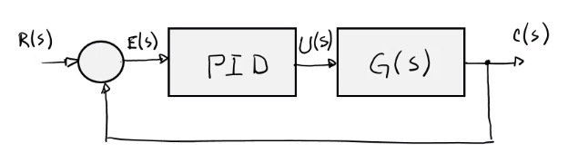
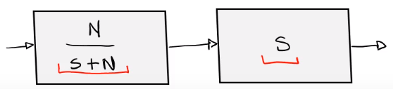

# Ley de control básica

$$
\begin{aligned}
u(t)&=K\left[e(t)+\dfrac{1}{T_i}\int e(t)dt + T_d\dfrac{de(t)}{dt}\right]\\\\
u(t)&=Ke(t)+K_i\int e(t)dt + K_d\dfrac{de(t)}{dt}\\
\end{aligned}
$$

# Proporcional (P)

$$u(t) = Ke(t$$
$

$$\dfrac{U(s)}{E(s)}=$$
$
## Ejemplo

### Estacionario
Para analizar el estado estacionario, se analiza la función de transferencia de lazo abierto:

$$G(s)=\dfrac{K}{Ts + 1}=\dfrac{K/T}{s + 1/T$$
$
Se puede concluir:
* TIPO cero
* $K_p=\lim_{s\rightarrow0}G(s) = K$
* $e_{ss}=\dfrac{1}{1+K}$

### Transitorio
Se analiza entonces la función de transferencia en lazo cerrado para estudiar el transitorio:

$$\dfrac{C(s)}{R(s)}=\dfrac{K/T}{s+\dfrac{1}{T}+\dfrac{K}{T}}=\dfrac{K/T}{s+\dfrac{K+1}{T}$$
$
Y se concluye lo siguiente:
* Primer orden
* Respuesta exponencial
* $\tau=\dfrac{T}{k+1}\quad;\quad e^{-\frac{t}{\tau}}$
* $4\tau$ al 98%
# Proporcional Integral (PI)

$$u(t)=Ke(t)+K_i\int e(t)d$$
$

$$\dfrac{U(s)}{E(s)}=K + \dfrac{K_i}{s} = \dfrac{Ks+K_i}{s$$
$
## Ejemplo

### Estacionario
Para analizar el estado estacionario, se analiza la función de transferencia de lazo abierto:

$$G(s)=\dfrac{Ks + K_i}{s(Ts + 1)$$
$
Se puede concluir:
* TIPO uno
* $K_p=\infty$
* $e_{ss}=0$
### Transitorio
Se analiza ahora el transitorio:

$$\dfrac{C(s)}{R(s)}=\dfrac{\dfrac{1}{T}(Ks+K_i)}{s^2+\dfrac{K+1}{T}s+\dfrac{K_i}{T}$$
$

Por lo que la parte integral `disminuyó el error` y `aumentó la exactitud`.

El problema que tiene este sistema es que ahora el sistema puede llegar a oscilar.
# Proporcional Derivativo (PD)

$$u(t)=Ke(t)+K_d\dfrac{de(t)}{dt$$
$

$$\dfrac{U(s)}{E(s)}=K + K_d $$
$
## Ejemplo

Para este mismo sistema en el transitorio, si se tuviera sólo un control proporcional, una función de lazo cerrado de la siguiente forma:

$$\dfrac{C(s)}{R(s)}=\dfrac{K}{s^2+K$$
$
Lo que tendría una respuesta oscilatoria, pues no hay término disipativo.
### Estacionario

$$G(s)=\dfrac{K+K_d s}{s^2$$
$
### Transitorio
Para el estado transitorio

$$\dfrac{C(s)}{R(s)}=\dfrac{K+K_d s}{s^2+K_d s +K$$
$
Se agrega entonces el término `disipativo` al sistema, o sea `amortiguamiento`.
# Proporcional Integral Derivativo (PID)

$$
u(t)=Ke(t)+K_i\int e(t)dt + K_d\dfrac{de(t)}{dt}\\
$$

$$\dfrac{U(s)}{E(s)}=K + \dfrac{K_i}{s} + K_d s = \dfrac{K_ds^2+Ks+K_i}{s}$$

No siempre es necesario utilizar el control PID, depende de cada sistema y sus requerimientos.

# Implementación

Para evitar el ruido de alta frecuencia en el derivador por lo general se ocupa un filtro pasabajas antes del bloque de derivación.

Se puede ver de la siguiente manera:

# Sintonización
Al proceso de determinar los valores óptimos para las constantes $K$, $K_d$ y $K_i$ se le conoce como sintonización.

Existen muchos métodos:
* Ubicación (localización de polos).
* Métodos de Ziegler-Nichols.
* Lugar de las raíces.
* Diagramas de Bode.
* A prueba y error.
* Etc.

## Ubicación de polos
### Ejemplo 1

Ahora evaluando el $e_{ss}$:

Por lo que el Control P parece ser suficiente para este caso.
Al ver el resultado se puede ver que existe un pequeño error en el $M_p$

Ese se da porque en realidad al utilizar el control proporcional, la función varía un poco de la función general:

### Ejemplo 2

Ahora se miden los resultados y luego se procedería a hacer ajustes manuales.

Pero en este caso no es necesario.
### Ejemplo 3
Este caso es parecido al anterior, pero no se cumple el $e_{ss}$. Por lo que se coloca un PID para poder cumplir.

Pero como se aumentó el grado del polinomio, también se requirió agregar un polo para poder obtener un polinomio de grado 3 y poder comparar.

Para determinar el valor del nuevo polo, se requiere evaluar varios para ver cuál es el mejor.

# Reglas de Ziegler - Nichols de Sintonización
Cuando se obtiene el módelo matemático de un sistema, es más sencillo y hay muchas más opciones para sintonizar los controles PID.

Sin embargo, si obtener dicho modelo es imposible o demasiado laborioso. Se deben recurrir a técnicas de sintonización para PIDs experimentales. De hecho es posible aplicar estos métodos uncluso cuando sí se conoce su modelo matemático.

Las **Reglas de Ziegler - Nichols**, nos permiten obtener los valores para $K_p$, $T_d$ y $T_i$ (como aparecen en el sistema de abajo) de forma experimental. Estas reglas son un método iterativo y normalmente no dan los valores adecuados al primer intento.

$T_i$ es el tiempo de integración, que se define de la siguiente manera:

$$
T_i = \dfrac{K_p}{K_i}
$$

$T_d$ es el tiempo de derivación y se define de la siguiente manera:

$$
T_d = \dfrac{K_d}{K_p}
$$

Existen dos métodos para calcular los valores utilzando estas reglas.

## Método 1
Consiste en llevar a cabo los siguientes pasos:
1. Obtener la respuesta del sistema al escalón unitario.
2. Si la planta no tiene integradores ni polos complejos conjugados dominantes. Probablemente tenga una respuesta curveada como una S.

3. Caracterizar la curva con las constantes **tiempo de retardo** $L$ y la **constante de tiempo** $T$.

4. Calcular los valores segúnlla siguiente tabla

| Tipo de controlador | Kp     | Ti     | Td   |
|---------------------|--------|--------|------|
| $P$      | $\dfrac{T}{L}$  | $\infty$ | 0    |
| $PI$ | $0.9\dfrac{T}{L}$ | $\dfrac{L}{0.3}$  | 0    |
| $PID$| $1.2\dfrac{T}{L}$ | $2L$     | $0.5L$ |

Estos valroes resultan de aproximar el valor de la función de transferencia como la de un sistema de primer órden con retraso de transporte:

$$
\dfrac{C(s)}{U(s)} = \dfrac{K e^{-Ls}}{Ts+1}
$$

## Método 2
En el segundo método, se siguien los siguientes pasos:
1. Se considera $T_i = \infty$ y $T_d = 0$:

$$
K_p (1 + \cancel{\dfrac{1}{T_i s}} + \cancel{T_d} s) = K_p
$$

2. Se encuantra una constante de proporcionalidad crítica $K_{cr}$, variando $K_p$ de 0 a $K_{cr}$ para la cual se obtinen respuestas oscilatorias por primera vez (si no se obtienen respuestas oscilatorias, no aplica este método).
3. Obtener el período crítico en la respuesta con cierta $K_{cr}$.

4. Determinar los valores de $K_p$, $T_d$ y $T_i$ según la siguiente tabla.

| Tipo de controlador | Kp     | Ti     | Td   |
|---------------------|--------|--------|------|
| $P$      | $0.5K_{cr}$  | $\infty$ | 0    |
| $PI$ | $0.45K_{cr}$ | $\dfrac{1}{1.2}P_{cr}$  | 0    |
| $PID$| $0.6K_{cr}$ | $0.5P_{cr}$     | $0.125P_{cr}$ |