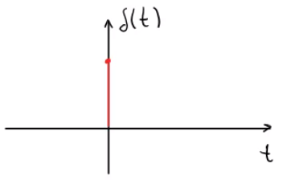
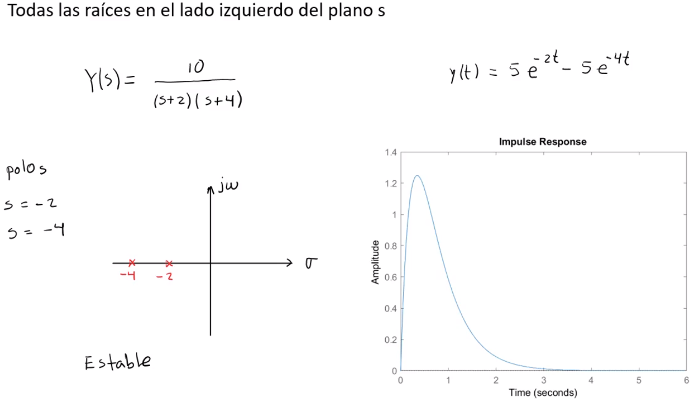
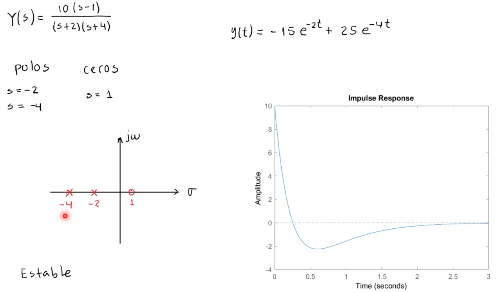
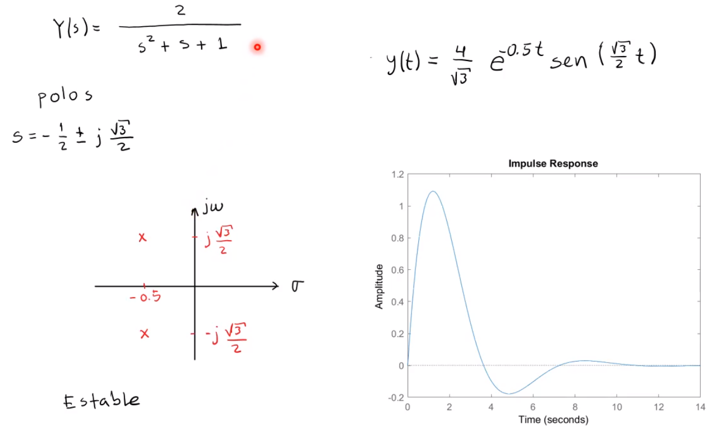
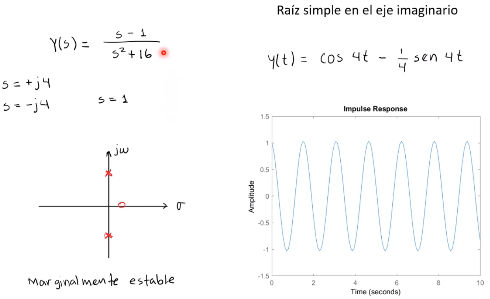
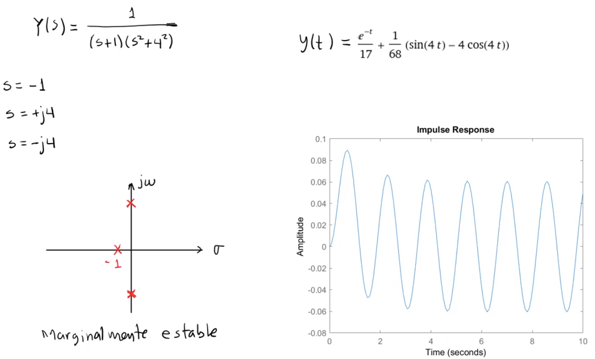
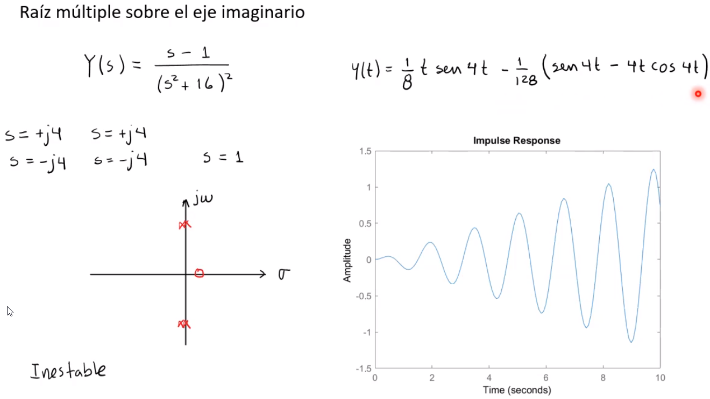
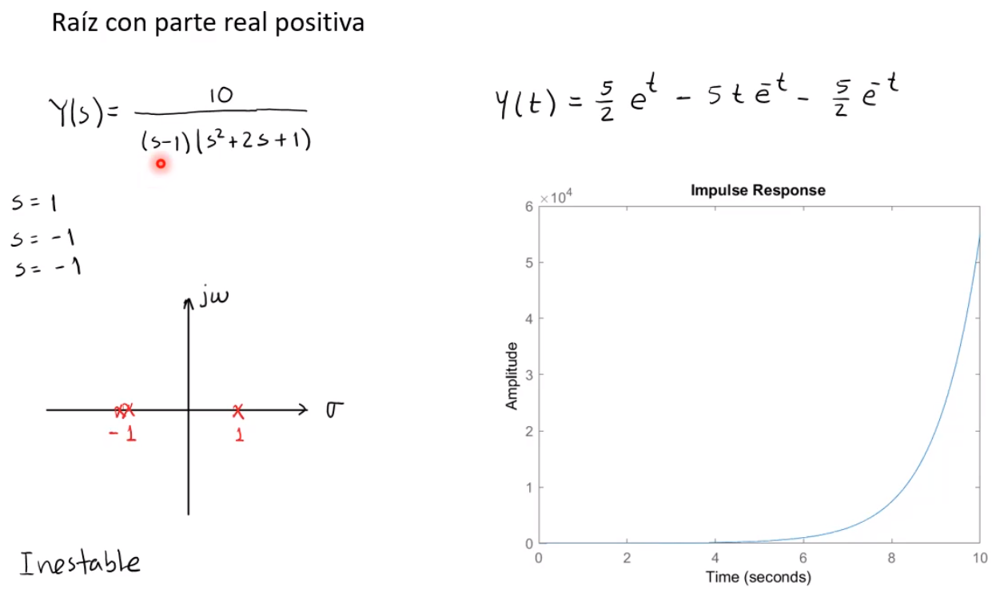

Es una propiedad de los sistems dinámicos.

NOTA: Un sistema está en equilibrio si su salida permanece en el mismo estado (cuado no tiene entradas aplicadas).

Un sistema sera `estable` si su salida regresa a su estado de equilibrio (cuando parte de una condición inicial o cuando tiene una entrada que lo perturba.

Un sistema será `críticamente estable` si la salida oscila continuamente.

Un sistema será `inestable` si su salida crece sin límite alejándose de su estado de quilibrio.

# Estabilidad en Sistemas Lineales

| Condición                                            | Valor de las raíces (polos)$\\s_i=\sigma_i+j\omega_i$                                                                                                                                                 |
| -                                                    | -                                                                                                                                                                                                     |
| `Asintóticamente estable`$\\$`Estable`               | Todas las raíces están en el semiplano izquierdo del plano $s\\\sigma_i<0$ para todo $i$                                                                                                              |
| `Merginalmente estable`$\\$`Merginalmente inestable` | Una raíz simple y ninguna raíz múltiple sobre el eje imaginario $(j\omega)$.$\\\sigma_i<0$ para cualquier $i$                                                                                         |
| `Intestable`                                         | Por lo menos una raíz en el semiplano derecho del plano $s$.$\\\sigma_i<0$ para cualquier $i\\$Por lo menos una raíz múltiple sobre el eje imaginario $(j\omega)$.$\\\sigma_i=0$ para cualquier $i\\$ |

## Impulso unitario
Para conocer la estabilidad de los sistemas se deben analizar teniendo como entrada un impulso unitario.

$$
\delta(t)=\begin{cases}
1&t=0\\
0&t\neq0\\
\end{cases}
$$

$$
\mathcal{L}\{\delta(t)\}=1
$$

Los sistemas se perturban con esta entrada, obteniedo su respuesta al impulso unitario.

$$
\begin{aligned}
\frac{Y(s)}{U(s)}&=\frac{1}{s+1}\\
Y(s)&=\frac{1}{s+1}U(s)=\frac{1}{s+1}\\
\Rightarrow y(t)&=e^{-t}\quad t\geq0
\end{aligned}
$$

## Ejemplos

* * *

* * *

* * *

* * *

* * *

* * *

# Criterio de Routh para la estabilidad de sistemas lineales
Este criterio permite saber si hay raices inestables en una ecuación polinomial sin tener que resolverla.

Se limita a los polinomios con un número finito de términos. Cuando se aplica el criterio, la información de la estabilidad absoluta del sistema puede ser obtenida directamente de los coeficientes de la ecuación característica.

## Procedimiento
### 1. Escribir el polinomio en la forma:

$$
a_0s^n+a_1s{n-1}+\ldots+a_{n-1}s+a_n= 0
$$

Con $a_n\neq0$, es decir no se consideran las raices en 0 (deben ser removidas).

### 2. Coeficientes positivos y todos presentes
Si `alguno` de los `coeficientes` es `0 o negativo` `y` hay al menos `un` `coeficiente positivo`, existe una o más raices imaginarias o que tienen partes reales positivas. Por lo tanto, el sistema es `inestable` de forma `absoluta`.

La `primera condición` para que el sistema sea `estable` de forma `absoluta`, requiere que `todos` los `coeficientes` esten `presentes` y sean `positivos`, ya que siempre se podrán factorizar en factores lineales y cuadráticos de la forma $(s+a)$  y pues así sus raices serán reales negativas para los factores lineales y complejos con partes reales negativas para los factores cuadraticos.

### 3. Arreglo de los coeficientes
Se debe formar un arreglo con todos los coeficientes de la siguiente forma:

$$
\begin{matrix}
s^n & a_0 & a_2 & a_4 & a_6 & \ldots\\
s^{n-1} & a_1 & a_3 & a_5 & a_7 & \ldots\\
s^{n-2} & b_1 & b_2 & b_3 & b_4 & \ldots\\
s^{n-3} & c_1 & c_2 & c_3 & c_4 & \ldots\\
s^{n-4} & d_1 & d_2 & d_3 & d_4 & \ldots\\
\vdots & \vdots & \vdots & \vdots & \vdots\\
s^2 & e_1 & e_2\\
s^1 & f_1\\
s^0 & g_1\\
\end{matrix}
$$

Los coeficientes $b_n$ se calculan de la siguiente forma:

$$
b_1=\dfrac{a_1a_2-a_0a_3}{a_1}\\
\phantom{-}\\
b_2=\dfrac{a_1a_4-a_0a_5}{a_1}\\
\phantom{-}\\
b_3=\dfrac{a_1a_6-a_0a_7}{a_1}\\
\vdots
$$

Luego se sigue el mismo patrón de multiplicar cruzados los coficientes de las dos filas anteriores:

$$
c_1=\dfrac{b_1a_3-a_1b_2}{b_1}\\
\phantom{-}\\
c_2=\dfrac{b_1a_5-a_1b_3}{b_1}\\
\phantom{-}\\
c_3=\dfrac{b_1a_7-a_1b_4}{b_1}\\
\vdots
$$

El proceso continua hasta que se complete la fila $n$. En el proceso, al terminar cada fila se, se puede dividir entre algún número positivo para facilitar los calculos subsecuentes.
### 4. Evaluación del criterio de estabiliad de Routh
El criterio dice que el `número de raices` con partes reales positivas (`inestables`) es igual al número de `cambios de signo` de los coeficientes en la primera columna del arreglo.

Por lo que, para que el sistema sea `estable`, `todas` los `términos` de la `primera columna` deben ser `positivos`. Si alguno es negativo (cambia de signo), entonces el sistema ya no será absolutamnte estable.

### Casos especiales
#### Algún término de la primera colúmna es 0
En ese caso si los términos de arriba y abajo del 0 son del `mismo signo`, significa que hay un `par` de `raices imaginarias`.

Si son de signos contrarios se toma como un cambio de signo.
#### Todos los coeficientes de una fila son 0
Significa que hay `2 raíces` de `igual magnitud` que son radialmente opuestas al plano $s$. Pueden ser dos raíces reales de signo opuesto y/o dos raíces imaginarias conjugadas.

En este caso se continua con los calculos de la fila utilizando la derivada el polinomio para los casos siguientes.

### Analisis de estabilidad relativa
Para esto, se sigue el criterio de Routh pero sustituyendo:

$$
s=\hat{s}-\sigma\quad\quad(\sigma = \text{constante})
$$

Y se escribe el polinomio en términos de $\hat{s}$
