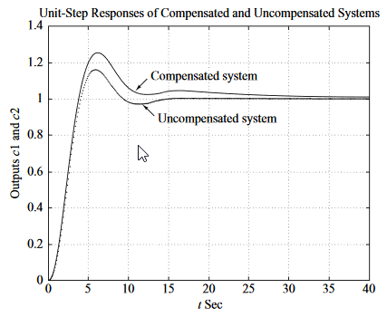

Compensadores

Los compensadores son usados para moldear el sistema y alcanzar los requisitos que el sistema debe cumplir.

Los compensadores más comunes son los compensadores en `serie` (fig a) y en `paralelo` (fig b).

Los compensadores serie son los más fáciles de diseñar, sin embargo, son los que requieren más componentes y por lo tanto son más costosos. Por lo que los compensadores en paralelo también son muy usados.

En la práctica, compensar el sistema se trata de diseñar un conjunto de compensadores en serie y en paralelo.

# Efectos de la adición de polos
La adición de un polo a la función de transferencia de lazo abierto, tiene el efecto de jalar el `LGR` a la derecha, tendiendo a `disminuir` la `estabilidad` relativa del sistema y `hacer más lento` el asentamiento de la `respuesta`.

# Efectos de la adición de ceros
La adición de un cero a la función de transferencia de lazo cerrado, tiene el efecto de jalar el `LGR` a la izquierda, tendiendo a `aumentar` la `estabilidad` relativa del sistema y `acelerar` el establecimiento de la `respuesta`.

Físicamente, la adición de un cero en la función de transferencia de lazo abierto, significa la adición de control derivativo al sistema.

# Compensadores en serie
Los compensadores en serie más comúnes son el compensador de adelanto y de retraso.
Para un sistema con función de transferencia:

$$
\dfrac{C(s)}{Y(s)} = K_c\alpha\dfrac{Ts+1}{\alpha Ts+1} = K_c\dfrac{s+\dfrac{1}{T}}{s+\dfrac{1}{\alpha T}}
$$

## Compensador de adelanto
Se utilizan cuándo el sistema presenta características de `respuesta en el estado estacionario` no satisfactorias.

Los pasos para el diseño de un compensador de adelanto son los siguientes:

**1.** De las especificaciones de diseño determinar la `localización` deseada para los `polos dominantes` de `lazo cerrado`.
**2.** Dibujando el `LGR`, determinar si cambiando la `ganancia` sólamente, es posible conseguir los polos deseados. Si no, calcular la `deficiencia de ángulo` **$\phi$**.
**3.** Asumir que el compensador de adelanto $G_c(s)$ es:

$$
G_c(s) = K_c\alpha\dfrac{Ts+1}{\alpha Ts+1} = K_c\dfrac{s+\dfrac{1}{T}}{s+\dfrac{1}{\alpha T}}\qquad (0\lt\alpha\lt1)
$$

Donde $\alpha$ y $T$ se determinan a partir del ángulo de deficiencia $\phi$. Y $K_c$ se determina a partir de la ganancia en lazo abierto requerida.

**4.** Si no se especifican las constantes de error estático, `determinar` la localización del `polo` y `cero` para `compensar` el ángulo de deficiencia $\phi$. Si no se imponen otros requisitos del sistema, `procurar` que $\alpha$ sea lo más acercada a `1`, pues implica un valor mayor de $K_v$:

$$
K_v = \lim_{s\rightarrow0}sG_c(s)G(s) = K_c\alpha\lim_{s\rightarrow0}sG_c(s)
$$

**5.** Determine el valor de la $K_c$ del compensador de adelanto a partir de la condición de la magnitud.

### Ejemplo
Considere el sistema de control con la siguiente función de transferencia de lazo abierto:

$$
G(s) = \dfrac{10}{s(s+1)}
$$

Su función de transferencia en lazo cerrado es:

$$
\begin{aligned}
\dfrac{C(s)}{R(s)} &= \dfrac{10}{s^2 + s + 10}\\
&= \dfrac{10}{(s + 0.5 + j3.1225)(s + 0.5 - j3.1225)}
\end{aligned}
$$

Se dibuja el `LGR`.

#### 1. Localización de polos
Los polos de lazo cerrado están localizados en:

$$
s + -0.5 \pm j3.1225
$$

El coeficiente de amortiguamiento es de $\xi=\frac{1/2}{\sqrt{10}} = 0.1581$ y su frecuencia natura de $\omega=\sqrt{10}=3.1623 \frac{rad}{s}$. Ya que el factor de amortiguamiento es bajo, tardará más tiempo en estabilizarse y no conviene eso. Se requiere que el factor de amortiguamiento sea de $\xi=0.5$ y la frecuencía ángular natural de $\omega=3\frac{rad}{s}$.

Se calculan los polos deseados:

$$
\begin{aligned}
s^2 + 2\xi\omega_n s + \omega_n^2 &= s^2 + 3s + 9\\
&=(s+1.5+j2.5981)(s+1.5-j2.5981)
\end{aligned}\\
\phantom{s}\\
s = -1.5 \pm j2.5981
$$

#### 2. Ángulo de deficiencia $\phi$
Se calcula el ángulo de deficiencia $\phi$.

El ángulo del polo de lazo abierto en el origen ($s=0$) a el polo de lazo cerrado deseado es de $120\degree$ y el ángulo del polo en $s=1$ a el polo de lazo cerrado deseado es de $100.894\degree$. Por lo tanto, el ángulo de deficiencia $\phi$, es:

$$
\phi = 180\degree - 120\degree - 100.894 = -40.894\degree
$$

Y eso debe contribuir el compensador de adelanto.

#### 3. Forma del compensador
Ahora se asume que el compensador tiene la siguiente forma:

$$
G_c(s) = K_c\alpha\dfrac{Ts+1}{\alpha Ts+1} = K_c\dfrac{s+\dfrac{1}{T}}{s+\dfrac{1}{\alpha T}}\qquad (0\lt\alpha\lt1)
$$

#### 4. Determinar polo y zero de compensación
Hay muchas formas de determinar un polo y zero que cumplan con el ángulo de deficiencia. A continuación se mestran 2 métodos.

##### Método 1
El primer método es el que busca la $\alpha$ máxima y por lo tanto la que implica mayor $K_v$.

Implica dibujar una línea horizontal cruzando por el polo deseado $P$ y una línea de $P$ al origen. Luego el polo y cero se encontrarán a $\frac{\phi}{2}$ de la bisección entre estás dós líenas, como se muestra a continuación:

Siguiendo este método, se tiene que la bisección está a $60\degree$ comenzando del segmento $PA$ y por lo tanto, el zero y polo están a $60º \pm 40.984º$ respectivamente. Por lo tanto:

$$
\text{cero en }s=-1.9432\\
\text{polo en }s=-4.6458
$$

##### Método 2
Se escoge el cero del compensador en $s=-1$ para que se cancele el polo de la planta en $s=-1$, así, el polo del compensador debe localizarse en $s=-3$.
#### 5. Determinar el valor de $K_c$
Se determina a partir de la condición de magnitud:

$$
\left|G_c(s)G(s)\right|_{s=P} = 1
$$

Para el método 1:

$$
\left|K_c \dfrac{s+1.9432}{s+4.6458}\dfrac{10}{s(s+1)}\right|_{s=-1.5+j2.5981} = 1
$$

$$
K_c=\left|\dfrac{s+4.6458}{s+1.9432}\dfrac{s(s+1)}{10}\right|_{s=-1.5+j2.5981} = 1.2287
$$

Para el método 2:

$$
\begin{aligned}
K_c&=\left|\dfrac{s+3}{s+1}\dfrac{s(s+1)}{10}\right|_{s=-1.5+j2.5981}\\
&= \left|\dfrac{s(s+3)}{10}\right|_{s=-1.5+j2.5981}\\
&= 0.9
\end{aligned}
$$

A continuación se realiza una comparación de ambos métodos:

## Compensador de retraso
Se utilizan cuándo el sistema presenta características de `respuesta en el estado estacionario` no satisfactorias. Este compensador busca no cambiar mucho la respuesta en transitorio pero sí `aumentar la ganancia` tanto como se pueda. Para esto, el ángulo de contribución del compensador de retraso no debe ser mayor a 5º por ejemplo (depende de la aplicación). Esto se logra posicionando el polo y zero del compensador muy cercanos entré si y cercanos al origen.

Los pasos para el diseño de un compensador de adelanto son los siguientes:
**1.** Dibujar el `LGR` en el plano $s$ y localizar los polos de lazo cerrado.
**2.** Asumir que la función de transferencia del compensador es:

$$
G_c(s) = \hat{K_c}\beta\dfrac{Ts+1}{\beta Ts+1} = \hat{K_c}\dfrac{s+\dfrac{1}{T}}{s+\dfrac{1}{\beta T}}
$$

**3.** Evalúe la constante de error estático especificada en el problema.
**4.** Determine el incremento necesario en la constante de error estático para satisfacer las especificaciones.
**5.** Determine el polo y el cero del compensador de retardo que producen el incremento necesario en la constante de error estático sin modificar apreciablemente el `LGR`. (Observe que la razón entre el valor de la ganancia requerido en las especificaciones y la ganancia que se encuentra en el sistema no compensado es la razón entre la distancia del cero al origen y la del polo al origen.)
**6.** Dibuje una nueva gráfica del `LGR` para el sistema compensado. Localice los polos dominantes de lazo cerrado deseados sobre el `LGR` y verificar que el cambio sea mínimo.
**7.** Ajuste la ganancia $\hat{K_c}$ del compensador a partir de la condición de magnitud, para que los polos dominantes en lazo cerrado se encuentren en la localización deseada ($\hat{K_c}$ será aproximadamente 1).

### Ejemplo
Considerando el sistema con la función de transferencia de lazo abierto:

$$
G(s) = \dfrac{1.06}{s(s+1)(s+2)}
$$

#### 1. Localización de polos

Su función de transferencia de lazo cerrado:

$$
\begin{aligned}
\dfrac{C(s)}{R(s)} &= \dfrac{1.06}{s(s+1)(s+2)+1.06}\\
&= \dfrac{1.06}{(s+0.3307-j0.5864)(s+0.3307+j0.5864)(s+2.3386)}
\end{aligned}
$$

Por lo que los polos dominantes son:

$$
s = -0.3307 \pm j0.5864
$$

##### 3. Evaluar el error estático
El coeficiente de amortiguamiento es $\xi=0.491$. La frecuencia angular natural de el sistema es $\omega_n = 0.673\frac{rad}{s}$. El error estático de velocidad es $K_v = 0.53 s^{-1}$

##### 4. Determinar incremento necesario
Se requiere hacer $K_v = 0.5 s^{-1}$ sin cambiar de forma apreciable el `LGR` de los polos dominantes de lazo cerrado.

##### 5. Determinar polo y cero del compensador
Se prueba un compensador de retraso para incrementar el $K_v$ en un factor de 10. Para esto se elige $\beta = 10$ y se localiza el cero y polo en $s = -0.05$ y $s = 0.005$ respectivamente para estar cercanos al 0. Quedando así la función de transferencia del compensador de retraso:

$$
G(s) = \hat{K_c}\dfrac{s + 0.05}{s + 0.005}
$$

##### 6. Verificar que el cambio sea mínimo
Ahora se calcula el ángulo de contribución:

$$
{\huge\angle}\dfrac{-0.3307 + j0.5864 + 0.05}{-0.3307 + j0.5864 + 0.005} = -3.47\degree
$$

Es menor a $4\degree$.

##### 7. Calcular $K_c$ con condición de magnitud
Ahora se calcula $K_c$, considerando el nuevo coeficiente de amortiguamiento:

$$
s = -0.31 \pm j0.55
$$

$$
\begin{aligned}
K_c &= \left|\dfrac{s(s+0.005)(s+1)(s+2)}{1.06(s+0.05)}\right|_{s=-0.31+j0.55}\\
&= 0.9656
\end{aligned}
$$

Se observa el error estático:

Se obtiene la siguiente respuesta:

## Compensador de retraso-adelanto
El compensador de retraso-adelanto, acelera la respuesta e incrementa la estabilidad del sistema.

Se utiliza cuándo ambas, la respuesta transitoria y estacionaria necesitan ser mejoradas.

Ya que este compensador añade 2 polos y 2 zeros, incrementa el orden del sistema en 2 órdenes. A menos que exista una cancelación de polos y ceros.

Los pasos para diseñar un compensador de retraso-adelanto son:

**0.** Considerando la forma del compensador de retraso-adelanto como:

$$
G_c(s) = K_c\dfrac{\beta}{\gamma}\dfrac{(T_1s+1)(T_2s+1)}{\left(\dfrac{T_1}{\gamma}s+1\right)(\beta T_2s+1)} = K_c\left(\dfrac{s+\dfrac{1}{T_1}}{s+\dfrac{\gamma}{T_1}}\right)\left(\dfrac{s+\dfrac{1}{T_2}}{s+\dfrac{1}{\beta T_2}}\right)
$$

Donde: $\beta > 1$ y $\gamma > 1$ y considerando $K_c$ como de la porción del compensador de adelanto.

### Caso 1 $\beta\neq\gamma$ 
**1.** A partir de las especificaciones de diseño dadas, determinar la localización deseada para los polos dominantes en lazo cerrado.
**2.** Utilizar la función de transferencia en lazo abierto sin compensar $G(s)$, para determinar la deficiencia de ángulo $\phi$ si los polos dominantes en lazo cerrado estuviesen en la posición deseada. La parte de adelanto de fase del compensador de retardo-adelanto debe contribuir a este ángulo.
**3.** Suponiendo que después selecciona un T2 suficientemente grande para que la magnitud de la parte de retardo sea aproximadamente $1$

$$
\left|\dfrac{s_1+\dfrac{1}{T_2}}{s_1+\dfrac{1}{\beta T_2}}\right| \approx 1
$$

, donde $s=s_1$ es uno de los polos dominantes de lazo cerrado, elegir los valores $T_1$ y $\gamma$ que:

$$
{\huge\angle}\dfrac{s_1+\dfrac{1}{T_1}}{s_1+\dfrac{\gamma}{T_1}} = \phi
$$

Los valores que satisfacen eso, no son únicos.
Luego, determina el valor de $K_c$ a partir de la condición de magnitud.

$$
\left|K_c\dfrac{s_1+\dfrac{1}{T_1}}{s_1+\dfrac{\gamma}{T_1}}G(s_1)\right| = 1
$$

**4.** Si se especifica la constante de error estático de velocidad $K_v$, determinar el valor de $\beta$ necesario.

$$
\begin{aligned}
K_v &= \lim_{s\rightarrow0} sG_c(s)G(s)\\
&= \lim_{s\rightarrow0} sK_c\left(\dfrac{s+\dfrac{1}{T_1}}{s+\dfrac{\gamma}{T_1}}\right)\left(\dfrac{s+\dfrac{1}{T_2}}{s+\dfrac{1}{\beta T_2}}\right)G(s)\\
& = \lim_{s\rightarrow0} sK_c\dfrac{\beta}{\gamma}G(s)
\end{aligned}
$$

Luego, utilizando un valor de $\beta$, seleccionar un valor de $T_2$ tal que:

$$
\left|\dfrac{s_1+\dfrac{1}{T_2}}{s_1+\dfrac{1}{\beta T_2}}\right| \approx 1
$$

$$
-5\degree<{\huge\angle}\dfrac{s_1+\dfrac{1}{T_2}}{s_1+\dfrac{1}{\beta T_2}} < 0\degree
$$

### Caso 2 $\beta=\gamma$ 
**1.** A partir de las especificaciones de diseño dadas, determinar la localización deseada para los polos dominantes en lazo cerrado.
**2.** La forma del compensador de retraso-adelanto se vuelve:

$$
G_c(s) = K_c\dfrac{(T_1s+1)(T_2s+1)}{\left(\dfrac{T_1}{\beta}s+1\right)(\beta T_2s+1)} = K_c\left(\dfrac{s+\dfrac{1}{T_1}}{s+\dfrac{\beta}{T_1}}\right)\left(\dfrac{s+\dfrac{1}{T_2}}{s+\dfrac{1}{\beta T_2}}\right)
$$

Con $\beta > 1$
**3.** Para obtener los polos de lazo cerrado en la posición deseada, calcular el ángulo de contribución $\phi$ que debe aportar la parte de adelanto.
**4.** Elegir $T_2$ lo suficientemente grande para que:

$$
\left|\dfrac{s_1+\dfrac{1}{T_2}}{s+\dfrac{1}{\beta T_2}}\right| \approx 1
$$

Determinar los valores $T_1$ y $\beta$ de las condiciones de magnitud y ángulo.

$$
\left|K_c\dfrac{s_1+\dfrac{1}{T_1}}{s_1+\dfrac{\beta}{T_1}}G(s_1)\right| = 1
$$

$$
{\huge\angle}\dfrac{s_1+\dfrac{1}{T_1}}{s_1+\dfrac{\beta}{T_1}} = \phi
$$

**5.** Usando el valor de $\beta$, elegir $T_2$ tal qué:

$$
\left|\dfrac{s_1+\dfrac{1}{T_2}}{s_1+\dfrac{1}{\beta T_2}}\right| \approx 1
$$

$$
-5\degree<{\huge\angle}\dfrac{s_1+\dfrac{1}{T_2}}{s_1+\dfrac{1}{\beta T_2}} < 0\degree
$$

El valor de $\beta T_2$, no debe ser tan grande como para no poder implementarlo físicamente.