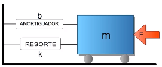
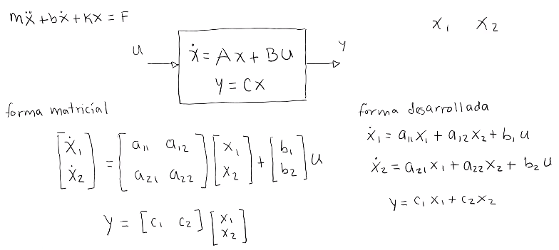
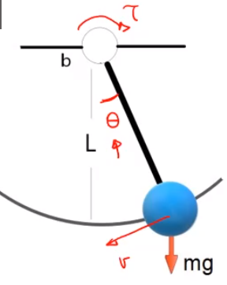
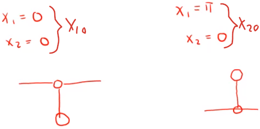
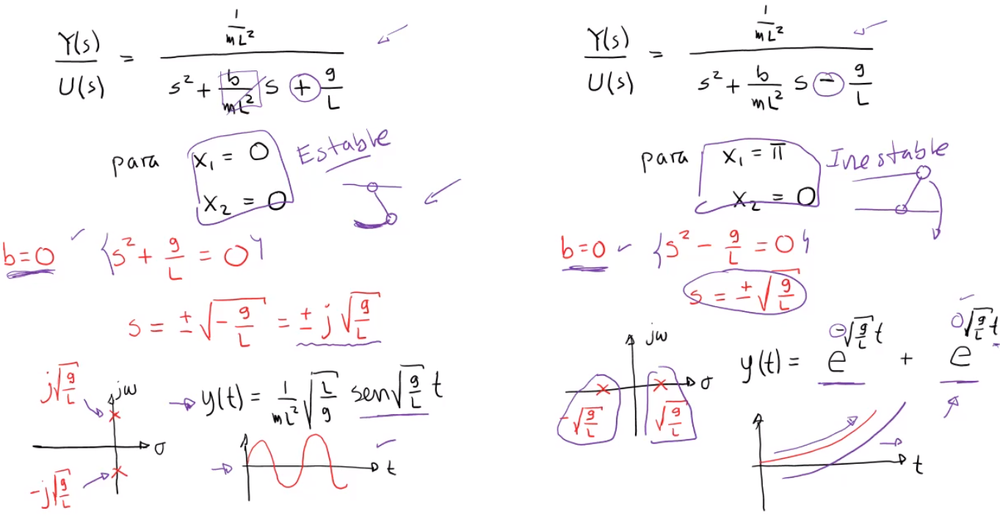

Modelado de sistemas

# Sistemas lineales
Para encontrar el modelo matemático de un sistema, se necesitan encontrar lo siguiente:
1. Ecuación de movimiento de Euler-Lagrange.
2. Ecuación de movimiento usando variables de estado.
3. Función de transferencia Y(s)/U(s).

## Ecuación de movimiento de Euler-Lagrange

$$
\newcommand{\dpartial}[2]{\dfrac{\partial#1}{\partial#2}}
\newcommand{\derivate}[2]{\dfrac{d#1}{d#2}}
\dpartial{}{}\left(\dpartial{L}{\dot{q}}\right) -\dpartial{L}{q}+\dpartial{D}{\dot{q}}=Q
$$

Donde:

$$
\begin{aligned}
L&=T-V\\
D&=\dfrac{1}{2}b\dot{x}\quad\leftarrow\text{para amortiguadores}
\end{aligned}
$$

$T$ es la energía cinética.
$U$ es la energía potencial.
$D$ es la función de disipación de Rayleigh.

Supongamos un sistema resorte amortiguador, después de aplicar E-L, se obtiene la siguiente expresión:

$$
m\ddot{x}+b\dot{x}+kx=F
$$

## Ecuación de movimiento de variables de estado

Para eso los pasos a seguir son los siguientes:
1. Asignación de variables de estado.

$$
\begin{aligned}
x_1&=x\\
x_2&=\dot{x}\\
\end{aligned}
$$

2. Asignación de las entradas y salidas

$$
\begin{aligned}
u&=F\\
y&=x_1\\
\end{aligned}
$$

3. Forma matricial

De la forma general:

$$
m\dot{x_2}+bx_2+kx_1=u
$$

Se obtienen las ecuaciones:

$$
\begin{aligned}
\dot{x_1}&=\dot{x}=x_2\\
\dot{x_2}&=-\dfrac{k}{m}x_1-\dfrac{b}{m}x_2+\dfrac{1}{m}u\\
y&=x_1
\end{aligned}
$$

Ahora se pasa a forma matricial:

$$
\newcommand{\matrix}[4]{\begin{bmatrix}
   #1 & #2 \\
   #3 & #4
\end{bmatrix}}
\newcommand{\vector}[2]{\left[\begin{array}{c}
   #1 \\
   #2 
\end{array}\right]}

\begin{aligned}
\vector{\dot{x_1}}{\dot{x_2}}&=\matrix{1}{0}{-\frac{k}{m}}{-\frac{b}{m}}\vector{x_1}{x_2}+\vector{0}{\frac{1}{m}}u\\
y&=\left[1\quad0\right]\vector{x_1}{x_2}
\end{aligned}
$$

## Función de transferencia
Se puede obtener a partir de la fomra de `Euler-Lagrange`, `Variables de estado` o forma `Matricial`.

Se aplica la transformada de Laplace y se lleva a la forma $\dfrac{Y(s)}{U(s)}$.

#### Por Euler-Lagrange

$$
m\ddot{x}+b\dot{x}+kx=F
$$

Se aplican las transformadas de Laplace:

$$
ms^2X(s)+bsX(s)+kX(s)=\mathcal{F(s)}
$$

Se lleva a la forma:

$$
\dfrac{X(s)}{\mathcal{F}(s)}=\dfrac{1}{ms^2+bs+k}
$$

#### Por variables de estado

$$
\begin{aligned}
\dot{x_1}&=\dot{x}=x_2\\
\dot{x_2}&=-\dfrac{k}{m}x_1-\dfrac{b}{m}x_2+\dfrac{1}{m}u\\
y&=x_1
\end{aligned}
$$

Se aplica la transformada de Laplace:

$$
\begin{aligned}
sX_1(s)&=X_2(s)\\
sX_2(s)(s)&=-\dfrac{k}{m}X_1(s)-\dfrac{b}{m}X_2(s)+\dfrac{1}{u}\\
Y(s)&=X_1(s)
\end{aligned}
$$

Desarrollando se llega al mismo resultado.

#### Por la forma matricial
Existe una fórmula general para obtener la función de transferencia aplicando las operaciones matriciales correspondientes a partir de la siguiente forma:

$$
\begin{aligned}
\dot{x}&=Ax+Bu\\
y&=Cx
\end{aligned}
$$

Se aplica la siguiente fórmula:

$$
\dfrac{Y(s)}{U(s)}=C(sI-A)^{-1}B
$$

# Sistemas no lineales
Para algunos sistemas, sus ecuaciones resultan ser no lineales y por lo tanto se requiere un paso extra para modelar el sistema:
1. Ecuación de movimiento de Euler-Lagrange.
2. Ecuación de movimiento usando variables de estado no lineal.
3. Linealizar
	1. Determinar los puntos de equilibrio
	2. Linealizar alrededor de los puntos de equilibrio encontrados.
4. Función de transferencia Y(s)/U(s).

## Ecuación de movimiento de Euler-Lagrange
Tomando en cuenta el caso de un pendulo simple con friccón:

Se obtiene la ecuación:

$$
mL^2\ddot{\theta}+mgL\sin{\theta}+b\dot{\theta}=\tau
$$

Se aprecia que es un sistema no lineal debido a la expresión $\sin{\theta}$.

## Ecuaciones de movimiento en variables de estado.
1. Asignación de variables de estado.

$$
\begin{aligned}
x_1&=\theta\\
x_2&=\dot{\theta}\\
\end{aligned}
$$

2. Asignación de las entradas y salidas

$$
\begin{aligned}
u&=\tau\\
y&=x_1\\
\end{aligned}
$$

3. Forma matricial

De la forma general:

$$
mL^2\dot{x_2}+mgL\sin{x_1}+bx_2=u
$$

Se obtienen las ecuaciones:

$$
\begin{aligned}
\dot{x_1}&=\dot{\theta}=x_2\\
\dot{x_2}&=-\dfrac{g}{L}\sin{x_1}-\dfrac{b}{mL^2}x_2+\dfrac{1}{mL^2}u\\
y&=x_1
\end{aligned}
$$

## Linealización
Se busca representar un sistema de ecuaciones de forma linealizada.

$$
\begin{aligned}
\dot{x}&=f(x)+g(x)u\\
y&=h(x)
\end{aligned}\quad\Rightarrow\quad
\begin{aligned}
\Delta\dot{x}&=\Delta A(x)+Bu\\
y&=C\Delta x
\end{aligned}
$$

Donde:
$
\newcommand{\dpartial}[2]{\dfrac{\partial#1}{\partial#2}}
A=\begin{bmatrix}
	\dpartial{f_1}{x_1}&\dpartial{f_1}{x_2}&\ldots\\
	\\
	\dpartial{f_1}{x_1}&\dpartial{f_2}{x_2}&\ldots\\
	\vdots&\vdots
\end{bmatrix}_{\large{x_0}}
$

$
B=\left.g(x)\right|_{x_0}
$

$
\newcommand{\dpartial}[2]{\dfrac{\partial#1}{\partial#2}}
C=\begin{bmatrix}
	\dpartial{h}{x_1}&\dpartial{h}{x_2}&\ldots
\end{bmatrix}_{\large{x_0}}
$
Esto se hace primeramente mediante un cambio de variable:

$$\Delta x=x-x_$$
$
Donde:
$\Delta x$= La nueva variable linealizada.
$x$= La nueva variable anterior.
$x_0$= El punto de equilibrio.

### Puntos de equilibrio
Se hace la entrada y velocidades del sistema sean igual a cero.

$$
\begin{aligned}
u&=0\\
\dot{x}&=0
\end{aligned}
$$

Por lo tanto:

$$
\begin{aligned}
0&=f(x)+g(x)0\\
f(x)&=0\quad\rightarrow\quad x_1,\ x_2,\ \text{etc}.
\end{aligned}
$$

Los puntos críticos son los estados del sistema que cumplen con la condición anterior.

### Ejemplo
#### Puntos de equilibrio

$$
\begin{aligned}
f_1(x)=\dot{x_1}&=\dot{\theta}=x_2\\
f_2(x)=\dot{x_2}&=-\dfrac{g}{L}\sin{x_1}-\dfrac{b}{mL^2}x_2+\dfrac{1}{mL^2}u\\
y&=x_1
\end{aligned}
$$

Siguiendo con el ejemplo del péndulo simple, primero se encuentran los puntod de equilibrio.

$$
\begin{aligned}
0&=x_2\\
0&=-\dfrac{g}{L}\sin{x_1}
\end{aligned}
$$

Por lo tanto, los puntos de equilibrio serán:

$$
\begin{aligned}
x_1&=n\pi;\quad n=0,1,2,\ldots\\
x_2&=0
\end{aligned}
$$

Analizando el sistema, los puntos de equilibrio son:

En realidad *físicamente*, sólo hay 2 puntos de equilibrio.

#### Linealización
Primero se realizan los cambios de variable.

$$
\Delta x_1=x_1-x_{10}\\
\Delta x_2=x_2-x_{20}
$$

Ahora se obtienen las derivadas parciales de la matriz $A$.

$$
\newcommand{\dpartial}[2]{\dfrac{\partial#1}{\partial#2}}
\begin{alignedat}{2}
\dpartial{f_1}{x_1}&=0&\quad\dpartial{f_1}{x_2}&=1\\
\\
\dpartial{f_2}{x_1}&=-\dfrac{g}{L}\cos{x_1}&\quad\dpartial{f_2}{x_2}&=-\dfrac{b}{mL^2}
\end{alignedat}
$$

Se obtienen las componentes $B$ y $C$.

$$
\newcommand{\dpartial}[2]{\dfrac{\partial#1}{\partial#2}}
B=\begin{bmatrix}0\\\\\frac{1}{mL^2}\end{bmatrix}\quad C=\begin{bmatrix}\dpartial{h}{x_1}=1&&\dpartial{h}{x_1}=0\end{bmatrix}
$$

Se escriben las ecuaciones matricialmente.

$$
\newcommand{\matrix}[4]{\begin{bmatrix}
   #1 & #2 \\
   #3 & #4
\end{bmatrix}}
\newcommand{\vector}[2]{\left[\begin{array}{c}
   #1 \\
   #2 
\end{array}\right]}

\begin{aligned}
\vector{\Delta\dot{x_1}}{\Delta\dot{x_2}}&=\matrix{0}{1}{-\frac{g}{L}\cos{x_1}}{-\frac{b}{mL^2}}\vector{\Delta x_1}{\Delta x_2}+\vector{0}{\frac{1}{mL^2}}u\\
y&=\left[1\quad0\right]\vector{\Delta x_1}{\Delta x_2}
\end{aligned}
$$

Evaluando ahora en el punto de equilibrio inferior:

$$
x_1=0;\quad x_2=0\\
$$

$$
\newcommand{\matrix}[4]{\begin{bmatrix}
   #1 & #2 \\
   #3 & #4
\end{bmatrix}}
\newcommand{\vector}[2]{\left[\begin{array}{c}
   #1 \\
   #2 
\end{array}\right]}

\begin{aligned}
\vector{\Delta\dot{x_1}}{\Delta\dot{x_2}}&=\matrix{0}{1}{-\frac{g}{L}}{-\frac{b}{mL^2}}\vector{\Delta x_1}{\Delta x_2}+\vector{0}{\frac{1}{mL^2}}u\\
y&=\left[1\quad0\right]\vector{\Delta x_1}{\Delta x_2}
\end{aligned}
$$

Evaluando ahora en el punto de equilibrio superior:

$$
x_1=\pi;\quad x_2=0\\
$$

$$
\newcommand{\matrix}[4]{\begin{bmatrix}
   #1 & #2 \\
   #3 & #4
\end{bmatrix}}
\newcommand{\vector}[2]{\left[\begin{array}{c}
   #1 \\
   #2 
\end{array}\right]}

\begin{aligned}
\vector{\Delta\dot{x_1}}{\Delta\dot{x_2}}&=\matrix{0}{1}{\frac{g}{L}}{-\frac{b}{mL^2}}\vector{\Delta x_1}{\Delta x_2}+\vector{0}{\frac{1}{mL^2}}u\\
y&=\left[1\quad0\right]\vector{\Delta x_1}{\Delta x_2}
\end{aligned}
$$

## Función de transferencia
Se obtiene la función de transferencia para ambos puntos críticos:

$$
\begin{aligned}
sX_1(s)&=X_2(s)\\
sX_2(s)&=\mp\dfrac{g}{L}X_1(s)-\dfrac{b}{mL^2}X_2(s)+\dfrac{1}{mL^2}U(s)\\
Y(s)&=X_1(s)\\
\end{aligned}\\
$$

Sustituyendo:

$$
s^2Y(s)=\mp\dfrac{g}{L}Y(s)-\dfrac{b}{mL^2}sY(s)+\dfrac{1}{mL^2}U(s)\\
$$

Despejando se obtiene:

$$
\begin{aligned}
&\dfrac{Y(s)}{U(s)}=\dfrac{\dfrac{1}{mL^2}}{s^2+\dfrac{b}{mL^2}s+\dfrac{g}{L}}\quad &\dfrac{Y(s)}{U(s)}=\dfrac{\dfrac{1}{mL^2}}{s^2+\dfrac{b}{mL^2}s-\dfrac{g}{L}}\\\\
&\text{para}\quad x_1=0,\quad x_2=0;&\text{para}\quad x_1=\pi,\quad x_2=0;
\end{aligned}
$$

## Información obtenida de los polos y la linealización
