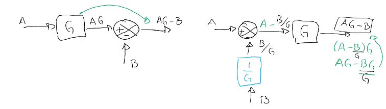

Partiendo del diagrama más básico de un sistema de control:

El objetivo es encontrar una función de transferencia para el sistema total. Entoces hay que llevarlo a la forma:

$$
\dfrac{Y(s)}{C(s)}=G_T(s)
$$

Se identifica el error:

$$
E(s)=C(s)-H(s)Y(s)
$$

Y la salida:

$$
Y(s)=G(s)E(s)
$$

Ahora sustituyendo y desarrollando:

$$
\begin{aligned}
Y(s)&=G(s)[C(s)-H(s)Y(s)]\\
    &=G(s)C(s)-G(s)H(s)Y(s)\\
	\\
    Y(s)+G(s)H(s)Y(s)&=G(s)C(s)\\
    Y(s)[1+G(s)H(s)]&=G(s)C(s)\\
\end{aligned}
$$

Por lo tanto:

$$
\dfrac{Y(s)}{C(s)}=\dfrac{G(s)}{1+G(s)H(s)}
$$

Eso quiere decir que ahora todo el sistema se puede representar con un simple bloque cuya función de transferencia es $G_T(s)$.

# Álgebra de bloques
## Bifurcación

Pasar el bloque delande del punto de bifurcación.

## Punto de suma

Al pasar el punto de suma el resultado final es $(A-B)G$, por lo que, para que el resultado sea el mismo $(AG-B)$, es necesario agregar el bloque $\frac{1}{G}$.

Una tabla con las reglas del álgebra de bloques se muestra a continuación:

# Reducción de un sistema de control
Es necesario llevar a cabo los siguientes pasos:
1. Identificar todos los lazor cerrados.
2. Identificar los lazos cerrados más internos.
3. Elegir un de los lazos más internos.
4. Si no está limpio, usar reglas del álgebra de bloques para limpiarlo.
5. Aplicarle la regla `13`.

Ejemplo:

$$\Downarro$$
$

$$\Downarro$$
$

$$\Downarro$$
$

$$\Downarro$$
$

Al hacer esta conversión se obtiene un bloque con una función de transferencia que es necesario desarrollar:

$$
\begin{aligned}
\dfrac{\dfrac{G_1G_2G_3}{1+G_3G_2H_2}}{\dfrac{H_1}{G_1}}&=\dfrac{G_1^2G_2G_3}{H_1(1+G_3G_2H_2)}
\end{aligned}
$$

$$\Downarrow$$

Se desarrolla la expresión final:

$$
\begin{aligned}
\dfrac{\dfrac{G_1^2G_2G_3}{H_1(1+G_3G_2H_2)}}{1+\dfrac{G_1^2G_2G_3}{H_1(1+G_3G_2H_2)}}&=\dfrac{G_1^2G_2G_3}{H_1(1+G_3G_2H_2)+G_1^2G_2G_3}
\end{aligned}
$$

$$\Downarrow$$

