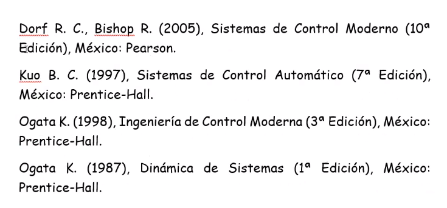

# Contacto
Profesor: Adolfo Rojas Pacheco
Correo: rojaspachecoadolfo@gmail.com
Grupo: 3MM3

# Formato de clase
La clase será asíncrona por medio de videos (publicados en Stream), textos y prácticas (en Archivo > Materiales de clase).

* Cuando haya publicación dar like para informar de enterado.
* Para preguntar por dudas, es necesario subirla en el espacio de **DUDAS** (personal), o en **Espacio de colaboración** (público).
	* El profesor se compromete a resolver en el horario de trabajo (Lunes a viernes de 8:30 a 16:30)

#### Equipo
- Carmona Felix Ángel Geovanny
- Hernández Jiménez Daniel
- Romero Rojas Alberto Rene

## Formato de prácticas

* Las prácticas deben ser enviadas por los tres integrantes del equipo por separado.
* La respuesta y evaluación será entregada a un solo integrante.
* El formato del nombre de los archivos a entregar es el siguiente: `Px_3MM3_CarmonaHernandezRomero.pdf`
	* |||
	|---|---|
	|Px|Significa P1,P2,P3,etc. Según el # de práctica|
	|3MM3|Grupo|
	|CarmonaHernandezRomero|Primer apellido de cada integrante, colocados en orden alfabético|
	|pdf|Solo se aceptan formatos .pdf|
	
	
* El contenido de las prácticas debe ser el siguiente:
	* |||
	|---|---|
	|Portada| Número y nombre de práctica, Integrantes (comenzando por apellido y en orden alfabético) y fecha de entrega|
	|Desarrollo|En donde se expliquen o describan detalladamente los procedimientos que se siguieron para cumplir con el objetivo de la práctica. Cuando sea pertinente, incluir las gráficas de simulaciones en el tiempo, la frecuencia, etc. que ayuden a comprobar o a explicar los resultados obtenidos y por lo tanto el cumplimiento del objetivo de la práctica.|
	|Observaciones y/o Conclusiones|Por **cada integrante**. Sustanciosas, no largas (Que se vea que entendimos el tema y lo que se hizo)|
	|Referencias|Incluir las fuentes consultadas (formato libre)|
* Las figuras y diagramas deben procurar ser originales y no copiados.
* Los desarrollos a mano serán escaneados y visibles.
* No copiar textos completos.

# Evaluación
EL promedio de todas las prácticas (aprox. **12**).

# Contenido del curso
**Nota**: Es necesario repasar ecuaciones diferenciales del tipo $\ddot{x}+4\dot{x}+5x = f(t)$. La transformada de Laplace directa e inversa y su aplicación para resolver ecuaciones diferenciales.

1. Conceptos de Sistemas de Control de Lazo Cerrado (SCLC), Álgebra de bloques, Modelado, Linealización, Estabilidad.
2. Análisis de la respuesta temporal. Control PID.
3. Lugar geométrico de las raíces (LGR o LR). Compensadores de adelanto, de atraso y de adelanto/atraso.
4. Diagramas de Bode y Compensadores.

# Bibliografía
El Ogata Inge.. es el que usará mucho el profe.
