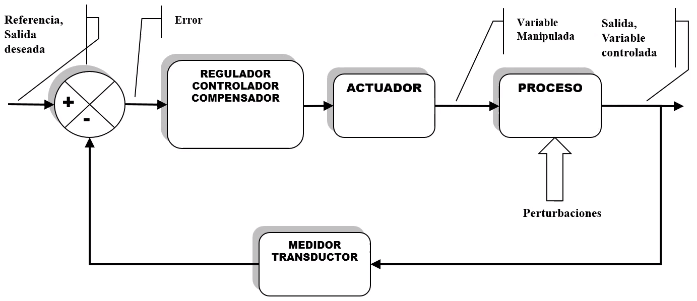

Existen 2 tipos de sistemas de control, los sistemas de control de `lazo abierto` y `lazo cerrado`. Los sistemas de lazo cerrado funcionan con **retroalimentación**, lo que hace que se evalúe el error en la salida, usando luego esa información para realizar ajustes al control.

# Diagrama general de un sistema de control en lazo cerrado

Los bloques rectangulares generalmente tienen, además de un nombre. Una expresión matemática del proceso que realiza. Esto se expresa generalmente por *funciones de transferencia*.

En el bloque de suma se tienen dos señales, la `salida deseada` o `referencia` y la `salida` o `variable controlada`. Este bloque hace la comparación entre ambas señales y entrega el `error`. Lo que causa las diferencias o error, son las `perturbaciones` externas.

Con base en el error, el `controlador` se da cuenta y manda una señal al `actuador` para corregir el la salida.

El `proceso` también es llamdo `planta`.

### Objetivos de un sistema de control de lazo cerrado
* **Rechazo de perturbaciones**: Mantener la salida controlada.
* **Regulación**: Ante un cambio en la referencia, la salida debe reaccionar a ese correctamente a ese cambio.
* **Seguimiento de trayectorias**: La salida debe seguir a la referencia cuando la referencia no es constante (por ejemplo una señal sinusoidal).