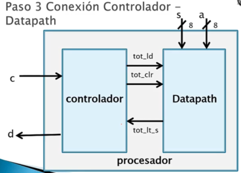

Conectar el datapath con el controlador

  
  
Las señales de conexión entonces son `tot_ld`, `tot_clr` y `tot_lt_s`.  
  
A su vez se muestrán las señales del procesador en sí, conectando señales de control con el controlador y señales de datos al datapath:  
• `c` Señal de introducción de moneda  
• `d` Señal de despachar refrésco  
• `s` Señal de precio de refresco  
• `a` Señal de valor de la moneda introducida