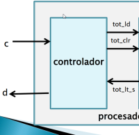
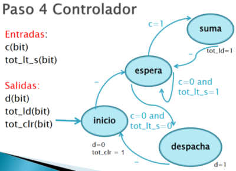
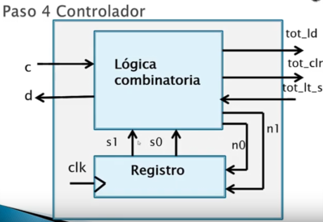
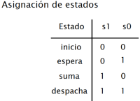
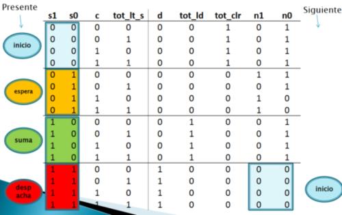
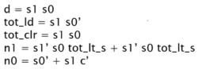
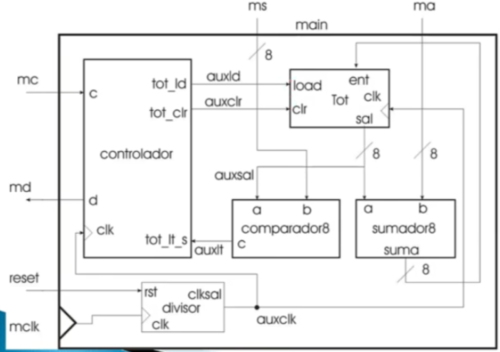

Tomando en cuenta el diagrama del paso anterior:  
  
  

## Se crea el diagrama de estados del controlador

  
  
  

## Se diseña el controlador

  
Un controlador básico, está compuesto por una ALU y uno o más registros  
  
Donde, dependiendo del estado presente (almacendo en los registros) y de las señales de entrada, la ALU entrega ciertas salidas, actualizando a su vez el registro al estado siguiente. La ALU, es una tabla de verdad.  
  
Para hacer todo a mano tendríamos que realizar los siguientes pasos:  
1. Tabla de estados  
  
2. Tabla de lógica combinatoria (apoyados del diagrama de estados y la tabla de estados)  
  
3. Ecuaciones usando mapas de Karnaugh  
  
4. Diseñar el circuito con VHDL  
  
En este caso se tuvo que utilizar un divisor además, debido al hardware utilizado (Nexys 2) cuyo reloj es de 50hz  