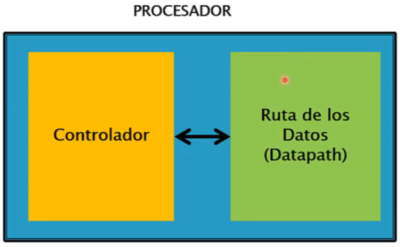

Diseño RTL

# Register Transfer Level

  
Es una métodología para diseñar principalmente procesadores.  
  

## Tipos de información de entradas y salidas

  
• Control: Son generalmente señales de 1 bit  
• Datos: Son señales de 1 o más bits  
  

## Arquitectura del procesador

  
  
  
En este diseño, todas las señales de control van al bloque Controlador y todas las señales de datos val al bloque Datapath.  
  
Ambos bloques se conectan internamente por las llamadas líneas de control.  
  

## Componentes del Datapath

  
• Registros  
• Sumadores  
• Comparadores  
• Contadores  
• Multiplicadores  
• Restadores  
• ALUs  
  

## Métodología RTL

  
1. Obtenga el [diagrama de estados de alto nivel](../../../6to%20Semestre/DLPs/Diseño%20RTL/Diagrama%20de%20estados%20de%20alto%20nivel.md).  
2. Genere la ruta de los datos ([datapath](../../../6to%20Semestre/DLPs/Diseño%20RTL/Generar%20el%20Datapath.md)).  
3. [Conecte la ruta de los datos con el controlador](../../../6to%20Semestre/DLPs/Diseño%20RTL/Conectar%20el%20datapath%20con%20el%20controlador.md).  
4. Desarrolle la [máquina de estados del controlador](../../../6to%20Semestre/DLPs/Diseño%20RTL/Desarrollar%20la%20máquina%20de%20estados%20del%20controlador.md).  