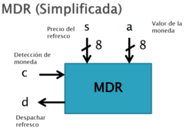
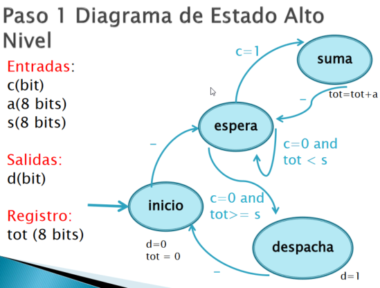

  
El siguiente ejemplo es siguiendo el caso de una maquina despachadora de refrescos simplificada.  
  
  

 [Índice](file:///C:/Users/Cori/Documents/Tareas/6to_semestre/DLPs/DLPs.ctb_HTML/index.html)