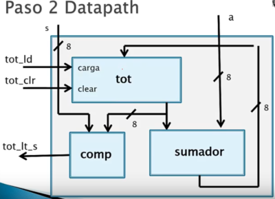

  
Donde se identifican los siguientes bloques:  
• tot Registro del total  
• sumador Bloque sumador  
• comp Bloque comparador  
  
Y las señales:  
▪ **tot****_****ld** señal de carga en total  
▪ **tot****_****clr** señal de borrar el total  
▪ **tot****_****lt****_****s** señal de menor que **s**  
▪ **s** señal de precio  
▪ **a** señal de valor de moneda

 [Índice](file:///C:/Users/Cori/Documents/Tareas/6to_semestre/DLPs/DLPs.ctb_HTML/index.html)