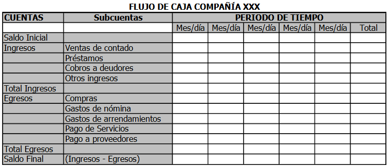

Flujo de caja

El flujo de caja muestra los ingresos y egresos comparados en un período de tiempo definido.

Sirve para **tomar decisiones** con estos datos entre **más detallado** se pueda hacer, la información será **más útil**, así si una cuenta se puede subdividir en sus componentes, así se debe hacer. Es de anotar, que el Flujo de Caja se hace de manera **anticipada**, es decir se realiza antes de que empiece a correr el período de tiempo para el cual se va a construir. La información se toma de lo conocemos o que podemos **predecir**, o sea, siempre vamos a saber que tenemos que pagar servicios, nómina, a proveedores, etc., y  sabemos que de donde provienen nuestros ingresos y sus cantidades (reales o estimadas).

El flujo de caja se hace de la siguiente manera:
