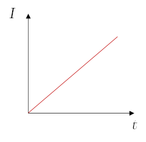

# Interés
El interés es la cantidad que debe pagar una persona por el uso del dinero tomado en **préstamo**.

## Fórmula del interés

$$
I = C\ t\ i
$$

Depende de 3 cosas:
* **Capital (C)**: Cantidad del prestamo [$\$$]
* **Plazo (t)**: Tiempo del prestamo [$s$]
* **Tasa de interés (i)** $\left[\dfrac{1}{s}\right]$

## Monto
Así pues, al final se debe pagar el dinero prestado más el interés generado por dicho préstamo:

$$
\begin{aligned}
M &= C + I\\
&= C + C\ t\ i\\
&= C(1 +  t\ i)
\end{aligned}
$$

Por lo tanto:

$$
M= C(1 +  t\ i)
$$

### Ejemplo
Si Chiricuto me presta $\$5000$ en un lapso de 1 més con una tasa del 12% semanal, cuánto le debería a Chiricuto al final del més y de cuánto fue el interés?

Primero realizamos las conversiones de tiempo necesarias:

$$
i = \left(\dfrac{0.12}{\text{año}}\right)\left(\dfrac{\text{año}}{12 \text{ méses}}\right) = \dfrac{0.01}{\text{més}}
$$

Por lo tanto:

$$
\begin{aligned}
M &= C(1 + t\ i) = (\$5000)\left[1 + (1 \text{ més})\left(\dfrac{0.1}{\text{més}}\right)\right]\\
&= \boxed{\$5500}
\end{aligned}
$$

Ahora se calcula el interés:

$$
\begin{aligned}
I &= M - C = \$5500 - \$5000\\
&= \boxed{\$500}
\end{aligned}
$$

## Clasificación
El interés se puede clasificar en **interés simple** e **interés compuesto**.

# Interés simple
Este ocurre cuando los intereses que se pagan al acreedor en cada lapso convenido no se incorporan al capital. Esto quiere decir que el capital siempre es el mismo.

## Ejemplo
En el ejemplo anterior, Chiricuto me presta $\$5000$ cada més y por la tasa de interés, se generan $\$500$ de interés al final del més.

Si Chiricuto me sigue prestando $\$5000$ pero ahora por dos méses se generaríá un interés simple:

$$
\begin{aligned}
I_1 &= C\ t_1\ i = (\$5000)(1 \text{ més})\left(\dfrac{0.1}{\text{més}}\right) = \$500\\
\\
I_2 &= C\ t_2\ i = (\$5000)(2 \text{ més})\left(\dfrac{0.1}{\text{més}}\right) = \$1000\\
\end{aligned}
$$

El interés aumentó al doble porque el tiempo del prestamo es el doble, es decir, se sigue una relación lineal.

Si $C=\text{cte}$ y $i=\text{cte}$

Entonces:

$I(t) = C\ t\ i$

# Interés compuesto
Este se da cuando los intereses se abonan al capital en lugar de regresarlos al acreedor.

## Ejemplo
En el ejemplo del interés simple, Chiricuto me presta $\$5000$ cada més y yo se los devuelvo junto con el interés que generan; $\$500$ por més porque siempre le devuelvo el dinero al final del més. Y luego Chiricuto me los vuelve a prestar para el siguiente més.

Pero si no puedo pagar un més, entonces Chiricuto me dice que puedo pagarle hasta el siguiente, pero **se abona el interés al capital**; es decir, es como si ahora me hubiera prestado $\$5000$ + $\$500$ = **$\$5500$**.

Por lo tanto al final del més el interés que tendre que pagar es el siguiente:

$$
\begin{aligned}
I_2 &= C_2\ t\ i = (\$5500)(1 \text{ més})\left(\dfrac{0.1}{\text{més}}\right)\\
&= \boxed{\$550}
\end{aligned}
$$

Supongamos ahora que no puedo pagarle de nuevo, entonces volvemos a quedar en lo mismo, por lo tanto, al final del segundo més tendré que pagar lo siguiente de interés:

$$
\begin{aligned}
I_3 &= C_3\ t\ i = (\$6050)(1 \text{ més})\left(\dfrac{0.1}{\text{més}}\right)\\
&= \boxed{\$605}
\end{aligned}
$$

## Fórmula del interés compuesto
Si se hace el análisis general:
hora el capital actual se calcula con el interes del més pasado.

$$
\begin{aligned}
C_{1}&= C_0 + C_0\ i = C_0(1+i)\\
C_{2}&= C_1 + C_1\ i = C_1(1+i) = C_0(1+i)^2\\
C_{3}&= C_2(1+i) = C_0(1+i)^3\\
&\phantom{=}\vdots\\
C_{n}&= C_0(1+i)^n\\
\end{aligned}
$$

Por lo que el interés compuesto se calcula de la siguiente forma:

$$
I_n = C_0(1+i)^n\ t \ i
$$

Por ende la curva que se obtiene no es lineal y crece muy rápido.
