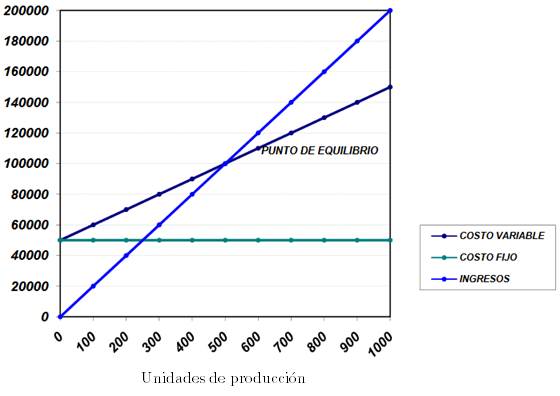

# Hernández Jiménez Daniel - 3MM3

El análisis de equilibrio es una técnica de uso muy generalizado en la `planeación` de las utilidades, de las ventas y en consecuencia de la producción.

### Definición
El punto de equilibro es el volúmen de producción y ventas con el cual, el ingreso total compensa exactamente los costos totales.

Se basa en la ralacón entre los ingresos totales de la empresa y su costo total, según cambia la producción (suponiendo que se vende la totalidad de esta).

### Utilidad
Sirve para:
* Determinar el nivel de operaciones necesario para cubrir todos los costos relativos a estas
* Evaluar la rentabilidad de los diversos niveles de producción y ventas
* Planear la producción
* Planear las ventas
* Planear resultados antes y después de ISR y PTU
* Controlar costos
* Tomar decisiones

# Fórmula del Punto de Equilibrio $P.E.$

$$
P.E. = \dfrac{C.F.}{1 - \dfrac{C.V.}{V.T.}}
$$

Donde:
$C.F.$ = Costos Fijos
$C.V.$ = Costos Variables
$V.T.$ = Ventas totales

## Ejemplo
Una empresa pide determinar el punto de equilibrio a partir de la siguiente información.

| Unidades producidas vendidas | costos fijos totales |  Costos variables totales  |  Costo total  |  Ingreso total  |  Resultado de la operación  |
|------------------------------|----------------------|----------------------------|---------------|-----------------|-----------------------------|
| 100                          |  $50,000.00          |  $10,000.00                |  $60,000.00   |  $20,000.00     | -$40,000.00                 |
| 200                          |  $50,000.00          |  $20,000.00                |  $70,000.00   |  $40,000.00     | -$30,000.00                 |
| 300                          |  $50,000.00          |  $30,000.00                |  $80,000.00   |  $60,000.00     | -$20,000.00                 |
| 400                          |  $50,000.00          |  $40,000.00                |  $90,000.00   |  $80,000.00     | -$10,000.00                 |
| 500                          |  $50,000.00          |  $50,000.00                |  $100,000.00  |  $100,000.00    |  $-                         |
| 600                          |  $50,000.00          |  $60,000.00                |  $110,000.00  |  $120,000.00    |  $10,000.00                 |
| 700                          |  $50,000.00          |  $70,000.00                |  $120,000.00  |  $140,000.00    |  $20,000.00                 |
| 800                          |  $50,000.00          |  $80,000.00                |  $130,000.00  |  $160,000.00    |  $30,000.00                 |
| 900                          |  $50,000.00          |  $90,000.00                |  $140,000.00  |  $180,000.00    |  $40,000.00                 |
| 1000                         |  $50,000.00          |  $100,000.00               |  $150,000.00  |  $200,000.00    |  $50,000.00                 |

Graficando estos valores:

Podemos determinar el punto de equilibrio de la siguiente forma:
Se determina la pendiente entre $C.V.$ y $V.T.$ utilizando cualquiera de los puntos:

$$
\dfrac{C.V.}{V.T.} = \dfrac{100,000}{200,000} = \dfrac{10,000}{20,000} = 0.5
$$

Ahora utilizando la fórmula:

$$
P.E. = \dfrac{C.F.}{1 - \dfrac{C.V.}{V.T.}} = \dfrac{50,000}{1 - 0.5} = 100,000
$$

Por lo tanto, el punto de equilibrio se logra en **500** unidades producidas y vendidas.