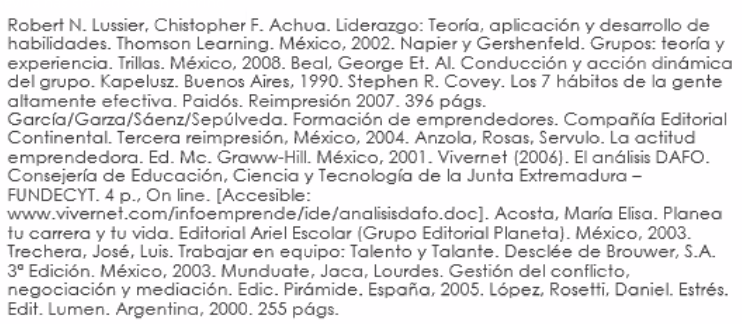

# Contacto
Profesora: REVILLA CUEVAS LAURA ADRIANA
Correo: ladrirec@gmail.com
Teléfono: 5527658706
Grupo: 2MV12
Zoom ID: 952 852 3817
Zoom Passcode: 590288
https://zoom.us/j/9528523817?pwd=V3ZuOFU5NlF0WVc2N0VIbEZsbktqQT09

# Temario
1. Liderazgo.
2. Desarrollo de habilidades intra e interpersonales.
3. El emprendedor.
4. Trabajo en equipo.
5. Conflicto de negociación.

# Evaluación
|||
|---|---|
|Exposición individual|25%|
|Participación en dinámicas|20%|
|Mapas conceptuales|10%|
|Reportes de ejercicios de autoevaluación|30%|
|Registro de participación en video clases|15%|
||100%|

# Reglas
* Todas las tareas que se suban, deben tener referencias.

# Bibliografía
