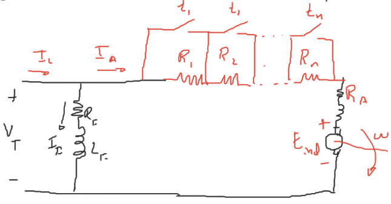
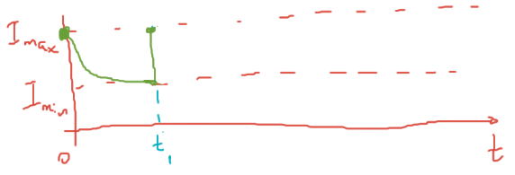

Para que al arranque los picos de corriente no sean muy elevados, se utiliza un circuito que arranca el motor paulatinamente y no de golpe.

# Diseño de arrancadores para motores de c.c.

$$
R_{T} = R_1 + R_2 + \ldots + R_n + R_A
$$

En $t=0$, $\omega=0$

$$
E_{ind} = K\Phi\omega = V_T-R_T I_{máx}\\
$$

$$
\Rightarrow R_T = \dfrac{V_T}{I_{máx}}
$$

En $t=t_1$, (antes de que el primer interruptor se cierre).

$$
E_{ind} = V_T-R_T I_{mín}\\
$$

En $t=t_1$, (en el momento que se cierra el interruptor).

$$
E_{ind} = V_T-(R_T-R_1) I_{máx}\\
$$

Igualando:

$$
R_T I_{mín} = (R_T-R_1)I_{máx}
$$

$$
\Rightarrow \dfrac{R_T}{R_T-R_1}=\dfrac{I_{máx}}{I_{mín}}
$$

En $t=t_2$:

$$
\begin{cases}
E_{ind} = V_T - (R_T-R_1)I_{mín}\\
E_{ind} = V_T - (R_T-R_1-R_2)I_{máx}\\
\end{cases}\\
$$

$$
\Rightarrow \dfrac{R_T-R_1}{R_T-R_1-R_2}=\dfrac{I_{máx}}{I_{mín}}
$$

Por lo tanto en $t=t_n$:

$$
\begin{cases}
E_{ind} = V_T - (R_T-R_1-R_2-\ldots-R_{n-1})I_{mín}\\
E_{ind} = V_T - (R_T-R_1-R_2-\ldots-R_{n-1}-R_n)I_{máx}\\
\end{cases}\\
$$

$$
\Rightarrow \dfrac{R_T-R_1-R_2-\ldots-R_{n-1}}{R_T-R_1-R_2-\ldots-R_{n-1}-R_n}=\dfrac{I_{máx}}{I_{mín}}=\dfrac{R_T-R_1-R_2-\ldots-R_{n-1}}{R_A}
$$

Si multiplicamos todas las relaciones:

$$
\newcommand{\p}[1]{\left(#1\right)}
\p{\dfrac{R_T}{\cancel{R_T-R_1}}}\p{\dfrac{\cancel{R_T-R_1}}{\cancel{R_T-R_1-R_2}}}\ldots\p{\dfrac{\cancel{R_T-R_1-\ldots-R_{n-1}}}{R_T-R_1-\ldots-R_n}}=\p{\dfrac{I_{máx}}{I_{mín}}}^n
$$

Por lo tanto

$$
\newcommand{\p}[1]{\left(#1\right)}
\dfrac{R_T}{R_T-R_1-\ldots-R_n}=\dfrac{R_T}{R_A}=\p{\dfrac{I_{máx}}{I_{mín}}}^n
$$

Donde $n$ es el número de secciones del arrancador.