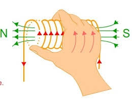

La dirección de la corriente se conoce usando la convención de la mano derecha.

Se utilizan núcleos magnéticos para concentrar el flujo magnético en formas deseadas y poder redirigirlo.

# Propiedades magnéticas del núcleo
Las propiedades magnéticas del material se definen en función de la magnetización $M [\frac{A}{m}]$ y la intensidad de campo magnético $H [\frac{A\ vuelta}{m}]$. Las unidades son así porque la magnetización depende intrínsecamente solo del material, mientras que la intensidad de campo también depende de la confuguración.

# Circuitos magnéticos
Para aplicaciones magnéticas, en donde se requiere generar fuerzas de carácter megnéticas, es conveniente por su practicidad, estudiar los problemas como circuitos.

## Fuerza magnetomotriz ($f_m$)($\mathcal{F}$)

$$\mathcal{F}=NI=\oint H\cdot d$$

## Semejanzas circuitos eléctricos - circuitos magnéticos

| Eléctrico                                                                                                                                                         | Magnético                                                                                                                                                                             |
|-------------------------------------------------------------------------------------------------------------------------------------------------------------------|---------------------------------------------------------------------------------------------------------------------------------------------------------------------------------------|
| $\sigma$ Conductividad                                                                                                                                            | $\mu$ Permeabilidad $\left[\dfrac{H}{m}\right]$                                                                                                                                       |
| $E$ Intensidad de campo                                                                                                                                           | $H$ Intensidad de campo $\left[\dfrac{Av}{m}\right]$                                                                                                                                  |
| $\mathrm{I}=\iint\vec{J}\cdot d\vec{s}$ Corriente                                                                                                                 | $\Phi=\iint \vec{B}\cdot d\vec{s}$ Flujo magnético [$Wb$]                                                                                                                             |
| $J=\dfrac{I}{s}=\sigma E$ Densidad de corriente                                                                                                                   | $B=\dfrac{\Phi}{s}=\mu H$ Densidad de flujo [$T$]                                                                                                                                     |
| $V$($fem$) Fuerza electromotriz                                                                                                                                   | $\mathcal{F}$ Fuerza magnetomotriz [$A$]                                                                                                                                              |
| $R$ Resistencia                                                                                                                                                   | $\mathcal{R}$ Reluctancia [$H^{-1}$]                                                                                                                                                  |
| $G=\dfrac{1}{R}$ Conductancia                                                                                                                                     | $\mathcal{P}=\dfrac{1}{\mathcal{R}}$ Permeancia [$H$]                                                                                                                                 |
| Ley de Ohm: $$\displaystyle\left\{\begin{aligned}R&=\dfrac{V}{\mathrm{I}}=\dfrac{l}{\sigma s}\\V&=\mathrm{I}R=El\end{aligned}\right.$$                            | Ley de Ohm: $$\displaystyle\left\{\begin{aligned}\mathcal{R}&=\dfrac{\mathcal{F}}{\Phi}=\dfrac{l}{\mu s}\\\mathcal{F}&=\mathcal{\Phi}\mathcal{R}=Hl=N\mathrm{I}\end{aligned}\right.$$ |
| Ley de Kirchoff: $$\displaystyle\left\{\begin{aligned}\Sigma\mathrm{I}&=0 \leftarrow Nodo\\\Sigma V -\Sigma R\mathrm{I}&=0 \leftarrow Malla\end{aligned}\right.$$ | Ley de Kirchoff: $$\displaystyle\left\{\begin{aligned}\Sigma\Phi&=0 \leftarrow Nodo\\\Sigma \mathcal{F} -\Sigma \mathcal{R}\Phi&=0 \leftarrow Malla\end{aligned}\right.$$             |
