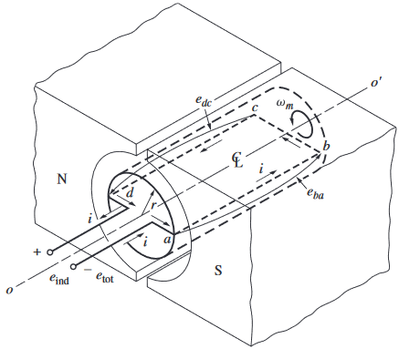
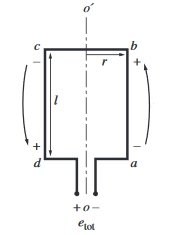
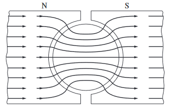
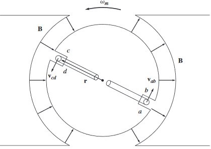
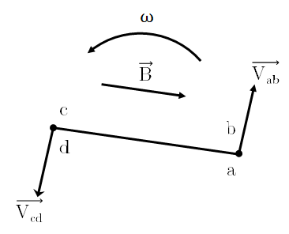
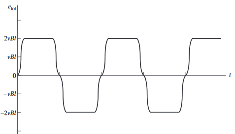
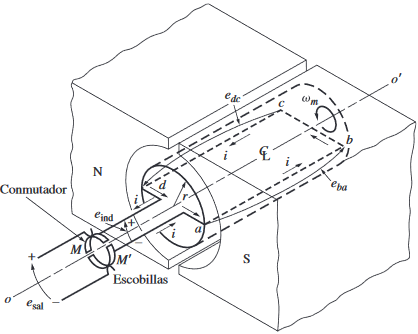
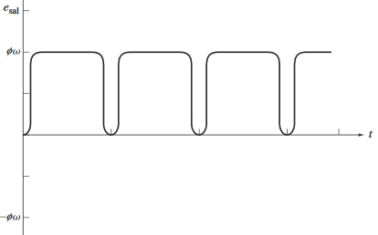
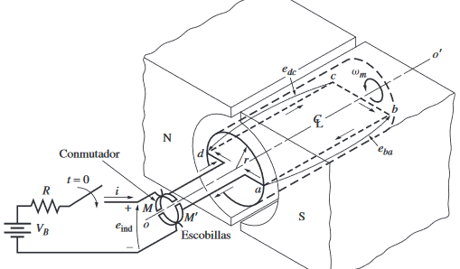
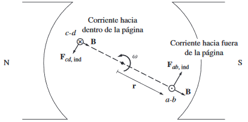

# Espira giratoria simple entre caras polares curvas
 
El flujo magnético fluye de la siguiente manera:

## Tensión inducida

$$
e_{ind}=e_{dc}+e_{bc}+e_{ba}+e_{ad}
$$

### Segmentos ab y cd

$$
\begin{aligned}
e_{ba}&=(\vec{v}\times \vec{B})\cdot \vec{l}\\
&= (-vB\hat{e}_z)\cdot(-l\hat{e}_z)\\
&= vBl\\
\\
e_{dc}&=(\vec{v}\times \vec{B})\cdot \vec{l}\\
&= vB\hat{e}_z\cdot l\hat{e}_z\\
&= vBl
\end{aligned}
$$

### Segmentos bc y da

$$
\begin{aligned}
e_{bc}&=(\vec{v}\times \vec{B})\cdot \vec{l}\\
&= [\pm vB\hat{e}_z]\cdot(l\hat{e}_\phi)\\
&= 0\\
\end{aligned}
$$

Analogamente pasa lo mismo con el segmento da.
### Tensión inducida total
Por lo tanto la tensión inducida total será:

$$
\begin{aligned}
e_{ind}&=e_{dc}+e_{bc}+e_{ba}+e_{ad}\\
&=vBl+0+vBl+0\\
&=2vBl\\
&=2r\omega Bl\\
&=2r\omega \frac{\Phi}{A}l\\
&=2r\omega \frac{\Phi}{\pi rl}l\\
&=\frac{2}{\pi}\omega \Phi\\
\end{aligned}
$$

Por lo tanto:

$$
e_{ind}=\frac{2}{\pi}\omega \Phi\\
$$

Donde:
$\Phi$=Flujo que pasa a través de la espira ($\phi=0$)

La señal de salida que genera es la siguiente:

## Conversión a tensión de c.d.
Como una manera de lograr eso, sólo se ocupa un `conmutador`.

El conmutador; que son dos segmentos conductores semicirculares, en conjunto con las escobillas; que son contactos fijos separados a un cierto ángulo tal que, en el instante en que la tensión en la espira es cero, los contactos hacen que los dos elementos queden en corto circuito.

De esta manera, cada vez que la tensión cambia de dirección, los contactos también cambian de conexión.

## Par inducido en la espira giratoria
Supongamos ahora que se conecta una bateria:

Las ecuaciones que se utilizan para analizar cada segmento es la siguiente:

$$
\vec{F}=i(\vec{l}\times \vec{B})\\
\phantom{a}\\
\vec{\tau}=\vec{r}\times\vec{F}
$$

### Segmento ab

$$
\begin{aligned}
\vec{F}_{ab}&=i(l\hat{e}_z\times B\hat{e}_{\rho})\\
&=ilB\hat{e}_{\phi}
\end{aligned}
$$

Por lo tanto

$$
\begin{aligned}
\vec{\tau}&=r\hat{e}_{\rho}\times ilB\hat{e}_{\phi}\\
&=rilB\hat{e}_{z}
\end{aligned}
$$

### Segmento bc y da

$$
\begin{aligned}
\vec{F}_{bc}&=i(l\hat{e}_{\rho}\times B\hat{e}_{\rho})\\
&=0
\end{aligned}
$$

Analogamente pasa lo mismo con el segmento da
### Segmento cd

$$
\begin{aligned}
\vec{F}_{ab}&=i(-l\hat{e}_z\times B\hat{e}_{\rho})\\
&=-ilB\hat{e}_{\phi}
\end{aligned}
$$

Por lo tanto

$$
\begin{aligned}
\vec{\tau}&=(-r\hat{e}_{\rho})\times (-ilB\hat{e}_{\phi})\\
&=rilB\hat{e}_{z}
\end{aligned}
$$

### Par total inducido

$$
\begin{aligned}
\vec{\tau}_{ind}&=\vec{\tau}_{dc}+\vec{\tau}_{bc}+\vec{\tau}_{ba}+\vec{\tau}_{ad}\\
&=rilB\hat{e}_z+0+rilB\hat{e}_z+0\\
&=2rilB\hat{e}_z\\
&=2ril(\dfrac{\phi}{A})\hat{e}_z\\
&=2ril\dfrac{\phi}{\pi r l}\hat{e}_z\\
&=\dfrac{2}{\pi}\phi\ i\ \hat{e}_z\\
\end{aligned}
$$

Por lo tanto:

$$
\vec{\tau}=\dfrac{2}{\pi}\phi\ i\ \hat{e}_z\\
$$
