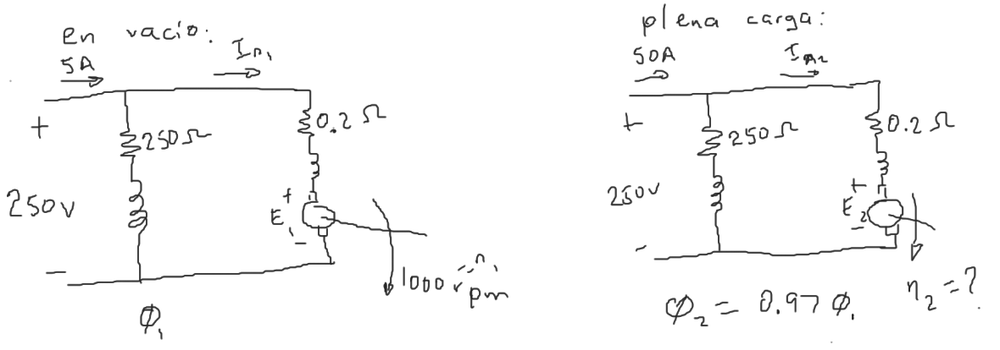

# Ejercicio 1
Un motor tipo derivación de 250 V gira en vacío a 1000 rpm y absorbe una corriente de 5 A. La resistencia total del inducido es de 0.2 Ω y la del campo en derivación de 250 Ω. Calcular la velocidad cuando esté cargado y tome una corriente de 50 A, sabiendo que la reacción del inducido debilita el campo un 3 %.

$$
\begin{aligned}
\dfrac{E_1}{E_2}=\dfrac{\cancel{\bar{K}}\Phi_1\ n_1}{\cancel{\bar{K}}\Phi_2\ n_2}=\dfrac{\Phi_1\ n_1}{\Phi_2\ n_2}
\end{aligned}
$$

De las mallas:

$$
\begin{aligned}
\dfrac{E_1}{E_2}= \dfrac{250 - 0.2I_{A1}}{250 - 0.2I_{A2}}
\end{aligned}
$$

Se obtiene ahora las corrientes:

$$
I_F = \dfrac{V_F}{R_F} = \dfrac{250}{250} = 1A
$$

$$
I_{A1} = 5 A - I_F = 4A\\
I_{A2} = 50 A - I_F = 49A\\
$$

Por lo tanto:

$$
\begin{aligned}
\dfrac{E_1}{E_2}&= \dfrac{250 - 0.2(4)}{250 - 0.2(49)} = \dfrac{1246}{1201}\\
n_2&=\dfrac{\Phi_1 n_1 E_2}{\Phi_2 E_1} = 
\end{aligned}
$$
