Máquinas de corriente continua

Compuesta por:
* `Rotor`: Se encarga de realizar la **conversión** de energía **electromecánica**. También se le conoce como `Armadura` o `Inducido`.
* `Estator`: Se utiliza para **generar** el **campo magnético**. También se le conoce como `Devanado de campo` o `Inductor`.

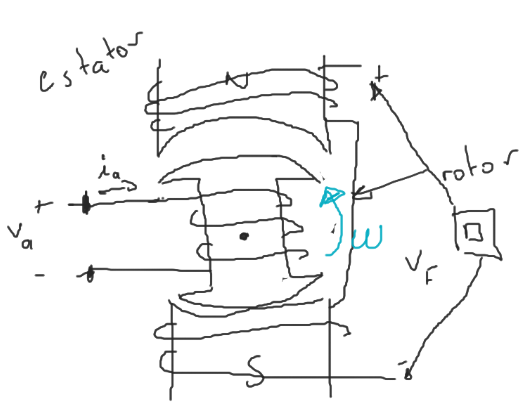

# Modelo (circuito eléctrico equivalente)
|Estator|Rotor|
|---------|---------|
|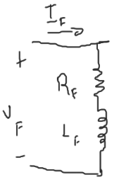|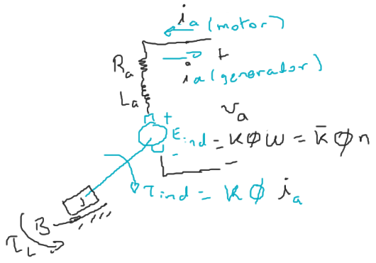|

|Motor|Generador|
|-----|---------|
|$T_{ind}=T_L+B\omega$|$T_L=T_{ind}+B\omega$|
|$T_{ind} > T_L$|$T_L > T_{ind}$|
|$V_a > E_{ind}$|$E_{ind} > V_a$|

Las pérdidas en el núcleo se determinan a partir de la prueba en vacío (sin carga).

La conversión de energíá electromecánica:

$$
E_{ind}\ i_a=T_{ind}\ \omega
$$

# Regulación de la velocidad (RV):

$$RV=\dfrac{n_{vacío}-n_{pc}}{n_{pc}}\times100\$$
$

# Tipos de máquinas de C.C.
* Nota: Las variables en estado estacionario se muestran en mayúsculas y las del estado transitorio en minúsculas.
## Excitación `separada`.
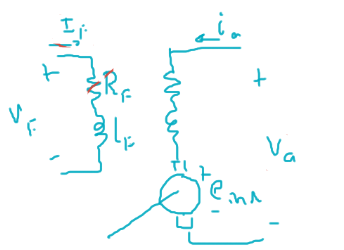

$$
\newcommand{\dpartial}[2]{\dfrac{\partial#1}{\partial#2}}
\newcommand{\derivate}[2]{\dfrac{d#1}{d#2}}

\begin{cases}
V_F=R_F I_F+L_F\cancel{\derivate{I_F}{t}}^0\\
V_a=R_a i_a+L_a\cancel{\derivate{i_a}{t}}^0+e_{ind}
\end{cases}
$$

En el estado estacionario.

$$
\begin{cases}
V_F=R_F I_F\\
V_a=R_a I_a+E_{ind} = R_a I_a+K\Phi\omega
\end{cases}
$$

Por lo tanto, para controlar su velocidad:

$$
\omega=\dfrac{V_a-R_a I_a}{K\Phi}
$$

Se puede:
* Control por `tensión`: Variar la tensión de armadura $V_a$
* Control de `campo`: Variando el valor del campo $\Phi$
* Control por `demanda de par`: Variando el valor de la corriente de armadura $I_a$

## Exitación en `derivación` (`paralelo`, `shunt`).
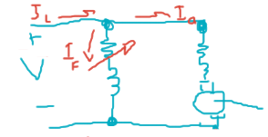

$$
\begin{aligned}
I_L&=I_a+I_F\\
V_a&=V
\end{aligned}
$$

## Exitación en `serie`.

$$
E_{ind} = V - (R_F + R_A) I
$$

Para circuito magnético lineal o no saturado.

$$
\phi = c I\quad,\quad c = cte.
$$

$$
\begin{aligned}
E_{ind} &= K\phi\omega = K c I \omega\\
&= K_v I \omega\\
\end{aligned}
$$

Donde:
$K_v$ = Constante de tensión $[\dfrac{V}{A\  rad/s}]$

$$
\tau_{ind} = K\phi I= K c I I = K_t I^2\\
$$

Donde:
$K_t$ = Constante de par $[\dfrac{N m}{A^2}]$
Sustituyendo $E_{ind}$:

$$
K_v I \omega = V - (R_F + R_A) I\\
$$

$$
I = \sqrt{\dfrac{\tau_{ind}}{K_t}}
$$

Por lo tanto:

$$
\omega = \dfrac{V}{\sqrt{K_v}}\dfrac{1}{\sqrt{\tau_{ind}}} - \dfrac{(R_F + R_A)}{K_v}\\
$$

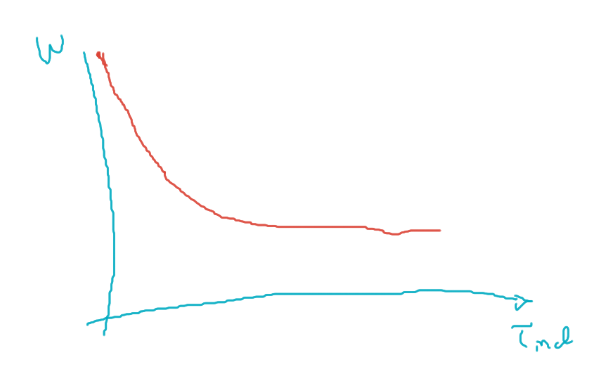

## Exitación de `imanes permanentes`.

# Ejercicios
Los ejercicios 1 al 5 se refieren al motor conectado en derivación con las siguientes características.
|||
|-|-|
|$P_{\text{nominal}}=15\ hp$|$I_{L\text{nominal}}=55 A$|
|$V_T=240V$|$n_\text{nominal}=1200\ rpm$|
|$100 \leq R_\text{ajustable} \leq 400 \Omega$|
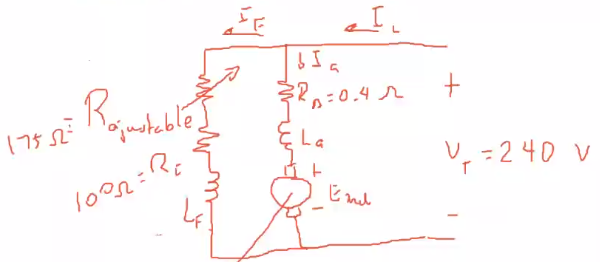
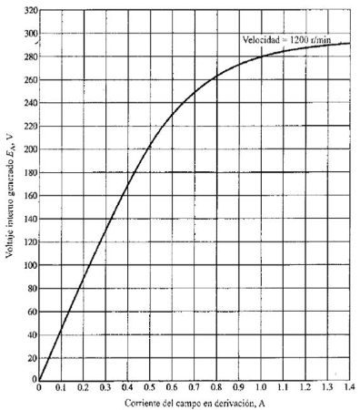
## Ejercicio 1
Si $R_{\text{ajustable}}= 175\Omega$, ¿cuál es la velocidad de rotación del motor en condiciones de vacío $n_{\text{vacío}}$?

$$
E_{ind}=K\Phi \omega = \bar{K}\Phi n\\
$$

$$
\begin{aligned}
I_F &= \dfrac{V_T}{R_{\text{ajustable}}+R_I}=\dfrac{240}{175+100}\\
&=0.87A
\end{aligned}
$$

$$
I_F = 0.87 \xRightarrow{curva}\begin{cases}
E_{ind}=275 V\\
n = 1200\ rpm
\end{cases}
$$

En vacio:

$$\boxed{I_a=0$$
$

$$\boxed{E_\text{vacío}=V_T=240V$$
$

$$
\boxed{\dfrac{E_{ind}}{E_\text{vacío}}=\dfrac{\cancel{\bar{K}\Phi}\ n}{\cancel{\bar{K}\Phi}\ n_\text{vacío}}}
$$

Por lo tanto:

$$
\newcommand{\result}[1]{\underline{#1/}}
\begin{aligned}
n_\text{vacío}&=\dfrac{n E_\text{vacío}}{E_{ind}}=\dfrac{1200\ rpm(240 V)}{275 V}\\
&=\result{1047\ rpm}
\end{aligned}
$$

## Ejercicio 2
 Si no existe reacción del inducido, ¿cuál es la velocidad del motor a plena carga? ¿cuál es la regulació́n de velocidad del motor? ¿cuál es la curva de velocidad - par del motor?
 

$$\dfrac{E_{ind}}{E_{pc}}=\dfrac{\bar{K}\phi n}{\bar{K}\phi n_{pc}}=\dfrac{n}{n_{pc}}\ldots($$
$$
 
 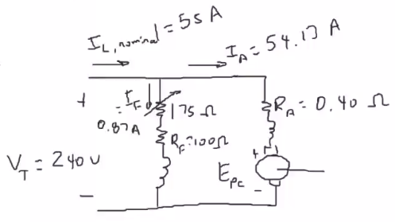
 
 

$$I_L = I_A + I_F\quad\Rightarrow\quad I_A = 54.1$$
$$
 

$$\boxed{\begin{matrix}I_L\approx I_F\\I_A\approx0\end{matrix}\quad \text{vacío$$
$$
 

$$\boxed{
 \begin{matrix}
 I_L\approx I_A\\
 I_F \ll I_A
 \end{matrix}\quad \text{plena carga}
 }$$

 
 Aplicando LVK:
 

$$
 V_T=R_AI_A + E_{pc}\\
 \begin{aligned}
 E_{pc}&= V_T -R_AI_A=240-0.4(53.13)\\
 &=218.34V
 \end{aligned}
 $$

$$
I_F = 0.87A \xRightarrow{curva}\begin{cases}
E_{ind}=275 V\\
n = 1200\ rpm
\end{cases}
$$

Sustituyendo en (1):

$$
\newcommand{\result}[1]{\underline{#1/}}
n_{pc}=\dfrac{1200(218.34)}{275}=\result{953\ rpm}
$$

Del ejercicio 2, sabemos que $n_{vacío}=1047\ rpm$

$$
\newcommand{\result}[1]{\underline{#1/}}
RV=\dfrac{1047 - 953}{953}\times100\%=\result{9.68\%}
$$

$$
V_T= R_AI_A + E_{ind}=R_AI_A+K\phi\omega
$$

$$
\omega=\dfrac{V_T}{K\phi}-\dfrac{R_AI_A}{K\phi}\ldots(2)
$$

$$\tau_{ind}=K\phi I_A$$

$$I_A=\dfrac{\tau_{ind}}{K\phi I_A}\ldots(3$$
$
Sustituyendo (3) en (2):

$$
\omega=\dfrac{V_T}{K\phi}-\dfrac{R_A\tau_{ind}}{(K\phi)^2}\quad\leftarrow\quad\text{curva par - velocidad}
$$

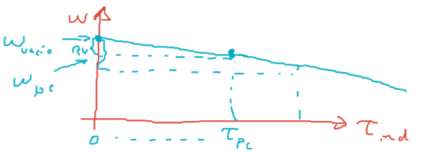

## Ejercicio 3
Si el motor está operando a plena carga y su resistencia variable se aumenta a 250 Ω?, ¿cuál es la nueva velocidad del motor, RV, $n_{vacío}$?
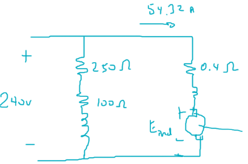
En el vacio:

$$\boxed{\begin{matrix}I_L\approx I_F\\I_A\approx0\end{matrix}\quad \text{vacío}$$
$

$$I_F=\dfrac{240}{250+100}=0.68$$
$

$$
I_F = 0.68A \xRightarrow{curva}\begin{cases}
E_{ind}=248 V\\
n = 1200\ rpm
\end{cases}
$$

$$V_T=E_{vacío}=240V$$

$$\dfrac{E_{ind}}{E_{vacío}}=\dfrac{n}{n_{vacío}$$
$

$$
\newcommand{\result}[1]{\underline{#1/}}
n_{vacío}=\dfrac{E_{vacío}n}{E_{ind}}=\result{1161\ rpm}
$$

Con plena carga:

$$
I_L=55A,\quad I_F=0.68A\quad\Rightarrow\quad I_A=54.32A
$$

$$
E_{pc}= V_T -R_AI_A=240-0.4(54.32)=218.27V\\
$$

$$\dfrac{E_{ind}}{E_{pc}}=\dfrac{n}{n_{pc}}$$

$$
\newcommand{\result}[1]{\underline{#1/}}
n_{pc}=\dfrac{E_{pc}n}{E_{ind}}=\result{1056\ rpm}
$$

$$
\newcommand{\result}[1]{\underline{#1/}}
RV=\dfrac{1047 - 953}{953}\times100\%=\result{9.9\%}
$$

## Ejercicio 4
Si la resistencia variable puede ser ajustada de 100 a 400 Ω?, ¿cuáles son las velocidades máxima y mínima de estemotor en vacío y a plena carga?
### Con $R_{ajustable}= 400Ω$
En el vacio:

$$\boxed{\begin{matrix}I_L\approx I_F\\I_A\approx0\end{matrix}\quad \text{vacío}$$
$

$$I_F=\dfrac{240}{400+100}=0.48$$
$

$$
I_F = 0.48A \xRightarrow{curva}\begin{cases}
E_{ind}=198 V\\
n = 1200\ rpm
\end{cases}
$$

$$V_T=E_{vacío}=240V$$

$$
\newcommand{\result}[1]{\underline{#1/}}
n_{vacío}=\dfrac{E_{vacío}n}{E_{ind}}=\result{1454\ rpm}
$$

Con plena carga:

$$
I_L=55A,\quad I_F=0.48A\quad\Rightarrow\quad I_A=54.52A
$$

$$
E_{pc}= V_T -R_AI_A=240-0.4(54.52)=218.19\\
$$

$$
\newcommand{\result}[1]{\underline{#1/}}
n_{pc}=\dfrac{E_{pc}n}{E_{ind}}=\result{1322\ rpm}
$$

$$
\newcommand{\result}[1]{\underline{#1/}}
RV=\dfrac{1047 - 953}{953}\times100\%=\result{9.98\%}
$$

### Con $R_{ajustable}= 100Ω$
En el vacio:

$$\boxed{\begin{matrix}I_L\approx I_F\\I_A\approx0\end{matrix}\quad \text{vacío}$$
$

$$I_F=\dfrac{240}{100+100}=1.2$$
$

$$
I_F = 1.2A \xRightarrow{curva}\begin{cases}
E_{ind}=288 V\\
n = 1200\ rpm
\end{cases}
$$

$$V_T=E_{vacío}=240V$$

$$
\newcommand{\result}[1]{\underline{#1/}}
n_{vacío}=\dfrac{E_{vacío}n}{E_{ind}}=\result{1000\ rpm}
$$

Con plena carga:

$$
I_L=55A,\quad I_F=1.2A\quad\Rightarrow\quad I_A=53.8A
$$

$$
E_{pc}= V_T -R_AI_A=240-0.4(53.8)=218.48\\
$$

$$
\newcommand{\result}[1]{\underline{#1/}}
n_{pc}=\dfrac{E_{pc}n}{E_{ind}}=\result{910\ rpm}
$$

$$
\newcommand{\result}[1]{\underline{#1/}}
RV=\dfrac{n_{vacío}-n_{pc}}{n_{pc}}\times100\%=\result{9.89\%}
$$

## Ejercicio 5
¿Cuál es la corriente de arranque de esta máquina, si arranca conectándola directamente a VT. Comparar esta corriente de arranque con la corriente nominal del motor.
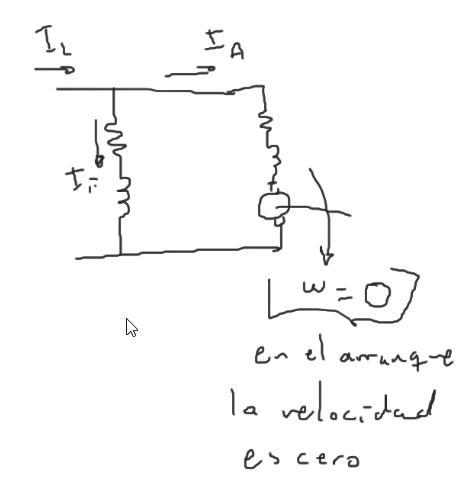

$$
\begin{aligned}
V_T&=R_AI_A + E_{ind}\\
&=R_AI_A + K\phi\cancel{\omega}\\
\end{aligned}
$$

$$
\newcommand{\result}[1]{\underline{#1/}}
I_{A, Arranque}=\dfrac{V_T}{R_A}=\dfrac{240}{0.4}=\result{600A}
$$

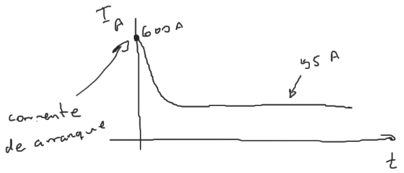

$$
I_{A,arranque}\gg I_F\\
\therefore\ I_{A,arranque}=T_{L,arranque}=I_{arranque}
$$

$$
\newcommand{\result}[1]{\underline{#1/}}
\dfrac{I_{arranque}}{I_{nominal}}=\dfrac{600}{55}=\result{10.9}
$$
