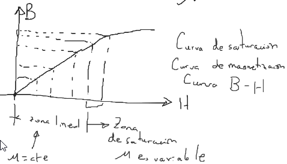

$M [\frac{A}{m}]$ es la magnetización y la intensidad de campo magnético $H [\frac{A\ vuelta}{m}]$.

Se define $\chi_m$ como la susceptibilidad magnética:

$$\tag{1}M=\chi_mH$$

Otra relación que se conoce es la siguiente:

$$B=\mu_0(H+M)\tag{2}$$

Donde:
$\mu_0$=Permeabilidad magnética del vacio.
$B$=Densidad de campo magnético $[\frac{Wb}{m^2}][T]$

Además:

$$\mu_0=4\pi\times10^{-7} \left[\frac{1}{H}\right]$$

$$\mu=\mu_r\mu_0$$

Sustituyendo (1) en (2):

$$B=\mu(H+\chi_mH)=\mu_0(1+\chi_m)H=\mu B$$

Esta es la relación lineal entre $B$ y $H$ para $\mu=cte.$

