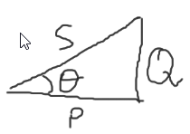

En la figura siguiente se muestra un transformador ideal, que se compone del devanado `primario` (alimentación) y el `secundario`.

# Relación de transformación $a$

La `relación de transformación` se define como:

$$
a = \dfrac{N_1}{N_2}
$$

Sin embargo, esto no es una forma práctica para poder calcularlo. Por eso en la práctica se utiliza lo siguiente:

$$
S_\text{entrada} = S_\text{salida}
$$

$S$ = Potencia aparente [$VA$]

$$
E_1I_1 = E_2I_2
$$

$$
\dfrac{E_1}{E_2} = \dfrac{I_2}{I_1}
$$

Por lo tanto:

$$
\boxed{a = \dfrac{N_1}{N_2} = \dfrac{I_2}{I_1} = \dfrac{E_1}{E_2}}
$$

Conociendo $a$, podemos conocer los valores del otro lado.

# Impedancia $Z$
Se define una `impedancia`:

$$
Z=\dfrac{E}{I}
$$

Por lo tanto:

$$
Z_2=\dfrac{E_2}{I_2}
$$

$$
\begin{aligned}
Z_1&=\dfrac{E_1}{I_1}=\dfrac{aE_2}{\dfrac{I_2}{a}}= a^2\dfrac{E_2}{I_2} = a^2Z_2\\
&=a^2(R_2+jX_2)
\end{aligned}
$$

# Modelo del transformador

Donde:
$R_1$ = Resistencia del primario [$\Omega$]
$X_1$ = Reactancia inductiva del primario [$\Omega$]
$R_2$ = Resistencia del secundario [$\Omega$]
$X_2$ = Reactancia inductiva del secundario [$\Omega$]
$X_m$ = Reactancia de magnetización.
$R_N$ = Representa las pérdidas en el núcleo (se determinan haciendo una `prueba al vacío`).

$$
X = \omega L = 2\pi f L
$$

Donde:
$f$ = Frecuencia eléctrica [Hz].

Para determinar de forma experimental las resistencias del primario o secundario se realiza la `prueba de corriente directa`.

Para determinar de forma experimental las reactancias se utiliza la `prueba de corto circuito`.

La tensíon inducida en el secundario $E_2$, se cálcula con la `Ley de Faraday`:

$$
E_2=N\dfrac{d\phi}{dt}
$$

## Potencia de entrada

$$
P_\text{entrada} = V_1 I_1 \cos{\theta}
$$

Donde:
$cos\theta = f.p. =$ Factor de potencia. 
### Factor de potencia

$$
\begin{cases}
f.p. > 1 & \text{Carga capacitiva}\\
f.p. = 1 & \text{En fase}\\
f.p. < 1 & \text{Carga inductiva}\\
\end{cases}
$$

En las industrias, el factor de potencia no puede ser menor a 0.8.
## Potencia aparente

$$
S_\text{aparente} = V_1 I_1 [VA]
$$

## Eficiencia de un transformador

$$
\eta = \dfrac{P_\text{salida}}{P_{entrada}}
$$

### Pérdidas en el devanado primario

$$
P_{DP} = |I_1|^2 R_1
$$

### Pérdidas en el núcleo

$$
P_\text{Núcleo} = \dfrac{|E_1|^2}{R_N}
$$

### Pérdidas en el devanado primario

$$
P_{DS} = |I_2|^2 R_2
$$

### Potencia de salida

$$
\begin{aligned}
P_\text{salida} &= |V_2||I_2|\cos{\theta_2}\\
&= P_\text{entrada} - P_{DP} - P_\text{Núcleo} - P_{DS}
\end{aligned}
$$

# Circuito equivalente referido al primario
