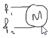

**Definición 1**. Una máquina eléctrica es un dispositivo que convierte energía eléctrica en energía mecánica y viceversa. Funciona por medio de campos magnéticos.

**Definición 2**. Una máquina eléctrica es un dispositivo que convierte un tipo de energía en otra, donde al menos una de ellas es eléctrica, y que funciona por medio de campos magnéticos.

# Clasificación de las maquinas eléctricas
* Estáticas
	* corriente alterna
		* Transformadores
			* monofásicos
			* trifásicos
			* distribución
			* potencia
			* autotransformador
* Rotatorias
	* corriente alterna
	* corriente continua

**Nota:** El transformador sólo funciona con corriente alterna, existen dispositivos de estado sólido que pueden hacer la operación de subida o bajada de tensión/corriente, sin embargo no operan con campos magnéticos y por lo tanto no son máquinas eléctricas.

## Máquinas eléctricas de corriente alterna
* Monofásicos (motores)
	* Inducción
	* Fase partida (dividida/hendida): Con rotor jaula de ardilla
	* Capacitor de arranque
	* Capacitor de aranque y marcha
	* Universal
* Trifásicos
	* Inducción (motores asíncronos)
		* Rotor jaula de ardilla
		* Rotor devanado
	* Síncronos
		* Imanes permanentes
		* Devanado de corriente contínua
		* Motor sin escobillas

## Máquinas eléctricas de corriente continua
* Excitación en derivación (Shunt)
* Excitación separada
* Excitación seria
* Excitación compuesta
* Imánes permanentes
* Universal

## Hilos
Los hilos se refieren a las fases con las que se alimentan el motor, una fase por cada línea, el neutro no cuenta.
* Monofásico
	* 1 hilo: 
	* 2 hilos: , se le sigue llamado *monofásico* y no *bifásico*, pues en realidad solo tiene más tensión, se utilizán dos fases diferentes para aumentarla:
Por ejemplo, $V=127\angle0\degree + 127\angle120\degree=220\angle-30\degree$
Pero al final del día, el motor ve una sola fase.
* Trifásico: 

## Conexiones trifásicas
Los motores y transformadores generalmente tienen una caja de conexión donde se puede conectar de distinta forma
### Delta
