# Aplicaciones de los motores de inducción
* **Compresores**.
* **Bombas**:  elevadoras  de  agua,  para  el  sistema  cloacal, para agua con tanque presurizado, para piscinas,  de  desagote  portátiles,  de  desagote  fijas, de pozo profundo.
* **Ascensores hidráulicos o eléctricos**
* **Escaleras mecánicas**
* **Acondicionadores   de   aire**:   equipos   centrales,   equipos individuales
* **Ventilación**
* **Rampas**
* **Portones automáticos**

Como  se  puede  apreciar  a  simple  vista,  estas  aplicaciones  comprenden  distintos  ámbitos,  como  pueden  ser:  edificios  de  propiedad  horizontal,  in-dustrias, hospitales, servicios, etc

# Motor de inducción trifásico o motor asíncrono trifásico
## Principio de funcionamiento
Este motor es alimentado por 3 tensiones de corriente alterna desfasadas 120º entre si. Lo que genera un campo magnético giratorio.
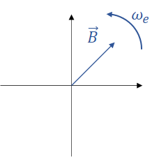
Al girar este el campo del estator, se genera un movimiento relativo entre el estator y el rotor. Como se ejerce en las barras del rotor, una fuerza magnetomotriz, ocasionada por el flujo variable de campo magnético, estas intentan seguir al campo del estator, haciendo que el rotor gire, persiguiendo al campo del estator.
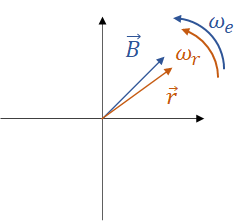
El rotor intenta seguir al campo en la misma dirección y velocidad, sin embargo, no logra alcanzarla nunca y son relativamente menores.

## Circuito equivalente
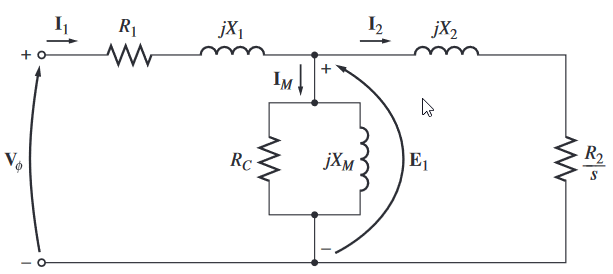
Donde:
$R_1$ = Resistencia del estator.
$X_1$ = Reactancia inductiva del estator.
$E_1$ = Tensión del primario (estator).

$$
E_1 = a E_R
$$

$V_\phi$ = Tensión (estator).
$I_2$ = Corriente referida del rotor.

$$
I_2 = \dfrac{I_R}{a_{ef}}
$$

$X_2$ = Reactancia inductiva referida del rotor.

$$
X_2 = a_{ef}^2X_{R0}
$$

$R_2$ = Resistencia referida del rotor.

$$
R_2 = a_{ef}^2R_{R}
$$

$R_C$ = Resistencia del núcleo.
$X_M$ = Reactancia del núcleo.
$a_{ef}$ = Relación efectiva de vueltas.
$X_{R0}$ = Reactancia del rotor en estado de bloqueo.

De manera general $R_N >> X_M$ por lo tanto el circuito se puede simplificar en algunos casos así:
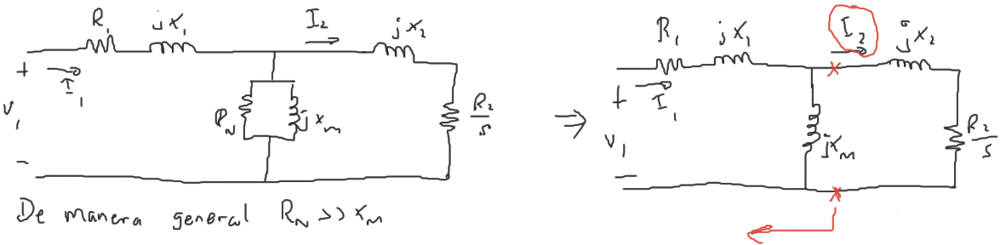
En este caso podemos sacer el circuito equivalente de Thevenin para el lado izqueirdo:

$$
V_{TH} = \dfrac{jX_M}{R_1+j(X_1+X_M)} V_{1}
$$

$$
Z_{TH} = \dfrac{jX_M(R_1 + jX_1)}{R_1 + j(X_1 + X_M)} = R_{TH} + jX_{TH}
$$

$$
I_2 = \dfrac{V_{TH}}{R_{TH} + \dfrac{R_2}{s}+j(X_{TH}+X_2)}
$$

## Conexiones
Se puede conectar en configuración `delta` $\Delta$ o `estrella` $Y$.
Una `tensión de línea` es aquella que se mide entre dos líneas.

Una `tensión de fase` se mide entre dos fases.

## Conexión estrella $Y$
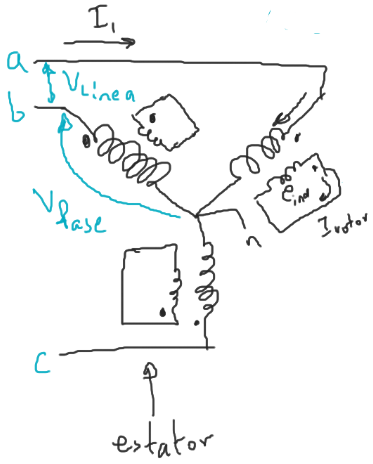
En esta configuración:

$$
\begin{aligned}
V_\text{fase} &= \dfrac{V_\text{línea}}{\sqrt{3}}\\
I_\text{fase} &= I_\text{línea}\\
\end{aligned}
$$

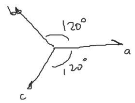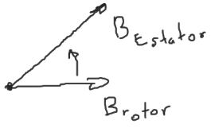
## Conexión delta $\Delta$
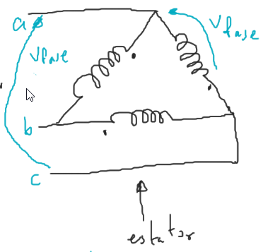
En esta configuración:

$$
\begin{aligned}
V_\text{fase} &= V_\text{línea}\\
I_\text{fase} &= \dfrac{I_\text{línea}}{\sqrt{3}}\\
\end{aligned}
$$

## Velocidad síncrona $n_\text{sinc}$
Es la velocidad con la que gira el el campo magnético del estator.

$$
n_\text{sinc} = \dfrac{120f}{p}
$$

Donde:
$f$ = Frecuencia eléctrica [Hz]
$p$ = Número de polos

La velocidad mecánica máxima que puede alcanzar un motor de inducción siempre será menor que la velocidad síncrona.

## Velocidad de deslizamiento
Es la diferencia entre la velocidad síncrona y la velocidad del motor (mecánica).

$$
n_\text{des} = n_\text{sinc} - n_m
$$

### Deslizamiento (S: Slip)

$$
S = \dfrac{n_\text{sinc}-n_m}{n_\text{sinc}} \times 100\%
$$

## Frecuencia en el rotor $f_r$
Es la frecuencia correspondiente a las corrientes del rotor.

$$
f_r = S f
$$

Donde:
$S$ = Deslizamiento.
$f$ = frecuencia de línea.

## Potencia de entrada $P_{\text{entrada}}$
### En $Y$

$$
P_{\text{entrada}} = 3 V_1 I_1\cos\theta = 3\dfrac{V_L}{\sqrt{3}}I_L\cos\theta = \sqrt{3}V_L I_L\cos\theta
$$

### En $\Delta$

$$
P_{\text{entrada}} = 3 V_1 I_1\cos\theta = 3V_L\dfrac{I_L}{\sqrt{3}}\cos\theta = \sqrt{3}V_L I_L\cos\theta
$$

## Pérdidas en el cobre del estator $P_{CE}$

$$
P_{CE} = 3 |I_1^2|R_1
$$

## Pérdidas en el núcleo $P_{\text{núcleo}}$

$$
P_{\text{núcleo}} = 3 \dfrac{|E_1|^2}{R_c}
$$

## Pérdidas en el entrehierro $P_{eh}$

$$
P_{eh} = P_{\text{entrada}} - P_{CE} - P_{\text{núcleo}} = 3 |I_2|^2\dfrac{R_2}{s}
$$

## Pérdidas en el rotor $P_{CR}$

$$
P_{CR} = 3 |I_2|^2 R_2
$$

## Potencia convertida $P_{\text{conv}}$

$$
\begin{aligned}
P_{\text{conv}} &= P_{eh} - P_{CR} = P_{\text{entrada}} - P_{CE} - P_{\text{núcleo}} - P_{CR}\\
&= 3 |I_2|^2 \dfrac{R_2}{s} - 3|I_2|^2R_2 = P_{eh} - sP_{eh}\\
&= 3(\dfrac{1}{s}-1)R_2|I_2|^2 = (1-s)P_{eh}\\
&= 3\underbrace{(\dfrac{1}{s}-1)R_2}_{R_{\text{conv}}} |I_2|^2
\end{aligned}
$$

## Par inducido $\tau_{ind}$

$$
\tau_{ind} = k\vec{B}_\text{estator}\times\vec{B}_\text{rotor}
$$

Como se puede apreciar, cuando están alineados el par es 0.

$$
\tau_{ind} = \dfrac{P_\text{conv}}{\omega_m} = \dfrac{P_{eh}}{\omega_{sinc}}
$$

## Pérdidas mecánicas $P_{mec}$

$$
P_{mec} = P_\text{fricción}
$$

## Potencia de salida $P_\text{salida}$

$$
P_\text{salida} = P_\text{conv} - P_{mec} = \tau_L \omega_m
$$

## Eficiencia $\eta$

$$
\eta = \dfrac{P_\text{salida}}{P_\text{entrada}}100\%
$$

## Corriente de arranque

$$
I_\text{arranque} = I_1\quad\text{cuando}\quad s=1
$$

$$
I_1\angle\theta_\text{arranque}
$$

$$
f.p._\text{arranque} = \cos\theta_{arranque}
$$

## Principales elementos que lo conforman
* **Carcasa**. Contiene a todos los componentes del motor eléctrico: estator, rotor, eje, etcétera. 
* **Estator**. Es un bloque de chapas de acero especial ranuradas para alojar los bobinados.
* **Rotor**. Junto al propio ventilador, son las partes giratorias del MIT. Existen dos tipos constructivos basados en el mismo principio de funciona-miento: bobinados y en cortocircuito o jaula de ardilla.
* **Eje**.  Soportado  por  los  rodamientos  alojados  en  las  tapas,  es  el  elemento  sobre  el  cual  se  encuentran  fijados  el  rotor  y  el  ventilador.  Por  sus  extremos,  se  acopla  al  equipo  al  cual  debe  impulsar
* **Chavetero**. Ubicado en el extremo del eje, aloja la chaveta, que es un elemento destinado a mejorar  la  fijación  del  acople  entre  el  motor  propiamente dicho y el equipo impulsado
* **Ventilador**.  Montado  sobre  el  eje,  fuera  de  la  carcasa, genera el aire para la refrigeración
* **Cubreventilador**.  Se  utiliza  para  proteger  el  ventilador  mecánicamente  y  evitar  contactos  directos con él
* **Tapas**.  Son  dos,  una  anterior  y  otra  posterior.  Cierran  el  estator  y  alojan  los  rodamientos  del  eje.  En  algunos  tipos  constructivos,  la  fijación  del  MIT  al  equipo  impulsado  se  hace  mediante una tapa delantera especialmente diseñada, llamada brida
* **Rodamientos**.  Son  dos  y  se  encuentran  alojados  en  cada  una  de  las  tapas;  son  los  que  sostienen y a su vez permiten el giro el eje. El tipo constructivo varía si el tipo MET funciona en posición horizontal o vertical.
* **Base**. Se utiliza para fijar el motor propiamente

# Motor de inducción monofásico
## Principio de funcionamiento
El motor monofásico de inducción consiste en una máquina asíncrona de jaula de ardilla cuyo estator es alimentado con una línea.

### Teorema de Leblanc
Señala que un devanado recorrido por una corriente alterna monofásica crea un campo magnético *pulsante*, el cual equivale a dos campos magnéticos giratorios iguales que rotan en sentidos opuestos y generan un par parecido al de una máquina asíncrona polifásica.
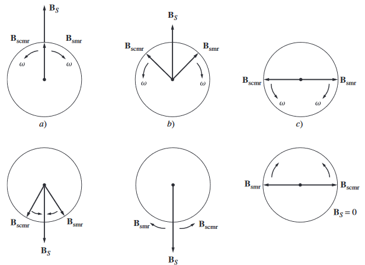

### Velocidades de deslizamiento
Si el motor  gira  a  una velocidad n, el deslizamiento $S$ del campo giratorio directo (el que gira en el mismo sentido que el motor) vale:

$$
S = \dfrac{n_\text{sinc}-n_m}{n_\text{sinc}}
$$

Y el deslizamiento $S'$ del campo inverso (el que gira en sentido contrario al eje del motor) vale:

$$
\begin{aligned}
S' &= \dfrac{(-n_\text{sinc})-n_m}{(-n_\text{sinc})} = -\dfrac{2\ n_\text{sinc} - n_\text{sinc}-n_m}{n_\text{sinc}}\\
&= 2 - S
\end{aligned}
$$

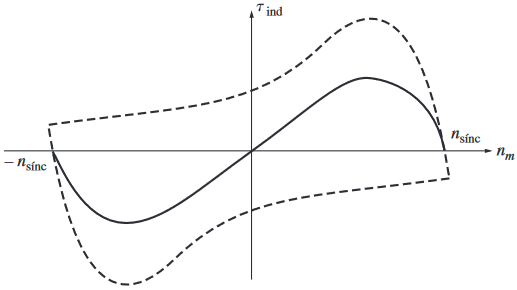

Por lo tanto el motor al estar a una velocidad $n$, seguiría girando. Sin embargo, su par de arranque es 0, pues se contrarrestan por ambos deslizamientos. Por lo tanto, es necesario utilizar un par de arranque para llevar al motor a una velocidad inicial.
## Circuito equivalente
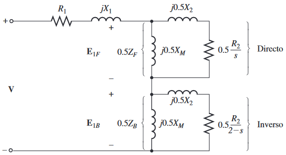
Donde:
$E_{1F}$ = Tensión en el estator del campo directo.
$E_{1B}$ = Tensión en el estator del campo inverso.
$Z_{F}$ = Impedancia equivalente de todos los elementos de impedancia del campo inverso.

$$
Z_F = R_F + jX_F = \dfrac{(R_2/s + jX_2)(jX_M)}{(R_2/s + jX_2) + jX_M}
$$

$Z_{B}$ = Impedancia equivalente de todos los elementos de impedancia del campo inverso.

$$
Z_B = R_B + jX_B = \dfrac{[R_2/(2-s) + jX_2](jX_M)}{[R_2/(2-s) + jX_2] + jX_M}
$$
