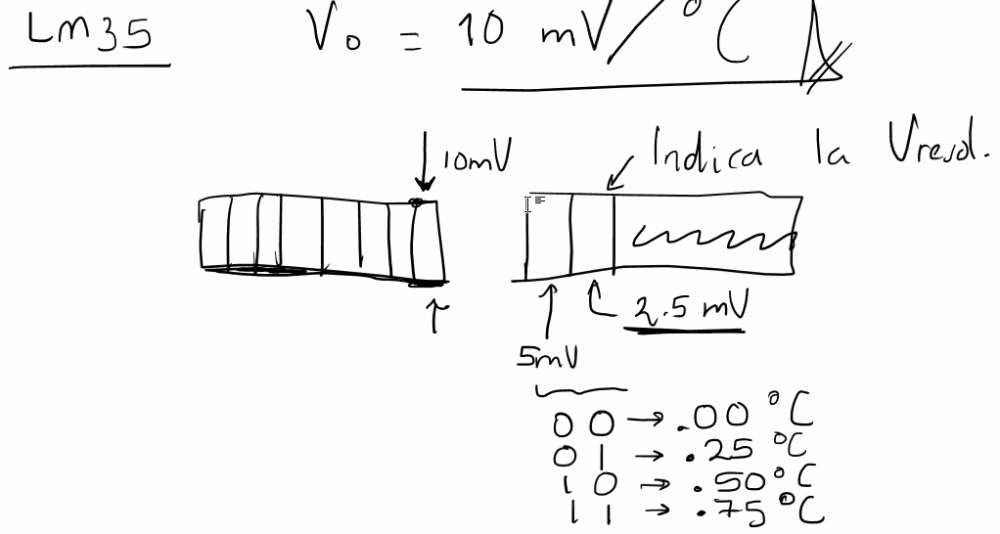
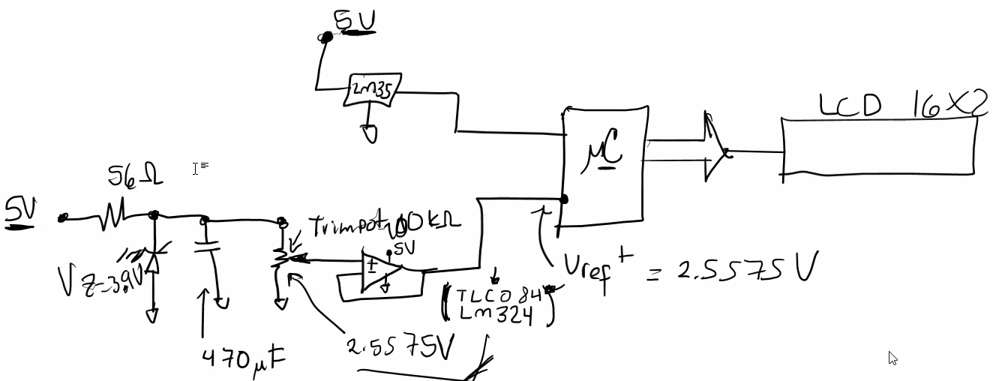

Notas

## Última práctica

Si la fuente no es muy buena, se puede regular con el siguiente circuito para que no varíe de forma que pueda afectar nuestras mediciones.

Pero como es simulado, solo poner una fuente de 2.5575V.

Desplegar en el display la palabra:
```
TEMP=027.50ºC
```

Se debe convertir cada 200 ms (1s si el siumaldor no deja).

Al cambiar los valores en el display, no borrar el display. Sino mover el cursor y cambiar el valor.

### Consejo
Sacar nombre primero por el LCD.