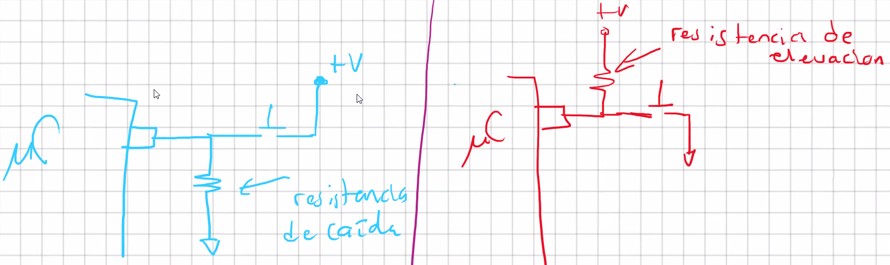

Pull-up Resistors

Las resistencias `pull-down` se utilizan para utilizar lógica positiva.

$$
\begin{cases}
0&\text{LOW}\\
1&\text{HIGH}\\
\end{cases}
$$

Las resistencias `pull-up` son para utilizar lógica inversa.

$$
\begin{cases}
0&\text{HIGH}\\
1&\text{LOW}\\
\end{cases}
$$

El `PIC16F887` cuenta con resistencias `pull-up` internas. **Sólo** hay en el `PORTB`.

Dichas resistencias son habilitadas poniendo en **0** el bit `RBPU` del registro `OPTION_REG`.

Esto activa las resistencias habilitadas para cada pin del `PORTB`, que se habilitan desde el registro `WPUB`.

**NOTA**: Al modificar el registro `TRISB`, se desactivan de forma automática las resistencias de pull-up, poniendo `RPBU` a 1.