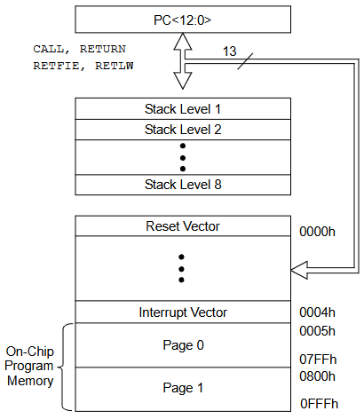

Son fragmentos de código que se mandan llamar repetidamente.

Se llaman con la instrucción 
```
CALL K
```
Donde:
`K`= Dirección de memoria donde se encuentra la subrutina

Para regresar de una subrutina se utiliza `RETURN`.

# La instrucción `CALL` y la `pila`
La pila del **PIC16F887** cuenta con una `pila` de `8 registros`. En esta pila se pueden almacenar entonces `8 subrutinas anidadas`.

## La instrucción `CALL` 
1. Guarda la dirección del `PC`; es decir, la siguiente instrucción donde se utilizó `CALL` en la dirección de la `PILA` que tiene el `Stack Pointer SP`.
2. Aumenta el `SP`.
3. Carga al `PC` con la dirección de programa escrita en el parámetro `K`.

## La instrucción `RETURN`
1. Decrementa el `SP`.
2. Carga al `PC` con la instrucción donde ahora apunta el `SP`; es decir, a la última dirección de la pila.