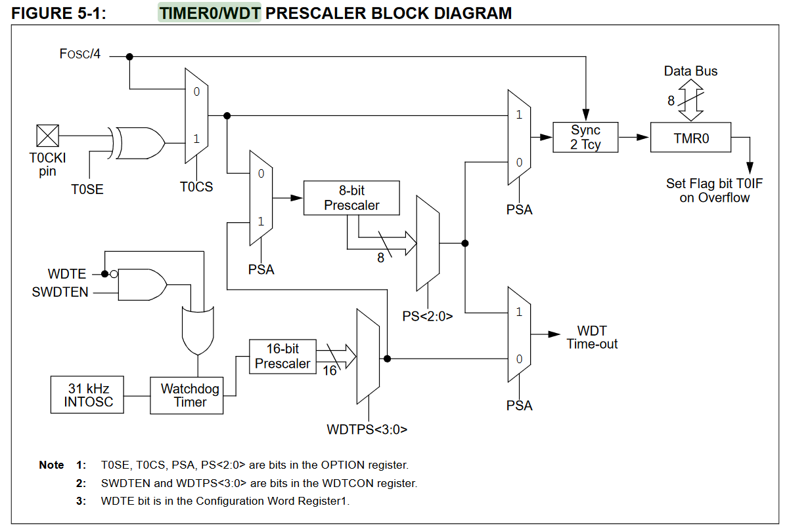
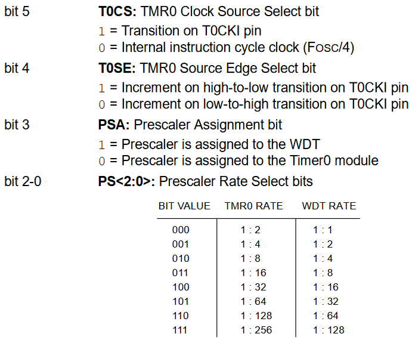

Timer

## Configuración en `OPTION_REG`

# Secuencia de uso del `Timer0` para contador de eventos
Temporizador, hace referencia a que incrementa con los ciclos de máquina.

1. `RA4` como entrada.
2. Si se usa *prescaler*: Seleccionar el prescaler poniendo `PSA=0` y definir el valor del prescaler con `OPTION_REG,<PS2:PS0>`. 
Si no se usa: `PSA=1`.
3. Seleccionar el flanco que incrementa: `T0SE=1` $\Downarrow$ , `T0SE=0` $\Uparrow$.
4. `T0CS=1` (cuenta por `RA4`).
5. Escribir en el registro `TMR0` el número a partir del cual iniciará el conteo.
6. Bajar la bandera `INTCON,T0IF` y si se van a usar interrupciones dar permiso de interrupción con `INTCON,T0IE` y `INTCON,GIE`.
7. Esperar a que se levante la bandera `T0IF` o continuar con el programa principal y en su momento interrumpirá el programa.