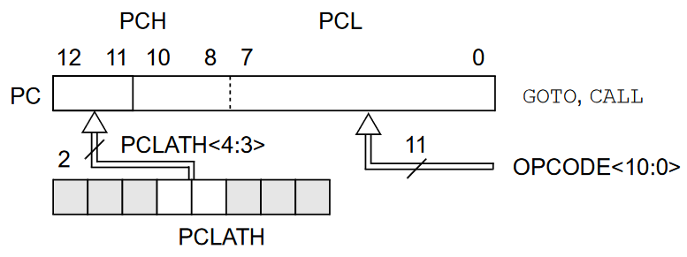
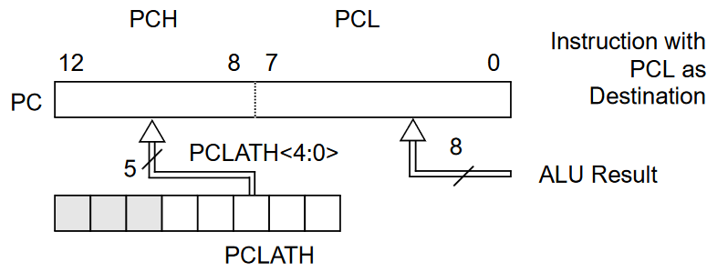

# Modo inherente o implícito
Son las instrucciones que no necesitan cambiar al contador de programa.

# Modo inmediato
Son las instrucciones que utilizan una literal como operando, por lo que no requiere ser buscado en memoria. Estas no afectan al contador de programa.

Ejemplos del PIC16F887: `MOVLW`, `ADDLW`, `SUBLW`, etc.
# Modo directo
Son instrucciones que leen o escriben la memoria RAM. Estas no afectan al contador de programa.

Ejemplos del PIC16F887: `MOVF`, `MOVWF`, `ADDWF`, etc.
# Modo indirecto
Se realiza con el registro `INDF`, que es un registro que no existe físicamente. Funciona como un apuntador. Dicho apuntador apunta a la dirección de memoria almacenado en `STATUS,IRP` concatenado con `FSR`. Por lo tanto, al modificar `INDF` se modifica *indirectamente* al registro apuntado por `INDF`.

# Modo relativo
Son las instrucciones que modifican al contador de programa: `GOTO`, `BTFSS`, `DECFSZ`, ...

Pero también se puede hacer por medio de algunos registros que modifican directamente al `PC`.

Cuando se utiliza `GOTO k` y `CALL k`, se toma además de la dirección que se especifica `k` se le concatena antes `PCLATCH<4>` y `PCLATCH<3>`.

Quedando de la siguiente forma:

También se puede modificar a PC directamente por medio del registro `PCL` y `PCLATCH` de la siguiente forma:

El `PCL` son los LSB del `PC`, `PCH` no se puede acceder directamente, sin embargo, se modifica de forma automática cuando se modifica el `PCL`, se toman los bits `PCLATCH<4:0>` y se copian en `PCH`.

Al modificar al `PCL`, esto pasa de forma automática, y siempre que se modifica al `PCL`, por cualquier operación, toma **2** ciclos.