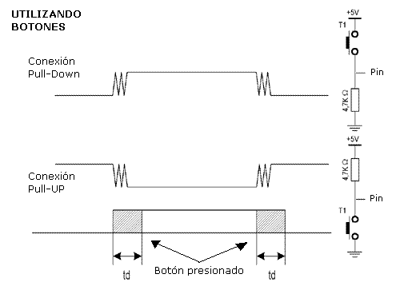

1. Esperar a que se `apriete` el interruptor
2. `Dejar` pasar el tiempo de rebotes (`25 ms`)
3. Esperar a que se `suelte` el interruptor
4. `Dejar` pasar el tiempo de rebotes (`25 ms`)
5. `Ejecutar` la tarea