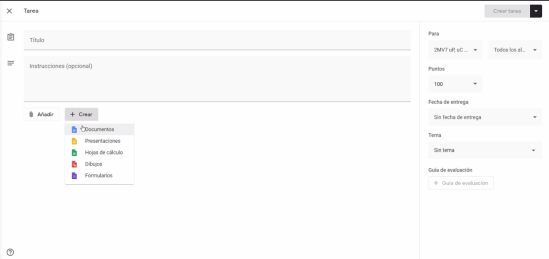

Reportes

Los apartados deben ser explicitos y no implicitos dentro del reporte:  
  
• Portada de la práctica  
• **Objetivos** (que indiquen claramente que es lo que se busca al realizar cada uno de los experimentos).  
• **Introducción** (de forma breve permite al lector entender de que se trata el trabajo que se está reportando, toca un poco de los puntos contenidos en todo el reporte).  
• **Marco teórico** (Incluye todo lo que sustenta teóricamente a todo lo que se requiere para realizar los experimentos con referencias).  
• **Desarrollo experimental** (Se explica claramente en qué consisten los experimentos, se presentan los cálculos que sustentan a cada diseño también se presentan los diagramas eléctricos y diagramas de flujo editados en software dedicado). Es obligatorio realizar diagramas de flujo y los códigos deben venir documentados.  
▪ Los comentarios deben ser por párrafo explicando fragmentos de código.  
▪  
• **Resultados**. Las fotos y figuras deben ser de buena calidad, no se debe omitir el texto a pesar de que la imagen lo ¨describa¨.  
• **Conclusiones** individuales(permiten obtener nuevas ideas a partir de los resultados relacionados con la teoría).  
• **Comentarios (opcionales).  
• Referencias** (formato IEEE).  
  

## Formato general

  
• Todas las páginas llevan número de página en la parte inferior derecha  
• Las ligas que le corresponden deberán estar escritas en el final del reporte.  
  

## Entrega

  
• Todas se entregan en Google Docs (Se deben hacer en Google Docs)  
  
• Todos los integrantes deben entregar  
  

## Portada

  
