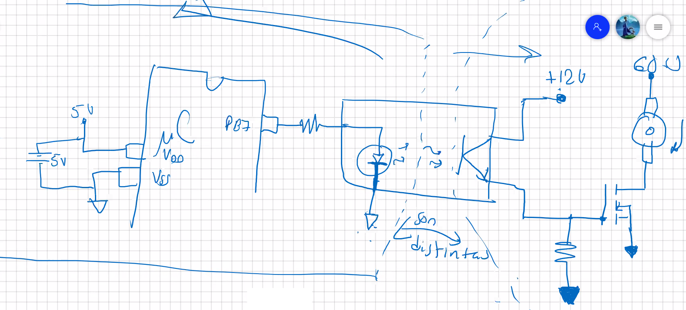
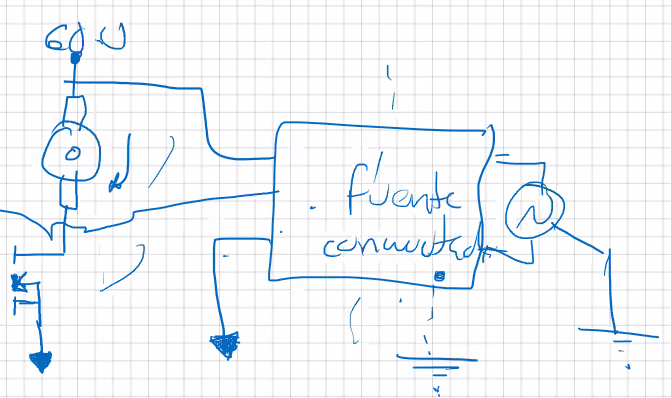

Siempre que se utilice `circuitos de potencia`, se debe `separar` el microcontrolador con un `optoacoplador` como el `PC817`. Si se trata de un sistema resistivo de baja potencia, se podría utilizar un transistor directo, pero lo mejor es utilizar un optoacoplador.

