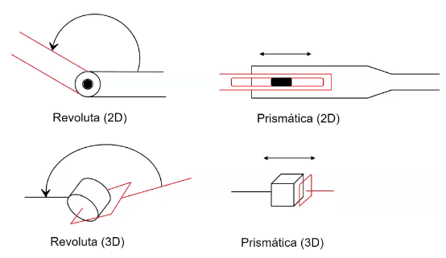
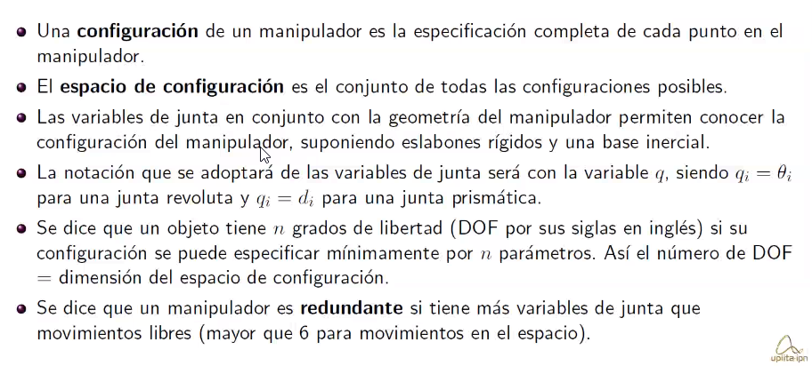
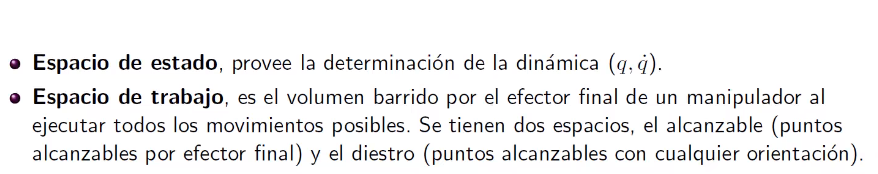
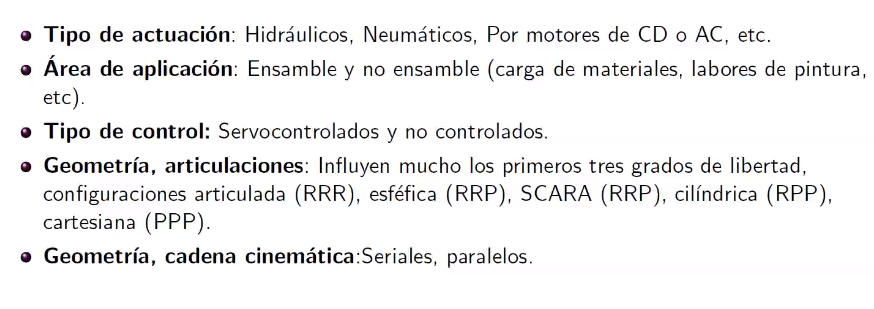
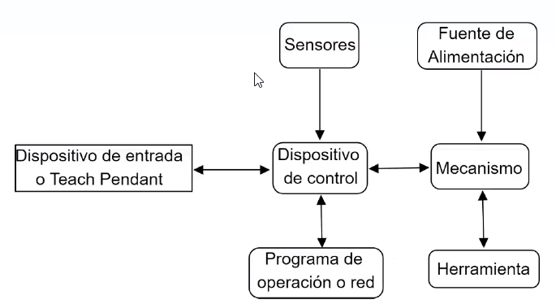
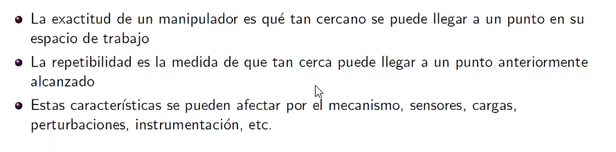
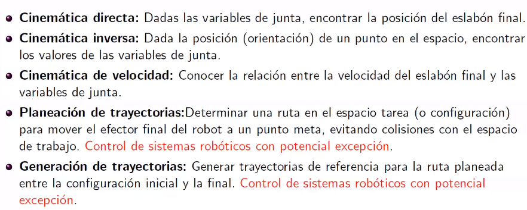
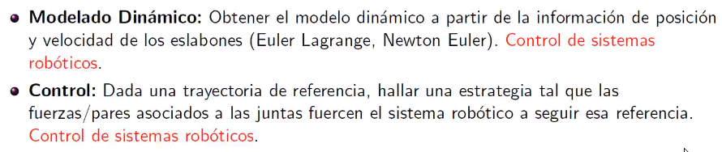

# Definición
Es un manipulador multifuncional reprogramable diseñado para mover materiales, herramientas o dispositivos especializados a través de movimientos programados para el desempeño de una variedad de tareas

#### Palabras clave:
* Reprogramabilidad (diferencia con un mecanismo).
* Ventajas: Costos de tareas menores, mayor presición y productividad, flexibilidad comparada con máquinas especializadas.

## Robots manupuladores:
Los robots manipuladores se componen de `eslabones` conectadas por `juntas` para formar una `cadena cinemática`.

Las juntas se clasifican como `revolutas` (R) (rotativas) o `prismáticas` (P) (lineales).

Cada junta representa la conexión entre dos eslabones.

Como convención, se denotará como $z_i$ al eje de rotación (eje de traslación) entre los eslabones $i$, $i+1$

Se denotará la varible de junta como $\theta$ para una revoulta y $d$ para una prismática.

## Espacio de configuración
* Una `configuración` es la especificación completa de cada punto en el manipulador.
* El `espacio de configuración` es el conjunto de todas las configuraciones posibles.
* 

### Espacio de estado
Provee la determinación dinámica ($q$,$\dot{q}$)

## Clasificación de manipuladores robóticos

## Componentes típicos de un sistema robótico

## Repetibilidad y exactitud

## Problemas asociados a la robótica

