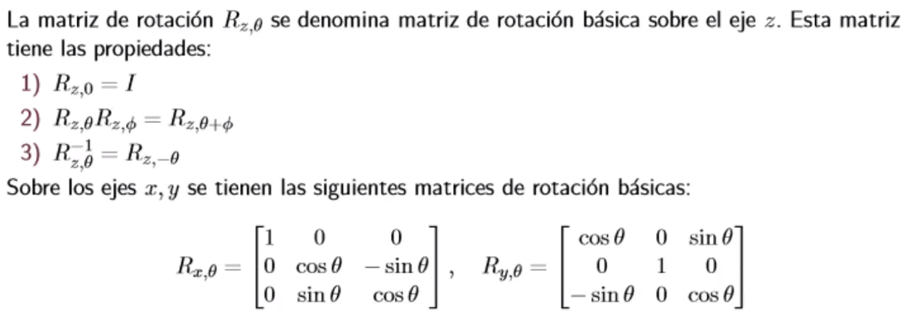

# Clase 1

Por lo tanto las matrices son `ortogonales` e incluso son `ortonormales`.

El determinante puede ser negativo, porque el determinante expresa permutaciones, por lo tanto en este caso, si se maneja la regla de la mano derecha el determinante sería 1, pero si se manejara la mano izquierda, entonces sería -1. Lo que implica que hubo una permutación en los ejes coordenados.

Esta es una de las 3 matrices de rotación canónica, en este caso la matriz de rotación canónica respecto a z.

# Clase 2

