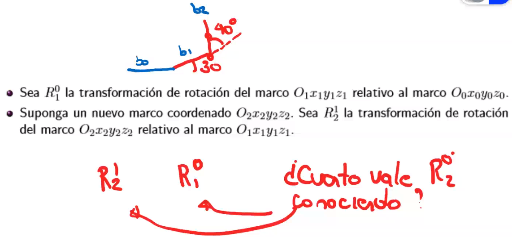
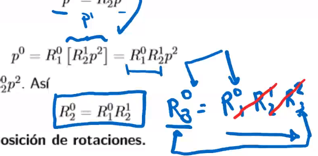
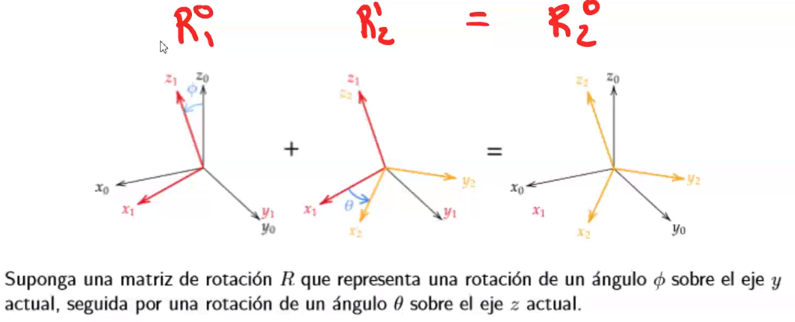

Transformaciones de similitud

* Un marco coordenado está formado por 3 vectores base canónicos.
* La matriz de rotación se puede ver como una matriz de cambio de base.
* La representación matricial de una transformación lineal general se transforma de un marco a otro mediante una `Transformación de similitud o semejanza`.

* Matrices propias

# Composición de rotaciones

## Regla de composición de rotaciones

### Memotécnia

Ojo, las rotaciones no son permutables!
Las matrices de rotación no conmutan.

