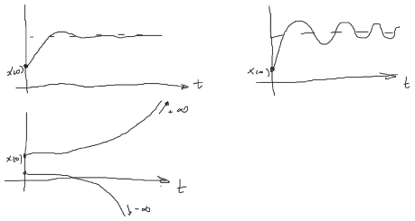
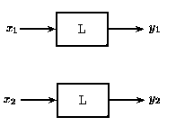
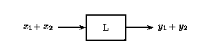
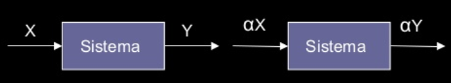
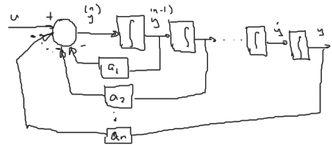

# Sistemas lineales y no lineales
Un `sistema lineal` sólo puede tener estos 3 comportamientos:

Los `sistemas no lineales`

## Teorema de superposición

## Principio de homogeneidad

## Linealidad de los sistemas
Un sistema es lineal si cumple el `Teorema de Superposición` y el `Principio de homogeneidad`. En otro caso el sistema es no lineal.

### Ejercicios: Demostrar si $y=f(x)$ es lineal o no lineal
1. $y = x + 2$

$$
\begin{aligned}
y(x_1) &= x_1 + 2\\
y(x_2) &= x_2 + 2\\
y(x_1) + y(x_2) &= x_1 + x_2 + 4\\
y(x_1 + x_2) &= x_1 + x_2 + 2 \neq y(x_1) + y(x_2)
\end{aligned}
$$

 Por lo tanto, no es lineal
 
2. $y = x^2$

$$
\begin{aligned}
y(x_1) &= x_1^2\\
y(x_2) &=x_2^2\\
y(x_1) + y(x_2) &=x_1^2 + x_2^2\\
y(x_1 + x_2) &= (x_1 + x_2)^2
\end{aligned}
$$

 Por lo tanto, no es lineal

3. $y=sen(x)$

$$
\begin{aligned}
y(x_1) &= \sin{x_1}\\
y(x_2) &=\sin{x_2}\\
y(x_1) + y(x_2) &=\sin{x_1} + \sin{x_2}\\
y(x_1 + x_2) &= \sin(x_1 + x_2)
\end{aligned}
$$

Por lo tanto no es lineal

4. $y=ax$

$$
\begin{aligned}
y(x_1) &= ax_1\\
y(x_2) &= ax_2\\
y(x_1) + y(x_2) &= ax_1 + ax_2\\
y(x_1 + x_2) &= a(x_1 + x_2) = ax_1 + ax_2
\end{aligned}
$$

$$
\begin{aligned}
y(x) &= ax\\
y(\alpha x) &= a\alpha x = \alpha a x\\
&= \alpha y(x)
\end{aligned}
$$

Por lo tanto, sí es lineal

### Ejercicios: Demostrar si las ecuaciones diferenciales son lineales o no lineales
Otra forma de ver si el sistema es lineal o no, es por medio de la ecuación general de estado.

1. $\dot{y} + 2 y = 0$ Sí es lineal porque $2 y$ y $\dot{y}$ cumplen con superposición y con homogeneidad
2. $\ddot{y} + y\dot{y} = 0$ No es lineal

$$
y(x_1)\dot{y}(x_1) + y(x_2)\dot{y}(x_2) \neq [y(x_1)+y(x_2)][\dot{y}(x_1)+\dot{y}(x_2)]\\
$$

## Forma general de un sistema lineal
Un sistema lineal con una entrada y una salida tiene la siguiente forma,

$$
y^{(n)} + a_1y^{(n-1)} + a_2y^{(n-2)} + \ldots + a_ny = u
$$

## Representación de espacio de estado

$$
\begin{aligned}
x_1 &= y\\
x_2 &= \dot{y} = \dot{x_1}\\
x_3 &= \ddot{y} = \dot{x_2}\\
&\vdots\\
x_n &= \ddot{y} = \dot{x_{n-1}}\\
\dot{x_n} &= y^n = -a_ny - a_{n-1}\dot{y} - \ldots - a_2y^{(n-2)} - a_1y^{(n-1)} + u\\
\dot{x_n} &= -a_nx_1 - a_{n-1}x_2 - \ldots - a_2x_{n-1} - a_1x_{n} + u\\
\end{aligned}
$$

Pasandolo a forma matricial:

$$
\begin{cases}
\dot{x} &= Ax + Bu\\
y &= Cx
\end{cases}\quad,\quad x(0) = x_0
$$

Donde
$x: n\times1$, $A:n\times n$, $u:m\times 1$, $B:n\times m$,$y:p\times 1$, $C: p\times n$

## Ejemplo
$\ddot{y} + 4\dot{y} + 3y = u$

$x_1 = y$
$x_2 = \dot{y} = \dot{x_1}$
$\dot{x_2} = \ddot{y} = -3y - 4\dot{y}+u$

Por lo tanto:

$$
\begin{cases}
\dot{x_1} = x_2\\
\dot{x_2} = -3x_1-4x_2 + u\\
\end{cases}
$$

$$
\begin{aligned}
\dot{x} &= \begin{bmatrix}
0&1\\
-3&-4\\
\end{bmatrix}x + \begin{bmatrix}0\\1\end{bmatrix}u\\
y &= \underbrace{\begin{bmatrix}1&0\end{bmatrix}}_{C}x
\end{aligned}
$$
