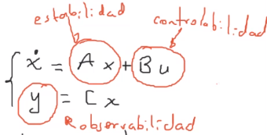
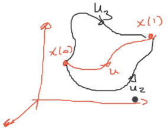
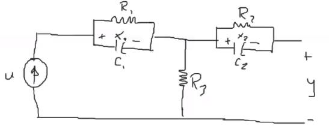
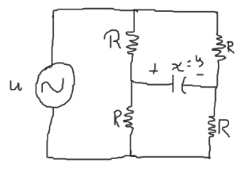
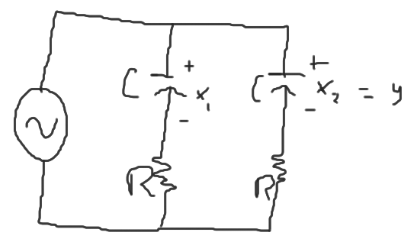
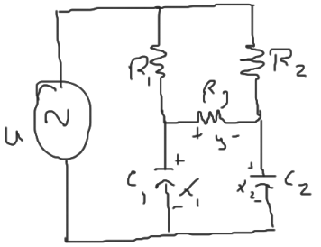

En un sistema en representación de variables de estado:

Donde:
$x$ = Vector de estado
$u$ = Entrada
$y$ = Salida

# Controlabilidad
La `controlabilidad` se refiere a la existencia de una entrada $u$ para controlar cada variable de estado de manera independiente.


El sistema

$$
\begin{cases}
\dot{x} &= Ax + Bu\\
y &= Cx
\end{cases}
$$

Tambien llamdo el par $(A,B)$ es controlable sí para todo estado inicial $x(0)=x_0$ y el estado final $x_1=x(T)$, existe una entrada $u(t)$ que lleva al sistema de $x_0$ a $x_1$ en tiempo finito $t:[0,T]$.
En otro caso, se dice que no es controlable.

Se evalúa variando la entrada y si cambian las variables de estado, es controlable.

## Criterios para determinar la controlabilidad
### Criterio de Kalman
La matriz de controlabilidad

$$
\mathcal{C} = [B\ AB\ A^2B\ \ldots\ A^{n-1}\ B]\quad:\quad n\times nm
$$

es de rango completo

$$
\text{rango}(C) = n
$$

```matlab
rank(C)
```
Si el sistema tiene una entrada ($m=1$) entonces:

$$
\det(C)\neq 0
$$


### Criterio de Hautus
La matriz de controlabilidad

$$
H_c = [\lambda I-A, B]\quad:\quad n\times(n+m)
$$

es de rango completo, para todo $\lambda \in \mathbb{C}$

$$
\text{rango}(H_c) = n
$$


### Criterio 3
Los valores propios de la matriz $A-BK$ pueden asignarse arbitrariamente mediante la selección apropiada de $K$.

$$
u = -kx
$$

$$
\dot{x} = Ax + Bu = Ax - BKx = (A-BK)x
$$

#### Ejemplo
Calcular $K$ para que $(A-BK)$ tenga valores propios $-2$ y $-3$.
a).

$$
\dot{x} = \begin{bmatrix}
1&-1\\
0&-1\\
\end{bmatrix}x + \begin{bmatrix}
1\\0
\end{bmatrix}u
$$


$$
\begin{aligned}
P_{LC}(s) &= \det(sI - (A-BK)) = (s+2)(s+3)\\
&= \det(s\begin{bmatrix}1&0\\0&1\end{bmatrix} - \left(\begin{bmatrix}
1&-1\\
0&-1\\
\end{bmatrix}-\begin{bmatrix}
1\\0
\end{bmatrix}K)\right) = (s+2)(s+3)\\
& = s^2 + K_1s + K_1 - 1 = s^2+5s+6\\
\end{aligned}
$$

Por lo tanto

$$
K_1 = 5\\
K_1 = 7\\
$$

Así que no es controlable puesto que la solución no es única

b).

$$
\dot{x} = \begin{bmatrix}
1&-1\\
0&-1\\
\end{bmatrix}x + \begin{bmatrix}
0\\1
\end{bmatrix}u
$$

Se encuentra:

$$
s^2 + K_2 + s - K_1 - K_2 - 1 = S^2+5s+6
$$

$$
\begin{aligned}
K_2 &= 5\\
K_1 &= -5-1-6 = -12\\
\end{aligned}
$$

Por lo tanto el resultado es único y el sistema es controlable.

### Criterio 4 Gramiano

$$
G_c(t) = \int_0^t e^{A\tau} BB^Te^{A^T\tau}d\tau
$$

es invertible si

$$
\det(G_c(t))\neq0
$$

```matlab
gram(sys,'c') <-- Controlabilidad
```

# Observabilidad
La `observabilidad` consiste en determinar si el estado inicial puede ser aproximado (calculado, reconstruido ,estimado, observado) conociendo $y(t)$.

Se evalúa variando las $c.i.$ y si cambia la salida es observable.

## Criterios para determinar observabilidad
Sea el sistema

$$
\begin{cases}
\dot{x} &= Ax + Bu\\
y &= Cx
\end{cases}\quad,\quad x(0) = x_0
$$

El par $A$, $C$ es observable si cumple con alguno de los siguientes criterios:
### Criterio de Kalman
La matriz de observabilidad

$$
O = \begin{bmatrix}C\\CA\\CA^2\\\vdots\\CA^{n-1}\end{bmatrix}
$$

Donde $O$ es de tamaño $np\times n$ y es de rango completo $\text{rango}(O) = n$.
Si el sistema sólo tiene una salida ($p = 1$):

$$
\det(O) \neq 0
$$


Si el rango es igual al orden del sistema $n$, entonces el sistema es observable.

### Criterio de Hautus
La matriz de observabilidad

$$
H_O = \begin{bmatrix}LI-A\\C\end{bmatrix}
$$

Donde $L$ son los valores propios de A.

Determina que el sistema es observable si el rango de $H_O$ es máximo (igual al órden del sistema $n$) para todos los valores de $L$.

### Criterio 3
Los valores propios de la matriz $A-LC$ pueden asignarse arbitrariamente mediante la selección apropiada de $L$.

### Criterio 4 Gramiano

$$
G_o(t) = \int_0^t e^{A^T\tau} C^TC e^{A\tau}d\tau
$$

es invertible para todo $t \geq 0$ si

$$
\det(G_o)\neq0
$$


```matlab
gram(sys,'o') <-- Observabilidad
```

## Ejemplos
Indicar si las variables en los siguientes sistemas son `controlables` y observables a partir de un análisis en simulación.

1. 
Haciendo el análisis en matlab, se determina que el sistema `no es controlable` y no es observable

2. 
* No es controlable
* Sí es observable

3. 

4. 
