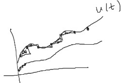

Considere el sistema en tiempo continuo,

$$
\tag{1}\begin{aligned}
    \dot{x}(t) &= Ax(t) + Bu(t)\\
    y(t) &= Cx(t)
\end{aligned}
$$

La solución del sistema $(1)$ está dada por,

$$
\tag{2}
x(t) = \mathcal{L}^{-1}\left\{(sI-A)^{-1}\right\}x(0) + \mathcal{L}^{-1}\left\{(sI-A)^{-1}Bu(s)\right\}
$$

$$
\tag{3}
x(t) = e^{At}x(0) + \int_0^t e^{A(t-\tau)}Bu(\tau)d\tau
$$

Se busca llevar el sistema $(1)$ a un sistema en tiempo discreto de la siguiente forma:

$$
\begin{aligned}
    \dot{x}((k+1)T) &= \overline{A}x(kT) + \overline{B}u(kT)\\
    y(kT) &= Cx(kT)
\end{aligned}
$$

Para hacer la sustitución $t = kT$ en la solución del sistema, se utiliza la ecuación $(3)$:

$$
\tag{4}
x(kT) = e^{AkT}x(0) + e^{AkT}\int_0^{kT} e^{-A\tau}Bu(\tau)d\tau
$$

Haciendo $t = (k+1)T$

$$
\tag{5}
x((k+1)T) = e^{A(k+1)T}x(0) + e^{A(k+1)T}\int_0^{(k+1)T} e^{-A\tau}Bu(\tau)d\tau
$$

Multiplicando $(4)$ por $e^{At}:n\times n$

$$
\tag{6}
e^{AT} x(kT) = e^{A(k+1)T}x(0) + e^{A(k+1)T}\int_0^{kT} e^{-A\tau}Bu(\tau)d\tau
$$

Restando $(5) - (6)$:

$$
\begin{aligned}
    x((k+1)T) - e^{AT}x(kT) &= e^{A(k+1)T}\int_{kT}^{(k+1)T}e^{-A\tau}Bu(\tau)d\tau\\
    x((k+1)T) &= \underbrace{e^{AT}}_{\overline{A}}x(kT) + e^{A(k+1)T}\int_{kT}^{(k+1)T}e^{-A\tau}Bu(\tau)d\tau\\
\end{aligned}
$$

Para $u(kT) = cte.$ para $kT \leq t \leq (k+1)T$

entonces:

$$
\tag{7}
    x((k+1)T) = \underbrace{e^{AT}}_{\overline{A}}x(kT) + \underbrace{\left(e^{A(k+1)T}\int_{kT}^{(k+1)T}e^{-A\tau}d\tau\right)B}_{\overline{B}}u(kT)
$$

El sistema se aproxima escalonadamente:

Como se puede observar, depende de $T$ el error que se tenga, a menor $T$, mejor error.

Ahora bien, asumiendo que $A$ es invertible:

$$
\tag{8}
\begin{aligned}
    e^{A(k+1)T}\int_{kT}^{(k+1)T}e^{-A\tau}d\tau &= e^{A(k+1)T}\int_{kT}^{(k+1)T}e^{-A\tau}\underbrace{A^{-1}A}_{I}\ d\tau\\
    &= e^{A(k+1)T}\left[-e^{-A\tau} A^{-1}\right]_{kT}^{(k+1)T} = \\
    &= \left[-I + e^{AT}\right]A^{-1}
\end{aligned}
$$

Haciendo $k = 0$ en $(8)$

$$
\begin{aligned}
    e^{AT}\int_0^T e^{-A\tau}d\tau &= e^{AT}\left[-e^{-A\tau}A^{-1}\right]_0^T = e^{AT}\left[-e^{-A\tau}A^{-1} + e^0A^{-1}\right]_0^T\\
    &= \left[-I + e^{AT}\right]A^{-1}
\end{aligned}
$$

Se puede ver que si $A$ es invertible, no depende del instante de muestreo $k$.

De $(7)$,

$$
    x((k+1)T) = \underbrace{e^{AT}}_{\overline{A}}x(kT) + \underbrace{\left(e^{A(k+1)T}\int_{kT}^{(k+1)T}e^{-A\tau}d\tau\right)}_{\int_0^T e^{-A(T-\tau)}d\tau}Bu(kT)
$$

Se define

$$
\begin{cases}
    \lambda = T - \tau\\
    d\lambda = -d\tau
\end{cases}\quad\Rightarrow\quad\text{si}\quad\begin{array}{c}
    \tau = 0 \Rightarrow \lambda = T\\
    \tau = T \Rightarrow \lambda = 0\\
\end{array}
$$

Así

$$
\int_0^T e^{-A(T-\tau)}d\tau = -\int_T^0e^{-A\lambda}d\lambda = \int_0^Te^{-A\lambda}d\lambda
$$

De forma que

$$
\begin{aligned}
    \overline{A}(T) &= e^{AT}\\
    \overline{B}(T) &= \left(\int_0^Te^{-A\lambda}d\lambda\right)B\\
\end{aligned}
$$

$$
\boxed{
\begin{aligned}
    \dot{x}((k+1)T) &= \overline{A}x(kT) + \overline{B}u(kT)\\
    y(kT) &= Cx(kT)
\end{aligned}
}
$$
