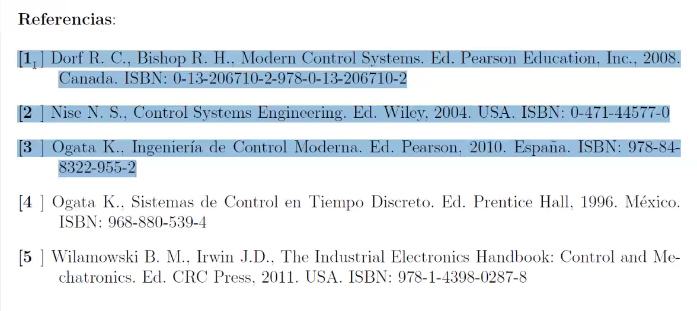

## Contacto

Nombre: Juan Luis Mata Machuca
Grupo: 4MM6
Plataforma: Teams

## Evaluación
|Periodo|Unidad|Procedimiento de evaluación|
|-|-|-|
|1|$I$|Ejercicios en clase y tareas: 25%|
|||Prácticas: 25%|
|||Examen: 50%|
|2|$II$|Ejercicios en clase y tareas: 25%|
|||Prácticas: 40%|
|||Examen: 35%|
|3|$III$|Ejercicios en clase y tareas: 25%|
|||Prácticas: 50%|
|||Examen: 25%|

|Unidad|Evaluación|
|-|-|
|$I$|20%|
|$II$|40%|
|$III$|40%|

## Temario
**Unidad 1**: Análisis de sitemas en espacio de estado.
* Introducción: Diferencia entre sistemas lineales y no lineales.
* Transformaciones de similitud.
* Observabilidad (Observadores de estado) y controlabilidad.
* Solución de ecuaciones en espacio de estados.

**Unidad 2**: Diseño de esquemas de control para sistemas en espacio de estado.
* Ubicación de polos.
* Diseño de observadores de estado.
* Retroalimentación de estado estática.
* Análisis de estabilidad de Lyapunov.

**Unidad 3**: Introducción a los sistemas de control en tiempo discreto.
* Sistemas muestrados retroalimentados.
* Técnicas de diseño de controladores discretos.
* Condiseraciones sobre la Implementación de controladores de sistemas discretos.
* Análisis de Sistemas Discretos MIMO en espacio de estados.
* Técnicas de Diseño de controladores discretos

## Referencias

Los más importantes son los primeros 4.