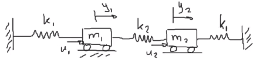

Considere el sistema masa - resorte

Se asume que no hay fricción entre los bloques y la superficie
1. Obtener la representación entrada - salida.
2. Obtener la representación en espacio de estado.
3. Realizar la simulación del sistema mecánico.

$$
k_1 = 10\ N/m\quad,\quad k_2 = 8\ N/m\quad,\quad m_1 = 3kg\quad,\quad m_2 = 1kg\quad\\
u_1 = 10\ N\quad,\quad u_2 = 8\ N
$$

# Representación entrada - salida

$$
\sum F_1 = -k_1 y_1 + u_1 - k_2 (y_1 - y_2) = m_1 \ddot{y_1}\\
\sum F_2 = k_2 (y_1 - y_2) + u_2 - k_1 y_2  = m_2 \ddot{y_2}\\
$$

Por lo tanto:

$$
\begin{cases}
\ddot{y_1} + \dfrac{(k_1 + k_2)}{m_1}y_1 - \dfrac{k_2}{m_1}y_2 = \dfrac{u_1}{m_1}\\
\\
\ddot{y_2} + \dfrac{(k_1 + k_2)}{m_2}y_2 - \dfrac{k_2}{m_2}y_1 = \dfrac{u_2}{m_2}
\end{cases}
$$

# Representación en espacio de estados
Se definen:

$$\begin{cases}
x_1 = y_1 & x_3 = y_2\\
x_2 = \dot{y_1} = \dot{x_1} & x_4 = \dot{y_2} = \dot{x_3}\\
\dot{x_2} = \ddot{y_1} & \dot{x_4} = \ddot{y_2}\\
\end{cases}$$

Por lo tanto:

$$\begin{cases}
\dot{x_1}= x_2\\
\dot{x_2}= - \dfrac{(k_1 + k_2)}{m_1}x_1 + \dfrac{k_2}{m_1}x_3 + \dfrac{u_1}{m_1}\\
\dot{x_3}= x_4\\
\dot{x_2}= \dfrac{(k_1 + k_2)}{m_2}x_1 - \dfrac{k_2}{m_2}x_3 + \dfrac{u_2}{m_2}\\
\end{cases}$$

$$
\begin{aligned}
\dot{x} &= \begin{bmatrix}
0&1&0&0\\
-\frac{k_1 + k_2}{m_1}&0&\frac{k_2}{m_1}&0\\
0&0&0&1\\
\frac{k_2}{m_2}&0&-\frac{k_1 + k_2}{m_2}&0\\
\end{bmatrix}x_0 + \begin{bmatrix}
0 & 0\\
\frac{1}{m_1} & 0\\
0 & 0\\
0&\frac{1}{m_2}\\
\end{bmatrix}\begin{bmatrix}
u_1\\u_2
\end{bmatrix}\\
y &= \begin{bmatrix}
1&0&0&0\\
0&0&1&0\\
\end{bmatrix}x
\end{aligned}
$$
