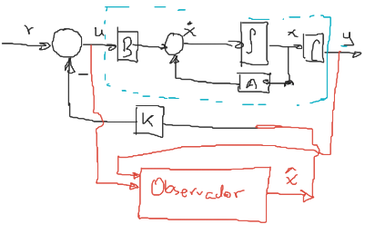
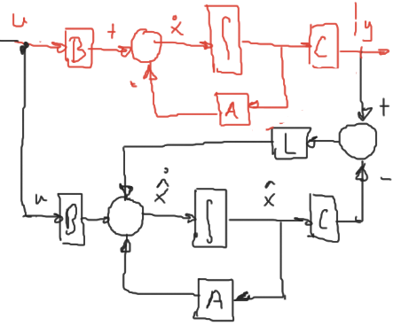
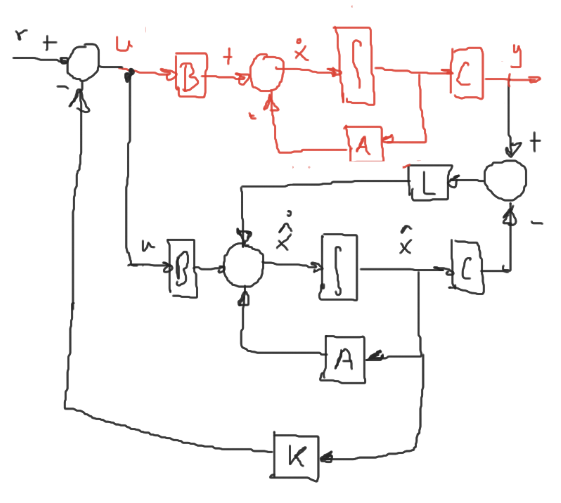
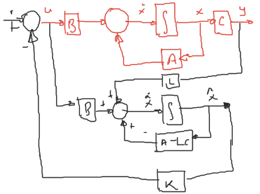

Cuándo no se conoce o no se puede medir una variable de estado para en el sistema a controlar, se deben emplear métodos para calcular dichas señales.

Para obtener un valor aproximado del vector de estado se utiliza una estructura denominada `Observador`.

La retroalimentación de estado $u = r - kx$ asume que se tienen disponibles todas las variables de estado. Sin embargo si no se puede se aplica la siguiente estructura:



Haciendo $u=r - k\hat{x}$. Donde $\hat{x}$ es un valor aproximado de $x$.

Los observadores de estado pueden ser de `orden completo` o `orden reducido`. La diferencia es que el de `orden reducido` sólo reproduce las `señales no conocidas` y las de `orden completo` `todas las señales`, incluso las ya conocidas. Sin embargo, la estructura del de `orden completo` es más `sencilla`.

Considere el sistema `SISO`

$$
(1)\ \begin{cases}
\dot{x} &= Ax + Bu\\
y &= Cx
\end{cases}\quad,\quad x(0) = x_0
$$

Donde la entrada $u$ y la salida $y$, son conocidas.
Se asume que el vector de estado $x$ es parcial o totalmente desconocido.

El problema consiste en estimar $x$ a partir de $u$ y de $y$.

# Estructura Luenberger
El observador de estado para el sistema (1) se define como sigue:

$$
(2)\ \dot{\hat{x}} = \underbrace{A\hat{x} + Bu}_\text{copia del sistema} + \underbrace{L(y-C\hat{x})}_\text{Factor de correción}\quad,\quad \hat{x}(0) = x_0
$$


Donde $L:n\times 1$ porque es un sistema con una salida.

En rojo, aparece el sistema original, en negro el observador de estado.

Al aplicar retroalimentación sería de la siguiente forma:


Reescribiendo (2)

$$
\begin{aligned}
\dot{\hat{x}} &= A\hat{x} + Bu + L(y-C\hat{x})\\
&= (A-LC)\hat{x} + Bu + Ly\\
&= (A-LC)\hat{x} + [B\ L]\underbrace{\begin{bmatrix}u\\y\end{bmatrix}}_\text{Entradas}\\
\end{aligned}
$$



Se define el error de estimación como,

$$(3)\quad e = x - \hat{x}$$

Derivando (3)

$$(4)\quad \dot{e} = \dot{x} - \dot{\hat{x}}$$

Sustituyendo (1) y (2) en (4),

$$
\begin{aligned}
\dot{e} &= Ax + Bu - A\hat{x} - Bu - L(y-C\hat{x})\\
&= Ax - A\hat{x} - Ly + LC\hat{x}\\
&= Ax - A\hat{x} - LCx + LC\hat{x}\\
&= A(x - \hat{x}) - LC(x - \hat{x})\\
&= Ae - LCe\\
&= (A - LC)e\\
\end{aligned}
$$


Resolviendo la ecuación diferencial:

$$
\boxed{e(t) = e^{(A-LC)t}e(0)}
$$

$$
||e||\xrightarrow[t\rightarrow\infty]{} 0\quad \text{si}\quad \boxed{A-LC}\quad \text{es estable}
$$


Entonces el diseño del `observador de estado` se resuelve como un problema de ubicación de polos para la matriz $\boxed{A-LC}$, es decir, se debe calcular $L$ para asignar la dinámica deseada del observador.

Nota: El observador debe ser siempre más rápido que el controlador de otra forma el controlador actuaría sobre un sistema retrasado.

## Ejercicio
Calcular la ganancia $L$ para asignar los polos del observador en $-2$, $-2\pm 2j$

$$
\dot{x} = \begin{bmatrix}
-1 & 1 & -2\\
0 & -1 & 1\\
0 & 0 & -1\\
\end{bmatrix}x + \begin{bmatrix}
1\\0\\1
\end{bmatrix}u
$$

$$
y = [1\ 0\ 0]u
$$


```matlab
clc; close all; clear all;

A = [-1  1 -2
      0 -1  1
      0  0 -1];
B = [1 0 1]';
C = [1 0 0];

syms s L1 L2 L3;

plcd = collect((s+2)*(s+2-2i)*(s+2+2i))

L = [L1;L2;L3];

I = eye(3);
plc = collect(det(s*I - (A - L*C)))

eq1 = L1 + 3 == 6;
eq2 = 2*L1 + L2 - 2*L3 + 3 == 16;
eq3 = L1 + L2 - L3 + 1 == 16;

L = solve([eq1 eq2 eq3],L1,L2,L3);
L = [L.L1;L.L2;L.L3]
eig(A-L*C)
```

$$
L = \begin{bmatrix}3\\17\\5\end{bmatrix}
$$


# Forma canónica controlable

$$\tilde{x} = $$

$$x = S\tilde{x} = S$$

$$\tilde{O} = O$$

Considere el sistema `SISO`

$$
(1)\quad \begin{cases}
\dot{x} &= Ax + Bu\\
y &= Cx
\end{cases}\quad,\quad x(0) = x_0
$$

El polinomio del sistema (1) es:

$$
p(s) = \det(sI-A) = s^n + a_1 s^{n-1}+ a_2 s^{n-2} + \cdots + a_{n-1} s + a_n
$$


Si el sistema (1) es observable, entonces puede ser transformado en la forma canónica observable, haciendo

$$x = Sz\quad(2)$$

Sustituyendo (2) en (1): 

$$
\begin{aligned}
\dot{x} = S\dot{z} &= ASz + Bu\\
(3)\quad\dot{z} &= S^{-1}ASz + S^{-1}Bu = \mathcal{A}z + \mathcal{B}u\\
&= \begin{bmatrix}
0&0&0&\cdots&0&-a_{n}\\
1&0&0&\cdots&0&-a_{n-1}\\
0&1&0&\cdots&\vdots&\vdots\\
\vdots&\ddots&\ddots&\ddots&\ddots&-a_{2}\\
0&\cdots&\cdots&0&1&-a_{1}\\
\end{bmatrix} \tilde{x} + \begin{bmatrix}bn\\ b_{n-1}\\ \vdots \\ b_2\\ b_1\end{bmatrix}u\\
\end{aligned}
$$


$$
y = CSz = \begin{bmatrix}0&0&0&\cdots&1\end{bmatrix}z
$$


Donde,

$$
\def\rddots{\cdot^{\normalsize\cdot^{\normalsize\cdot}}}
S^{-1} = \tilde{O}^{-1}O = \begin{bmatrix}
a_{n-1}&\cdots&a_3&a_2&a_1&1\\
\vdots&\rddots&\rddots&\rddots&1&0\\
a_3&\rddots&\rddots&\rddots&\rddots&\vdots\\
a_2&a_1&1&\rddots&&\vdots\\
a_1&1&0&&&\vdots\\
1&0&\cdots&\cdots&\cdots&0\\
\end{bmatrix}\begin{bmatrix}C\\CA\\CA^2\\\vdots\\CA^{n-1}\end{bmatrix}
$$


El observador se propone para el sistema (3)

$$
\dot{\hat{z}} = \underbrace{S^{-1}AS\hat{z} + S^{-1}Bu}_\text{copia del sistema} + \underbrace{\bar{L}(y-CS\hat{z})}_\text{Factor de correción}\quad,\quad \hat{z}(0) = z_0
$$


$$
\begin{aligned}
\dot{\hat{z}} &= S^{-1}AS\hat{z} + S^{-1}Bu + \bar{L}(y-CS\hat{z})\\
&= S^{-1}AS\hat{z} + S^{-1}Bu + \bar{L}y-\bar{L}CS\hat{z}\quad;\quad\bar{L} = S^{-1}L\\
&= S^{-1}AS\hat{z} + S^{-1}Bu + S^{-1}Ly-S^{-1}LCS\hat{z}\\
(5)\qquad &= S^{-1}(A-LC)S\hat{z} + S^{-1}Bu + \bar{L}y\\
\end{aligned}
$$


$$
(6)\quad \begin{cases}
\dot{\hat{x}} &= (A-LC)\hat{x} + Bu + Ly\\
y &= C\hat{x}
\end{cases}
$$


Los observadores (5) y (6) son similares, es decir:

$$
\lambda(S^{-1}(A-LC)S) = \lambda(A-LC)
$$


Por lo tanto:

$$
\begin{aligned}
\dot{\hat{z}} &= \mathcal{A}\dot{z} + \mathcal{B}u + \bar{L}(y-C\hat{z})\\
&= \mathcal{A}\dot{z} + \mathcal{B}u + \bar{L}y-\bar{L}C\hat{z}\\
&= (\mathcal{A}-\bar{L}C)\dot{z} + \mathcal{B}u + \bar{L}y\\
\end{aligned}
$$


$$
\begin{aligned}
p_{LC} &= det(sI-(A-LC)) = det(sI - P(A-LC)P^{-1})\\
&= s^n + \tilde{a}_1 s^{n-1}+ \tilde{a}_2 s^{n-2} + \cdots + \tilde{a}_{n-1} s + \tilde{a}_n\\
&= (s - \mu_1)(s - \mu_2)\cdots(s - \mu_n)
\end{aligned}
$$

Donde $\mu_i$ son los polos del observador.

$$
\begin{aligned}
\mathcal{A} - \bar{L}C &= \begin{bmatrix}
0&0&0&\cdots&0&-\tilde{a}_{n}\\
1&0&0&\cdots&0&-\tilde{a}_{n-1}\\
0&1&0&\cdots&\vdots&\vdots\\
\vdots&\ddots&\ddots&\ddots&\ddots&-\tilde{a}_{2}\\
0&\cdots&\cdots&0&1&-\tilde{a}_{1}\\
\end{bmatrix} = \begin{bmatrix}
0&0&0&\cdots&0&-a_{n}\\
1&0&0&\cdots&0&-{a}_{n-1}\\
0&1&0&\cdots&\vdots&\vdots\\
\vdots&\ddots&\ddots&\ddots&\ddots&-{a}_{2}\\
0&\cdots&\cdots&0&1&-{a}_{1}\\
\end{bmatrix}\begin{bmatrix}\bar{L}_1\\\bar{L}_2\\\vdots\\\bar{L}_n\end{bmatrix}\begin{bmatrix}0&0&\cdots&0&1\end{bmatrix}\\
&= \begin{bmatrix}
0&0&\cdots&0&-a_n-\bar{L}_1\\
1&0&\cdots&0&-a_{n-1}-\bar{L}_2\\
0&1&\cdots&0&\vdots\\
0&0&\cdots&1&-a_1-\bar{L}_n\\
\end{bmatrix}
\end{aligned}
$$


Por lo tanto:

$$
\begin{aligned}
-\tilde{a}_n = -a_n - \bar{L}_1\quad&\Rightarrow\quad \bar{L_1} = \tilde{a_n} - a_n\\
-\tilde{a}_{n-1} = -a_{n-1} - \bar{L}_2\quad&\Rightarrow\quad \bar{L_2} = \tilde{a}_{n-1} - a_{n-1}\\
&\vdots\\
-\tilde{a}_{1} = -a_{1} - \bar{L}_n\quad&\Rightarrow\quad \bar{L_n} = \tilde{a}_{1} - a_{1}\\
\end{aligned}
$$


Entonces:

$$
\bar{L} = \begin{bmatrix}
\tilde{a}_n - a_n\\
\tilde{a}_{n-1} - a_{n-1}\\
\vdots\\
\tilde{a}_1 - a_1\\
\end{bmatrix}
$$


## Procedimiento
1. Determinar el polinomio característico del sistema (1), $p(s) =det(sI-A)$

$$a_1,a_2,\ldots,a_n$$
2. Obtener el polinomio característico con los polos del observador

$$
\begin{aligned}
p_{LC} &= (s - \mu_1)(s - \mu_2)\cdots(s - \mu_n)\\
&= s^n + \tilde{a}_1 s^{n-1}+ \tilde{a}_2 s^{n-2} + \cdots + \tilde{a}_{n-1} s + \tilde{a}_n\\
\end{aligned}
$$

3. Calcular $S^{-1}$ y luego $S$
4. Calcular $\bar{L}$
5. Obtener $L = S\bar{L}$
6. Comprobación
```matlab
eig(A-LC)
```

$$\mu_1,\mu_2,\ldots,\mu_n$$

# Fórmula de Ackerman
Considere el sistema `SISO`

$$
(1)\quad \begin{cases}
\dot{x} &= Ax + Bu\\
y &= Cx
\end{cases}\quad,\quad x(0) = x_0
$$

El polinomio del sistema (1) es:

$$
p(s) = \det(sI-A) = s^n + a_1 s^{n-1}+ a_2 s^{n-2} + \cdots + a_{n-1} s + a_n
$$


y el observador de estado:

$$
(2)\quad \begin{cases}
\dot{\hat{x}} &= A\hat{x} + Bu + L(y-C\hat{x})\\
\dot{\hat{x}} &= (A-LC)\hat{x} + Bu + Ly\\
\end{cases}
$$


El polinomio característico para el observador es:

$$
\begin{aligned}
p_{LC} &= det(sI-(A-LC)) = det(sI - P(A-LC)P^{-1})\\
&= s^n + \tilde{a}_1 s^{n-1}+ \tilde{a}_2 s^{n-2} + \cdots + \tilde{a}_{n-1} s + \tilde{a}_n\\
&= (s - \mu_1)(s - \mu_2)\cdots(s - \mu_n)
\end{aligned}
$$


Aplicando el Teorema de Caley-Hamilton:

$$
P_\text{obs}(A - LC) = (A - LC)^n + \tilde{a}_1 (A-LC)^{n-1}+ \cdots + \tilde{a}_{n-1} (A-LC) + \tilde{a}_nI = 0\\
$$


Para $n=3$:

$$
\begin{aligned}
(3')\quad p_{LC} &= s^3 + \tilde{a}_1 s^2 + \tilde{a}_2 s + \tilde{a}_3\\
(4')\quad P_\text{obs} &= (A-LC)^3 + \tilde{a}_1 (A-LC)^2 + \tilde{a}_2 (A-LC) + \tilde{a}_3 I\\
\end{aligned}
$$

$$
\begin{aligned}
(A-LC)^2 &= (A-LC)(A-LC) = A^2 - ALC - LCA + (LC)^2\\
&= A^2 - LCA - (A-LC)LC
\end{aligned}
$$

$$
(A-LC)^3 = (A-LC)^2(A-LC) = A^3 - LCA^2 - (A-LC)LCA - (A-LC)^2LC
$$

Por lo tanto:

$$
A^3 - LCA^2 - (A-LC)LCA - (A-LC)^2LC + \tilde{a}_1A^2 - \tilde{a}_1LCA - \tilde{a}_1(A_LC)LC + \tilde{a}_2A - \tilde{a}_2LC + \tilde{a}_3 I = 0
$$

$$
\underbrace{A^3 + \tilde{a}_1A^2+\tilde{a}_2A + \tilde{a}_3 I}_{P_\text{obs}(A)} - \begin{bmatrix}(A-LC^2)L + \tilde{a}_1(A-LC)L+\tilde{a}_2L&(A-LC)L+\tilde{a}_1L&L\end{bmatrix}\underbrace{\begin{bmatrix}C\\CA\\CA^2\end{bmatrix}}_{O_k} = 0
$$

$$
P_\text{obs}(A) - \begin{bmatrix}(A-LC^2)L + \tilde{a}_1(A-LC)L+\tilde{a}_2L&(A-LC)L+\tilde{a}_1L&L\end{bmatrix}O_k = 0\\
$$

$$
\begin{aligned}
P_\text{obs}(A)O_k^{-1} &= \begin{bmatrix}(A-LC^2)L + \tilde{a}_1(A-LC)L+\tilde{a}_2L&(A-LC)L+\tilde{a}_1L&L\end{bmatrix}\\
P_\text{obs}(A)O_k^{-1}\begin{bmatrix}0\\0\\1\end{bmatrix} &= \begin{bmatrix}(A-LC^2)L + \tilde{a}_1(A-LC)L+\tilde{a}_2L&(A-LC)L+\tilde{a}_1L&L\end{bmatrix}\begin{bmatrix}0\\0\\1\end{bmatrix} = L\\
\end{aligned}
$$


Por lo tanto:

$$
\boxed{
L = P_\text{obs}(A)O_k^{-1}\begin{bmatrix}0\\0\\\vdots\\0\\1\end{bmatrix}
}
$$


# Ecuación de Lyapunov
Sea F una matriz con valores característicos iguales que la dinámica deseada del observador, entonces:

$$A - LC = T^{-1}FT\quad,\quad T\text{ invertible}$$

$$TA - TLC = F$$

$$-FT + TA - \underbrace{TL}_{\bar{L}}C = $$

$$\boxed{-FT + TA - \bar{L}C = 0}\\\text{Ecuación de Lyapunov}$$


## Procedimiento
1. `Seleccionar` una matriz $F$ que tenga el conjunto de valores propios del observador. Se recomienda que $F$ sea `diagonal por bloques`. Utilizando bloques de Jordan para valores repetidos.
2. Proponer arbitrariamente $\bar{L}:n\times1$ tal que el par $(F,\bar{L})$ sea `controlable`.
3. Resolvemos la ecuación para $T$: `T = lyap(-F , A , -Lb*C)`
4. Calcular $L = T^{-1}\bar{L}$
