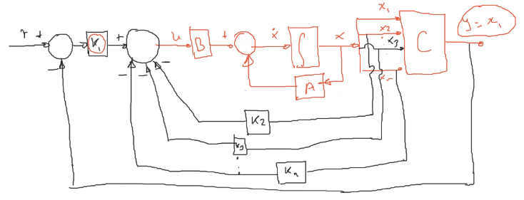
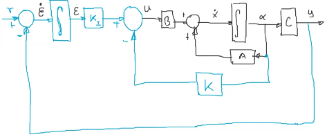

La señal de referencia es una constante.

$$
r(t) = r
$$

El problema consiste en que la salida $y$ se aproxime a la señal de referencia $r$,

$$
y(t)\xrightarrow[t\to\infty]{} r
$$

Considere el sistema `SISO`:

$$
(1)\quad \begin{cases}
    \dot{x} = Ax + Bu\\
    y = Cx
\end{cases}\quad\quad \begin{matrix}
A: n\times n\\
B: 1\times n\\
C: n\times 1\\
\end{matrix}
$$

## Caso 1: El sistema $(1)$ tiene un integrador
Se asume que la matriz $A$ tiene un valor propio en $0$ (tiene un integrador).



$$
\begin{aligned}
    u &= (r - \overbrace{x_1}^{y})K_1 - x_2 K_2 - x_3 K_3 - \ldots - x_n K_n\\
    &= K_1 r - \underbrace{\begin{bmatrix}
        K_1 & K_2 & \ldots & K_n
    \end{bmatrix}}_{K} \underbrace{\begin{bmatrix}
        x_1 \\ x_2\\\ldots \\ x_n
    \end{bmatrix}}_{x}\\
    (2)\quad&= K_1 r - Kx
\end{aligned}
$$

Sustituyendo (2) en (1)

$$
\begin{aligned}
    \dot{x} &= Ax + B(K_1 r - Kx)\\
(3)\quad&= (A - BK) x + B K_1 r\quad\leftarrow{\text{Sistema en lazo cerrado}}
\end{aligned}
$$

Los polos en lazo cerrado se asignarán al sistema $(3)$:

$$
p_{lc}(s) = \det(sI - (A-BK)) = (s-\mu_1)(s-\mu_2)\ldots(s-\mu_n)
$$

En estado estacionario:

$$
(4)\quad\lim_{t \to \infty} \dot{x}(t) = (A - BK) \lim_{t\to\infty} x(t) + B K_1 r
$$

Haciendo $(3) - (4)$:

$$
\dot{x} -\lim_{t \to \infty} \dot{x}(t) = (A-BK)\left(x - \lim_{t\to\infty} x(t)\right) 
$$

Se define $e = x - \lim_{t\to\infty} x(t)$, entonces:

$$
\boxed{\dot{e}(t) = (A-BK)e(t)}
$$

Por lo que:

$$
e(t) = e^{(A-BK)t}e(0)
$$

Si $(A - BK)$ es estable (sus valores propios son todos negativos):

$$
|e(t)| \xrightarrow[t\to\infty]{}0
$$

En resumen, el problema de regulación para el caso $(1)$, se resuelve como un problema de ubicación de polos para la matriz $A - BK$

## Caso 2: El sistema $(1)$ NO tiene un integrador



Se utiliza un controlador Proporcional Integral `PI`:

$$
\text{PI}\begin{cases}
    u = K_I\varepsilon = - Kx\\
    \dot{\varepsilon} = r - y = r - Cx
\end{cases}
$$


$$
(3) = \begin{bmatrix}
    \dot{x}\\\dot{\varepsilon}
\end{bmatrix} = \underbrace{\begin{bmatrix}
    A & 0\\
    -C & 0\\
\end{bmatrix}}_{(n+1)\times(n+1)}\begin{bmatrix}
    x\\\varepsilon
\end{bmatrix} + \begin{bmatrix}
    B\\0
\end{bmatrix}u + \begin{bmatrix}
    0\\1
\end{bmatrix}r
$$

En el estado estacionario:


$$
(4) = \begin{bmatrix}
    \lim_{t\to\infty} \dot{x}(t)\\
    \lim_{t\to\infty} \dot{\varepsilon}(t)\\
\end{bmatrix} = \overbrace{\begin{bmatrix}
    A & 0\\
    -C & 0\\
\end{bmatrix}}^{\bar{A}}\begin{bmatrix}
    \lim_{t\to\infty} {x}(t)\\
    \lim_{t\to\infty} {\varepsilon}(t)\\
\end{bmatrix} + \overbrace{\begin{bmatrix}
    B\\0
\end{bmatrix}}^{\overline{B}}\lim_{t\to\infty}u(t) + \overbrace{\begin{bmatrix}
    0\\1
\end{bmatrix}r}^{r \text{ es cte.}}
$$

$(3) - (4)$:

$$
\begin{aligned}
    x_c &= x(t) - \lim_{t\to\infty} x(t)\quad,\quad\varepsilon_c = \varepsilon(t) - \lim_{t\to\infty}\varepsilon(t)\\
    u_c &= u(t) - \lim_{t\to\infty} u(t) = K_I\varepsilon - Kx - K_I \lim_{t\to\infty} \varepsilon(t) + K \lim_{t\to\infty} x(t)
\end{aligned}
$$


$$
\dot{e} = \begin{bmatrix}
    \dot{x_e}\\
    \dot{\varepsilon_e}\\
\end{bmatrix} = \begin{bmatrix}
    A & 0\\
    -C & 0\\
\end{bmatrix}\begin{bmatrix}
    x_e\\\varepsilon_e
\end{bmatrix} + \begin{bmatrix}
    B\\0
\end{bmatrix}u_e
$$


$$
(5)\quad\dot{e} = \overline{A} e + \overline{B}u_e
$$


$$
u_e = K_I \varepsilon_e - Kx_e = -\begin{bmatrix}
    K, - K_I
\end{bmatrix}e
$$

$$
(6)\quad u_e = -\overbrace{\begin{bmatrix}
    K,-K_I
\end{bmatrix}}^{\overline{K}}e
$$

Sustituyendo $(6)$ en $(5)$:

$$
\dot{e} = \overline{A}e + \overline{B}\begin{bmatrix}
    -\overline{K}e
\end{bmatrix}
$$

$$
\dot{e} = (\overline{A} - \overline{B}\ \overline{K})e
$$

Por lo tanto, el diseño del controlador `PI` se resuelve como un problema de ubicación de polos para la matriz $\overline{A} - \overline{B}\ \overline{K}$, donde $\overline{K} = \begin{bmatrix}
    K,-K_I
\end{bmatrix}$.

## Selección de polos
El procedimiento para la selección de los polos del sistema $(1)$ a un sistema de segundo orden de la forma:

$$
(2)\quad\frac{Y(s)}{U(s)} = \frac{\omega_n^2}{s^2 + 2\xi\omega_ns + \omega_n^2}
$$

El polinomio característico de la ecuación $(2)$ es:

$$
p(s) = s^2 + 2\xi\omega s  + \omega_n^2 = 0
$$

Cuyos **polos dominantes** son:

$$
\boxed{s_{1,2} = -\xi\omega_n \pm \omega_n \sqrt{\xi^2-1}}
$$

### Procedimiento
1. Se calculan $\omega_n$ y $\xi$ para que cumplan con los requerimientos del sistema
2. Se obtienen los polos determinantes del sistema $s_{1,2}$
3. **Caso a**: Si la planta **tiene** un cero en $s = q_1$, entonces el valor del polo adicional se asigna igual que $q_1$.
4. **Caso b**: Si la planta **NO tiene** ceros, el polo adicional se asignará al menos 5 veces más a la izquierda que al parte real de los polos dominantes.

$$
s_3 = 5\ \real({s_{1,2}})\quad;\quad\real(s_{1,2}) < 0
$$


## Tips
Para saber si un sistema tiene un integrador:
* La matriz $A$ tiene un valor propio en $0$
* La función de transferencia tiene una s multiplicando en el denominador

## Ejercicios
### 1.
Sea el sistema:

$$
\begin{aligned}
    \dot{x} &= \begin{bmatrix}
        0 & 1 & 0\\
        0 & 0 & 1\\
        -1 & -5 & -6\\
    \end{bmatrix}x + \begin{bmatrix}
        0\\1\\1
    \end{bmatrix}u\\
    y &= \begin{bmatrix}
        1 & 0 & 0
    \end{bmatrix}x
\end{aligned}
$$

Determinar las ganancias del controlador tales que los polos del sistema en lazo cerrado se ubiquen en $-2\pm 4j$, $-10$ y $-10$.

$$
|r - y| \xrightarrow[t\to\infty]{} 0
$$

```matlab
clc; close all; clear all;

% Ejercicio 2
A = [0  1  0
     0  0  1
     -1  -5  -6];
B = [0 1 1]';
C = [1 0 0];

eig(A) % No tienen integrador

Ab = [A zeros(3,1)
     -C 0];

Bb = [B
      0];

I = eye(size(Ab,1));

syms s k;
p1 = -2 + 4i; p2 = -2-4i; p3 = -10; p4 = -10;
plc = collect((s-p1)*(s-p2)*(s-p3)*(s-p4))

PLCAb = Ab^4 + 24*Ab^3 + 200*Ab^2 + 800*Ab + 2000*I;
Ckb = [Bb Ab*Bb Ab^2*Bb Ab^3*Bb];

Kb = [0 0 0 1] * Ckb^-1 * PLCAb

eig(Ab - Bb*Kb)

K = Kb(1:end-1)
KI = -Kb(end)
```

Se obtuvieron los siguientes resultados:

$$
\begin{aligned}
    K &= \begin{bmatrix}
        73.3787 & 17.6351 & 0.3649
    \end{bmatrix}\\
    K_I &= 285.7143
\end{aligned}
$$


### 2.
Sea el sistema:

$$
\begin{aligned}
    \dot{x} &= \begin{bmatrix}
        0 & 1 & 0\\
        0 & 0 & 1\\
        0 & -5 & -6\\
    \end{bmatrix}x + \begin{bmatrix}
        0\\0\\1
    \end{bmatrix}u\\
    y &= \begin{bmatrix}
        1 & 0 & 0
    \end{bmatrix}x
\end{aligned}
$$

1. Diseñar un sistema de regulación, es decir calcular las ganancias del controlador tales que los polos del sistema en lazo cerrado se ubiquen en $-2\pm 2j$ y $-10$.

``` matlab
clc; close all; clear all;

% Ejercicio 2
A = [0  1  0
     0  0  1
     0  -5  -6];
B = [0 0 1]';
C = [1 0 0];

% Se identifica si tiene integrador
eig(A) % Sí tiene integrador

I = eye(size(A,1));

syms s k;
p1 = -2 + 2i; p2 = -2-2i; p3 = -10;
plc = collect((s-p1)*(s-p2)*(s-p3))

PLCA = A^3 + 14*A^2 + 48*A + 80*I;
Ck = [B A*B A^2*B];

k = [0 0 1] * Ck^-1 * PLCA

eig(A - B*k)
```
2. Realizar la simulación del sistema en lazo cerrado. $r$ escalón unitario.
3. Calcular K tal que el máximo sobre impulso sea $12\%$ y el tiempo de establecimiento de $0.5s$

El máximo sobre impulso se calcula como:

$$
MP = e^{\frac{\xi\pi}{\sqrt{1-\xi^2}}}
$$

El tiempo de establecimiento comoo:

$$
T_s = \dfrac{4}{\xi\omega_n}
$$

Por lo tanto:

$$
\begin{cases}
    \dfrac{4}{\xi\omega_n} = 0.5\\
    0.12 = e^{\frac{\xi\pi}{\sqrt{1-\xi^2}}}
\end{cases}
\begin{cases}
    \omega_n = \dfrac{8}{\xi}\\
    \ln(0.12) = \frac{\xi\pi}{\sqrt{1-\xi^2}}
\end{cases}
\begin{cases}
    \omega_n = \dfrac{8}{\xi}\\
    \xi^2(\ln^2(0.12) + \pi^2) = 1
\end{cases}
$$

$$
\begin{cases}
    \omega_n = \dfrac{8}{\xi}\\
    \xi = \dfrac{1}{\sqrt{\ln^2(0.12) + \pi^2}}
\end{cases}
\begin{cases}
    \omega_n = 14.3\\
    \xi = 0.55
\end{cases}
$$

Por lo que los polos dominantes son:

$$
s_{1,2} = -7.9 \pm 11.95j
$$

Se verifica si la planta tiene ceros:

```matlab
sis= ss(A,B,C,0)
tf(sis)
```

En este caso no tiene ceros, por lo que se procede a definir el $3$er polo como veces la parte real de los polos dominantes.


$$
s_3 = 5(-7.9) = -39.5
$$

Ahora se calcula $K$ para ubicar los polos en $s_1$, $s_2$ y $s_3$.

```matlab
clc; close all; clear all;

A = [0  1  0
     0  0  1
     0  -5  -6];
B = [0 0 1]';
C = [1 0 0];

I = eye(size(A,1));

syms s k;
p1 = -7.9 + 11.95i; p2 = -7.9 - 11.95i; p3 = -39.5;
plc = collect((s-p1)*(s-p2)*(s-p3))

PLCA = A^3 + 553/10*A^2 + 13269/16*A + 1296943/160*I;
Ck = [B A*B A^2*B];

k = [0 0 1] * Ck^-1 * PLCA

eig(A - B*k)
```

Se obtuvo el siguiente resultado:

$$
K = \begin{bmatrix}
    8105.9 & 824.3 & 49.3
\end{bmatrix}
$$

